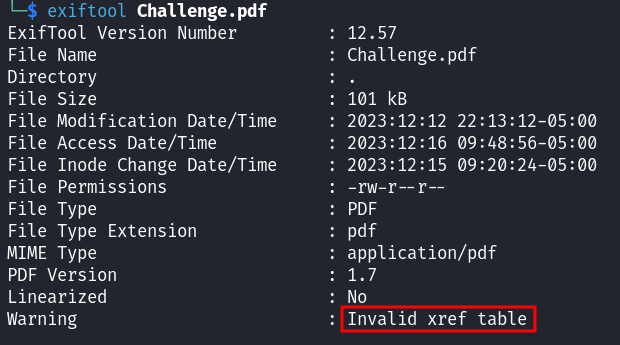
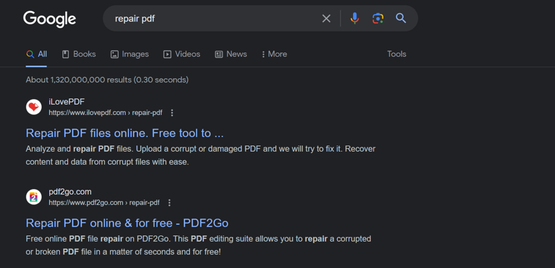
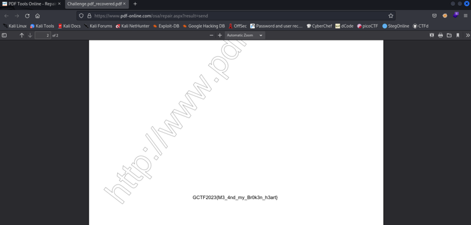

Corrupted PDF

## Description
I got this pdf and it's very important to me. WHY CAN'T IT OPEN OMG!
 
Attachment: `challenge.pdf`

## Solution
The PDF file given is corrupted and the content cannot be read.
  
We can use `exiftool` to check the metadata of the file. There is a warning says that this file has an invalid xref table.
  
We can search the internet for online tools that can repair corrupted PDF files.
  
Once fixed, scroll through the PDF file and we will see the flag at the bottom of the file.

## Flag
`GCTF2023{M3_4nd_my_Br0k3n_h3art}`
