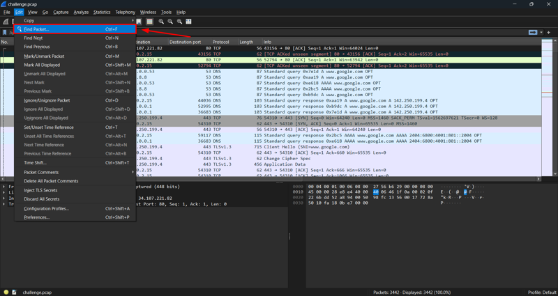
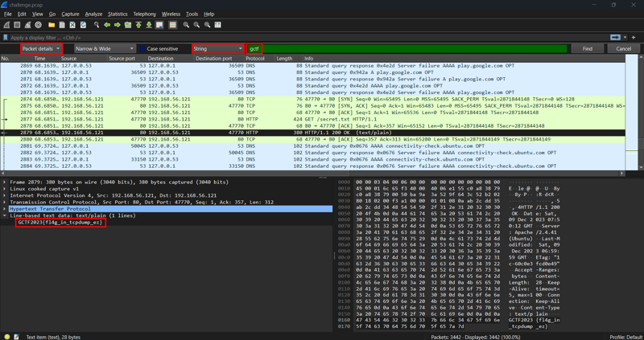
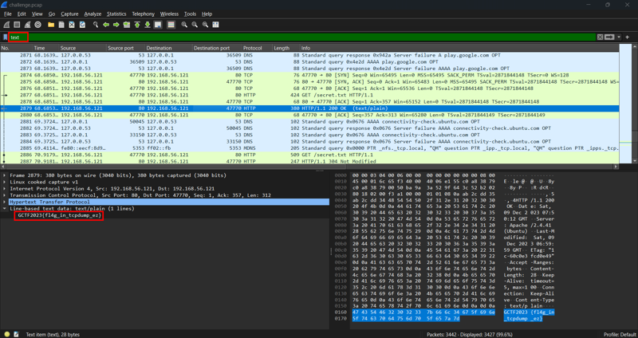

Search string within packets

## Description
It's cleartext :3  
Attachment: `challenge.pcap`

## Solution
### Solution 1: Search String
Since the challenge description says that the flag is in cleartext, we can straightaway search for the flag within the packets.
  
`Edit` --> `Find Packet`
     
  
We can search for packet details that contain the string which is the flag format `gctf` and we will get the flag. 

### Solution 2: Filter Data
  
We can also use the filter to filter for text data to get the flag.

## Flag
`GCTF{fl4g_in_tcpdump_ez}`