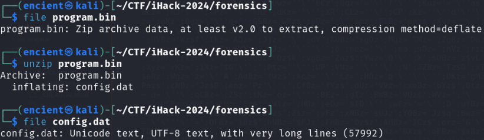
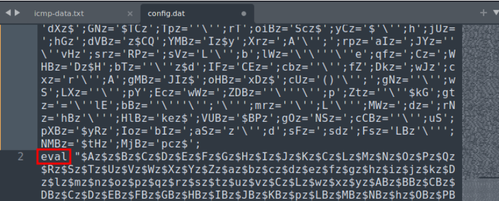
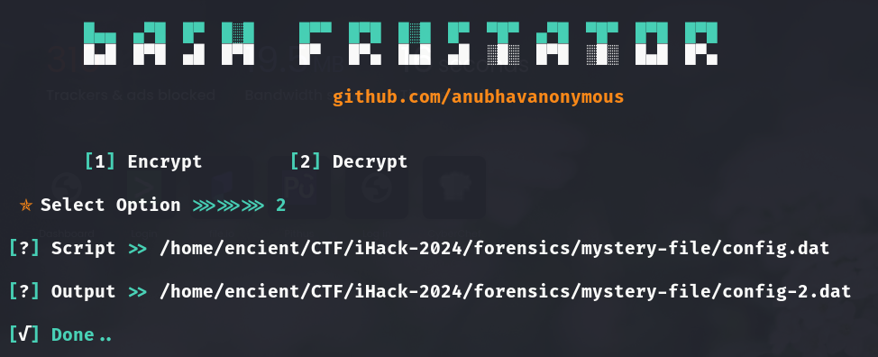
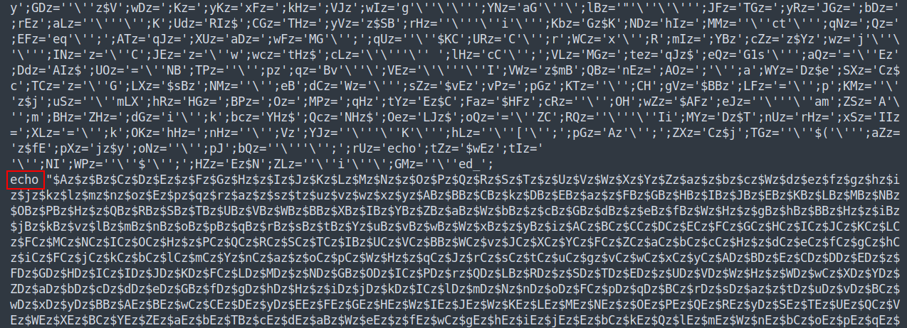
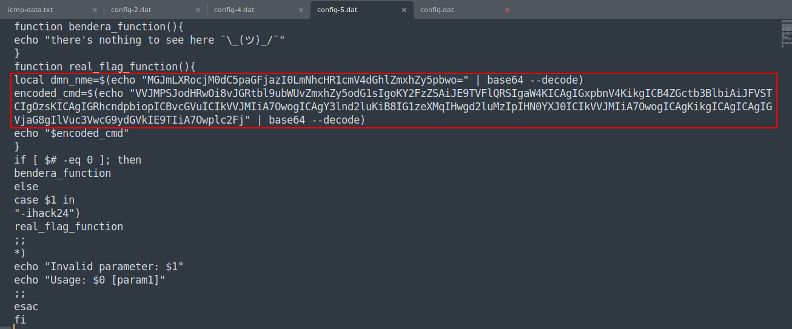
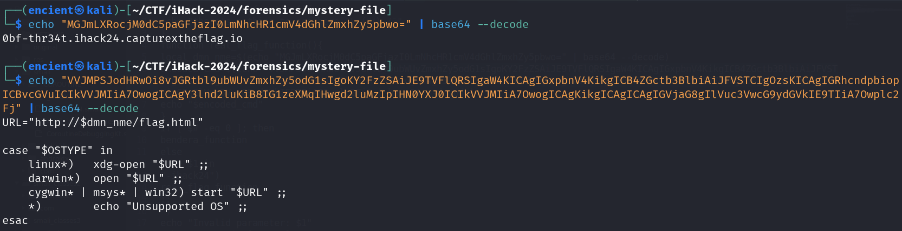
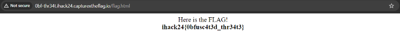

## Description
A company has engaged your team to conduct a Digital Forensics and Incident Response (DFIR) analysis on their compromised image servers. During the investigation, your team discovered a suspicious file named "program.bin" in an unconventional binary. The nature of this file, including its content and unusual placement, strongly suggests that it could be a malicious payload or a backdoor script. The team is tasked with analyzing this file to determine its purpose and potential threat.     
Attachment: `mystery file.zip`

## Solution
     
By using `file` command to see the file type, we know that it is a zip file. After unzipping it, it gives us `config.dat` which seems like a file with plaintext.     

     
Looking into the file, it seems like it is heavily obfuscated. However, instead of the .dat file, it looks more like a bash script as it contains `eval`.  

> 💡 `eval` in Bash programming language is mostly used to execute command.      

Therefore, we proceed to search for tools that can perform bash script deobfuscation. Here are the tools that can be used:
- [tio.run](https://tio.run/#)
- [DeBash](https://dsh.deno.dev/)
- [Bash Frustrator](https://github.com/anubhavanonymous/Bash_Frustator)

     
We used Bash Frustrator which is a Python tool to deobfuscate the script.

     
After the first deobfuscation process, the script seems like no change and still has long unreadable strings. However, we noticed that `eval` became `echo`, and the script is actually shorter compared to the previous script. Therefore, we think that the script might have several layer of obfuscation.     

     
After several times of deobfuscation, we can finally read and understand the script. There is a function which has encoded command.     

     
Decode the command and we will get the content. We need to visit the URL to get the flag.      

     

## Flag
`ihack24{0bfusc4t3d_thr34t3}`