Difficulty: Easy  
Description: phpBB forum database analysis, `access.log` analysis

## Scenario
An external contractor has accessed the internal forum here at Forela via the Guest WiFi and they appear to have stolen credentials for the administrative user! We have attached some logs from the forum and a full database dump in sqlite3 format to help you in your investigation.     

Attachment: `access.log`, `phpbb.sqlite3`

## Overview
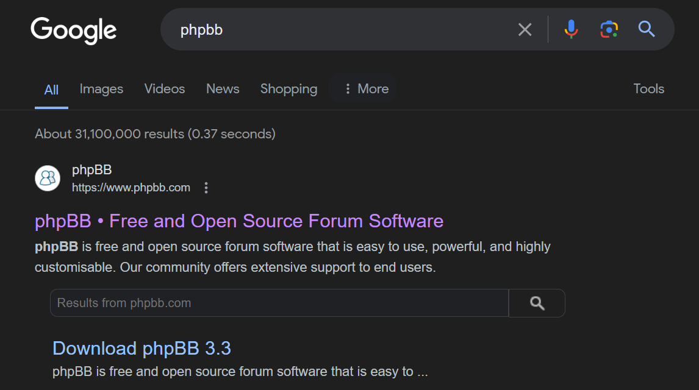     
phpBB is a free and open source forum in the internet. It is written in PHP scripting language according to my research. I also tried searching for "phpBB forensics analysis" and something similar to see if there is any resources that might be helpful for my analysis, but there is no useful result came up from my search.     
Since the log file is given, we can try to view the log file and analyze it. [http Log Viewer](https://www.apacheviewer.com/) is an useful tool to view web server logs so we can filter and analyze the log files easily.     
On the other hand, the SQLite file can be viewed by using online [SQLite viewer](https://sqliteviewer.app/).

## Solution
### Task 1
***What was the username of the external contractor?***
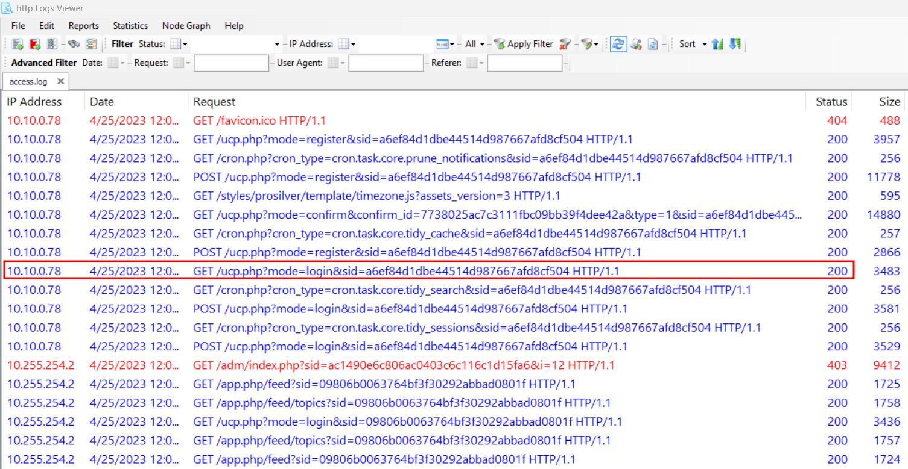     
When viewing the `access.log`, we can see that `10.10.0.78` has an successful login attempt. If analyze further, we will know that this IP address logged in as a normal member, while `10.255.254.2` has logged in successfully and access admin page (`adm`) straight away. Therefore, we can assume `10.10.0.78` is the external contractor, and `10.255.254.2` is the real admin.     

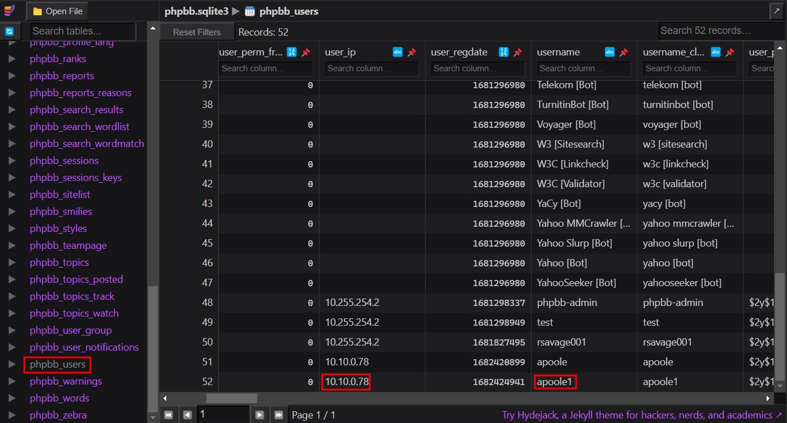     
Once we get the IP address, we can move on to the SQLite file to find for more information. Upon browsing through the database, I found out that `phpbb_users` table shows the users in the forum. Therefore, we can use the IP address we found from the log file and get the username.     
Answer: `apoole1`

### Task 2
***What IP address did the contractor use to create their account?***  
Refer [Task 1](#task-1)     
Answer: `10.10.0.78`

### Task 3
***What is the post_id of the malicious post that the contractor made?***  
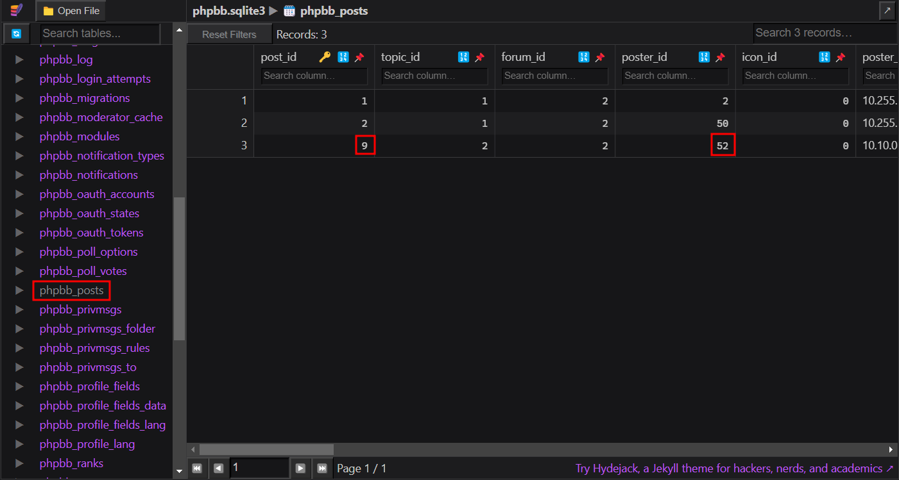     
From Task 1, we know that `user_id` is `52`. Therefore, we can view `phpbb_posts` and search for the same ID in `poster_id`.     
Answer: `9`

### Task 4
***What is the full URI that the credential stealer sends its data to?***  
From Task 4, we can get the post content by copying the `post_text`. The post is in HTML format but it is quite messy. Therefore, we can use online HTML beautifier to beautify the code and start analyzing it.     
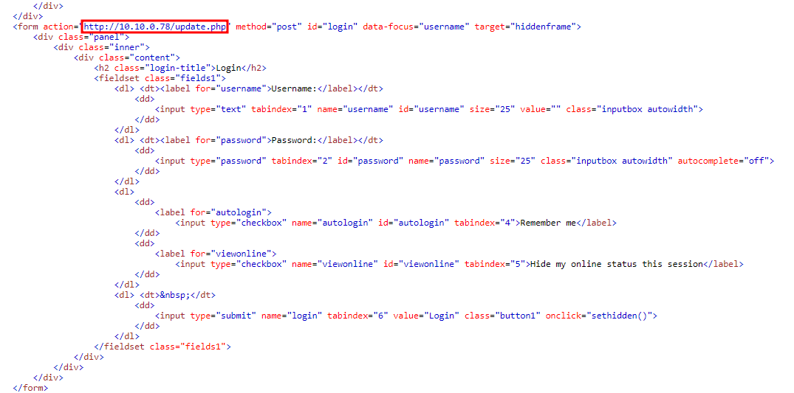     
We will then see that there is a login form that will post its data to `http://10.10.0.78/update.php`.     
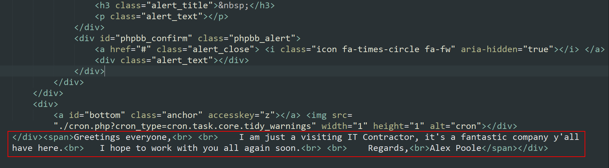     
Once the user logged in through the form, it will show the normal IT contractor post to the user. Therefore, we know that this is a fake login form that is created to steal the credentials of the user.     
Answer: `http://10.10.0.78/update.php`

### Task 5
***When did the contractor log into the forum as the administrator? (UTC)***
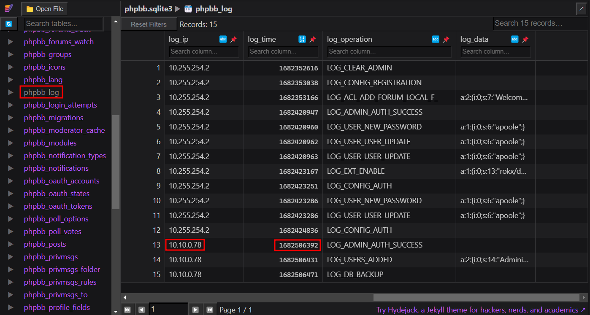     
View `phpbb_log` to get the login time from `log_time`. However, the time shown in the log is in Unix time which is in epoch format. Therefore, we can search the internet for an online converter to convert the time to UTC.     
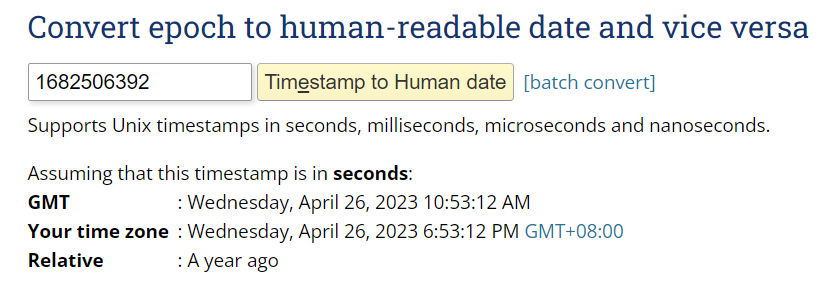     
Using the [epoch converter](https://www.epochconverter.com/), we can then get the accurate time and date in UTC format.     
Answer: `26/04/2023 10:53:12`

### Task 6
***In the forum there are plaintext credentials for the LDAP connection, what is the password?***     
LDAP, which is Lightweight Directory Access Protocol, is a protocol that allows an application to query user information easily. When I was solving this task, my thought process was that it might be in some kind of configuration file in the database. Therefore, I tried to search for information from the config file.     
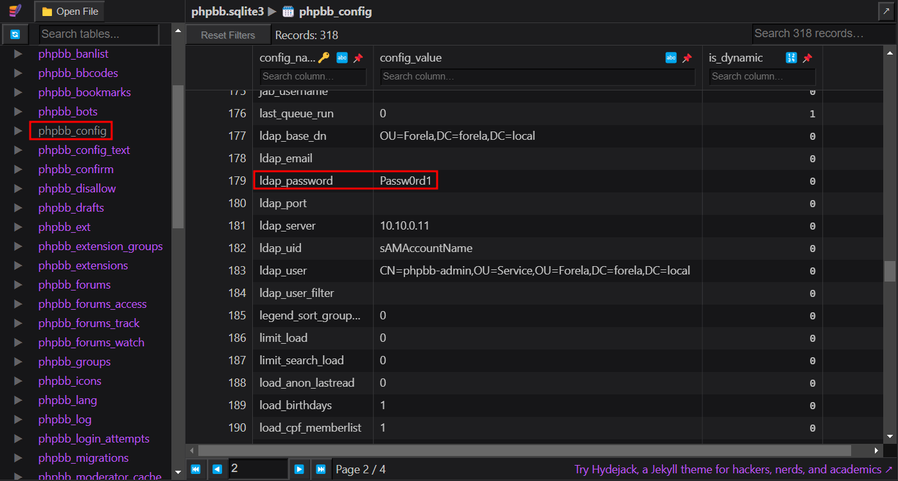     
In `phpbb_config`, we can easily see the plaintext password stored in `ldap_password`.     
Answer: `Passw0rd1`

### Task 7
***What is the user agent of the Administrator user?***     
As stated in Task 1, we knew the IP address of the admin is `10.255.254.2`. Therefore, we can just get the user agent from `access.log` by filtering the IP address.     
Answer: `Mozilla/5.0 (Macintosh; Intel Mac OS X 10_15_7) AppleWebKit/537.36 (KHTML, like Gecko) Chrome/112.0.0.0 Safari/537.36`

### Task 8
***What time did the contractor add themselves to the Administrator group? (UTC)***     
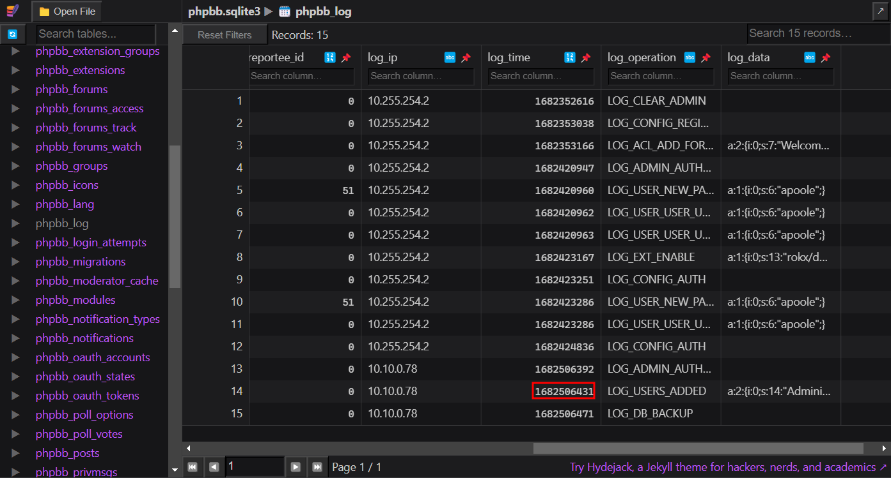     
Using the same method in Task 5, we can get the time and convert it into UTC.     
Answer: `26/04/2023 10:53:51`

### Task 9
***What time did the contractor download the database backup? (UTC)***     
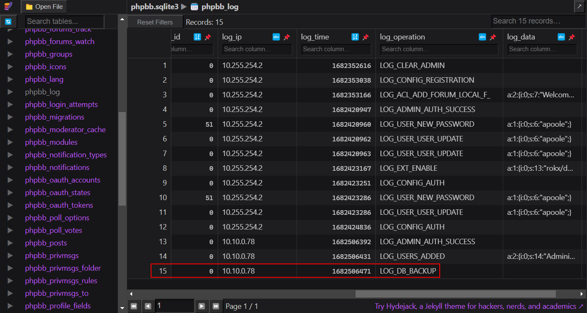     
From `phpbb_log` we can see that the contractor created a database backup. Therefore, we can filter the time to only search for everything after it.     
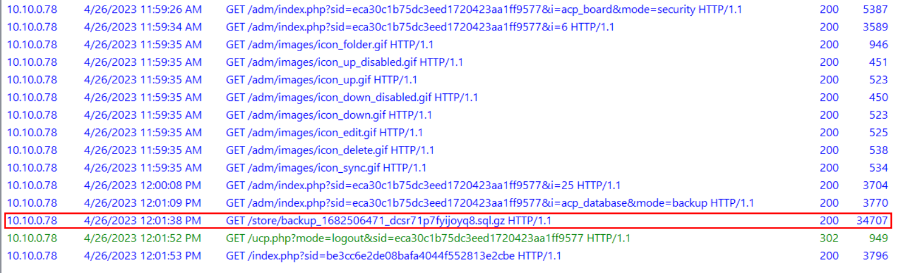     
In `access.log`, we can try to search for `backup` to see if there is any relevant information. It shows that the contractor downloaded a zipped SQL file and got a status code of 200 which indicates successful download. Therefore, we can assume that this is the database backup.     
Answer: `26/04/2023 11:01:38`

### Task 10
***What was the size in bytes of the database backup as stated by access.log?***     
Refer Task 9.     
Answer: `34707`