Difficulty: Easy <br>
Description: Browser forensics, eM Client investigation and credential dumping from registry

## Scenario
An elf named "Elfin" has been acting rather suspiciously lately. He's been working at odd hours and seems to be bypassing some of Santa's security protocols. Santa's network of intelligence elves has told Santa that the Grinch got a little bit too tipsy on egg nog and made mention of an insider elf! Santa is very busy with his naughty and nice list, so he’s put you in charge of figuring this one out. Please audit Elfin’s workstation and email communications.

Attachment: `optinseltrace1.zip` 

## Overview
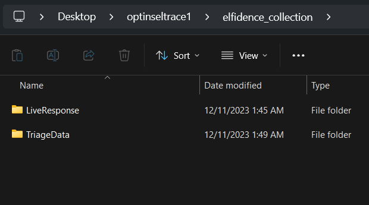
We were given a folder of triaged data, as well as live response data.

## Solution
### Task 1
***What is the name of the email client that Elfin is using?***
```
<YOUR-PATH>\optinseltrace1\elfidence_collection\TriageData\C\users\Elfin\Appdata\Roaming
```
Since user Elfin was mentioned, we can analyze and investigate his folder. Roaming folder has files that sync to other devices if we log in on the same domain ([source](https://www.xda-developers.com/appdata/)). Therefore, this folder might contain some useful data about application settings or web browser information.
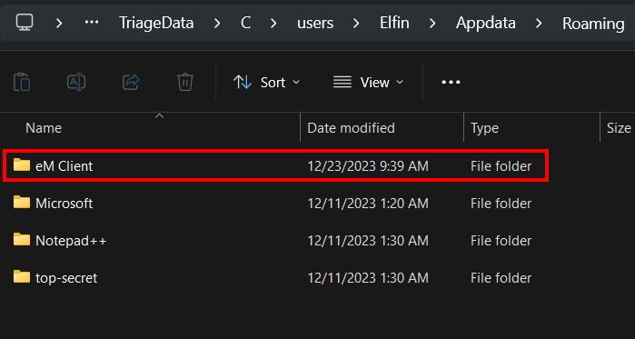
In this folder, we can see a folder named `eM Client`. Doing some research will know that this is the email client that we are searching for.
<br>     
As an alternative method, I did some browser forensics on Elfin's workstation. We can get Google Chrome `History` file in the location below:
```
<YOUR-PATH>\optinseltrace1\elfidence_collection\TriageData\C\users\Elfin\Appdata\Local\Google\Chrome\User Data\Default
```
Google Chrome history is saved as SQLite file. Therefore, we can use any SQLite viewer application, or we can find one online.
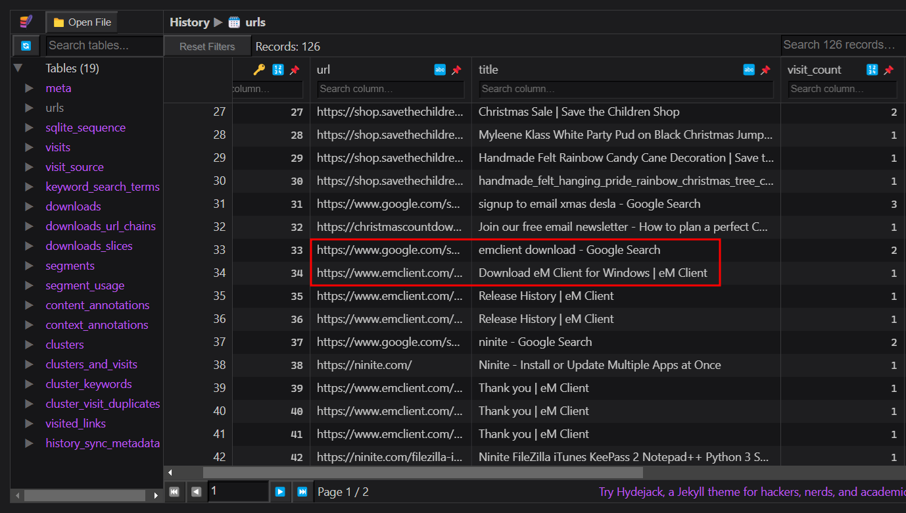
We can see that Elfin searched for eM Client download and downloaded successfully as we can see in id 39-41, where he reached the Thank you page of eM Client.
<br>     
Answer: `eM Client`


### Task 2
***What is the email the threat is using?*** <br>    

By looking into the question, we know that we need to investigate the emails as most of the questions are related to email. Doing a quick research in the internet by searching for "eM Client forensics analysis", we will be able to find a tool named [eM Client Forensics Wizard](https://forensiksoft.com/emclient-forensics.html#:~:text=eM%20Client%20Forensics%20Wizard%20provides,%2C%20Hex%20View%2C%20Raw%20Message.) which allows us to analyze and extract email from eM Client mailboxes.
> 💡Another method to analyze the mailbox is to install eM Client itself, which is shown by a video [here](https://www.youtube.com/watch?v=FL3-ACA6axk).

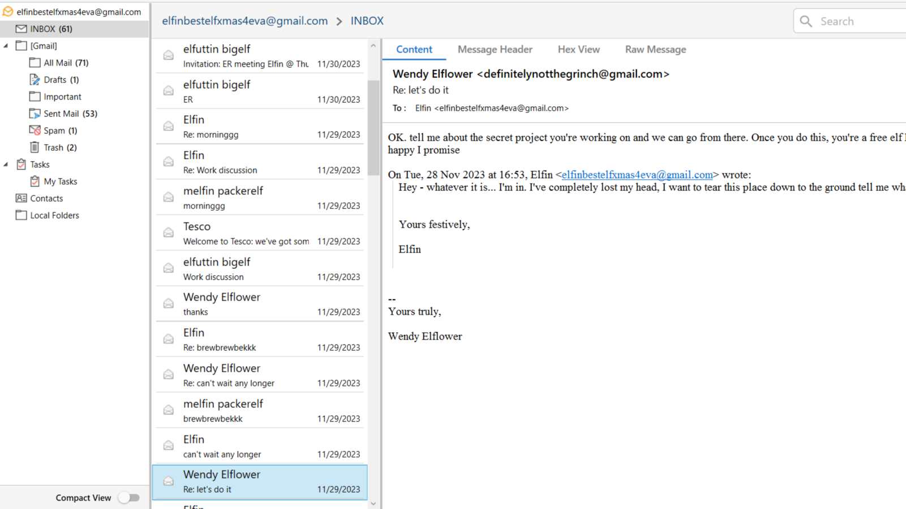
Once loaded the application, we can browse through all emails and find the threat's email. Wendy Elflower looks suspicious as she kept on chatting with Elfin to get more information about his company data and the super secret santa binary file. 
> 💡You could browse and read through all emails to know the storyline and know what is actually going on.

<br>   

Answer: `definitelynotthegrinch@gmail.com`


### Task 3
***When does the threat actor reach out to Elfin?***
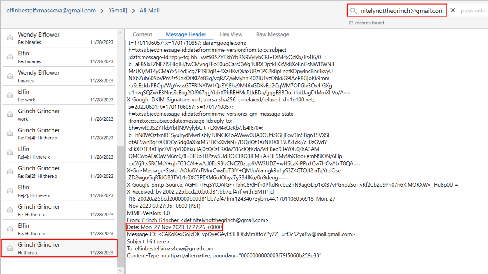
In `All Mail` section, we can search for more emails sent by Wendy Elflower / Grinch Grincher using the search bar on top right. From there, we will be able to see the date of the first email received. However, since the answer required the time, we can search for more information about the email by navigating to `Message Header` section in the email.
> Apparently Grinch Grincher uses a fake name which is Wendy Elflower. He changes his name to Wendy Elflower (using the same email address) after a few emails.

<br>     

Answer: `2023-11-27 17:27:26`


### Task 4
***What is the name of Elfin’s boss?*** <br>    

Assuming that boss will always send email to employees (to chase for work, to schedule meetings etc.), we can search for Elfin's inbox to see if there's any messages from his boss.
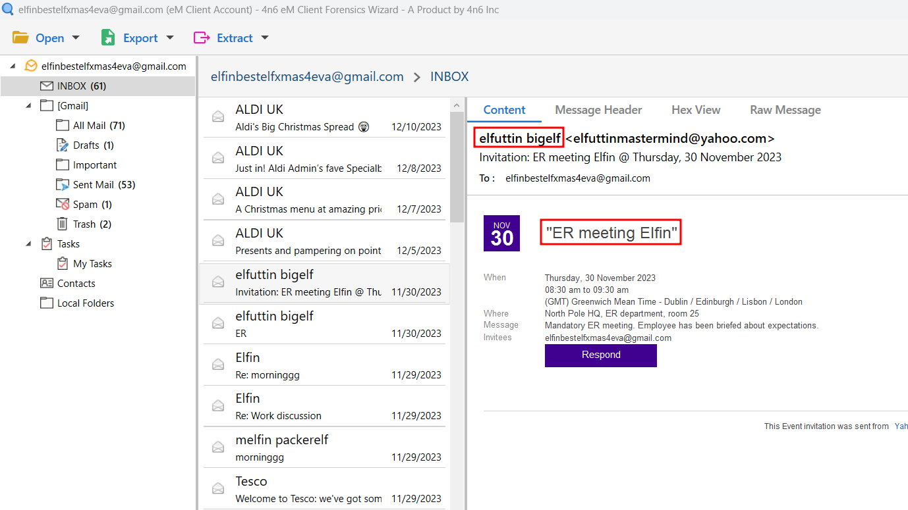
There is a scheduled ER meeting with Elfuttin Bigelf. ER meeting means Employee Relations meeting, where it focuses on connection between managers and their members and employee will be briefed about expectations from manager. Therefore, we know that Elfuttn Bigelf is Elfin's big boss.
<br>    

Answer: `Elfuttin Bigelf`


### Task 5
***What is the title of the email in which Elfin first mentions his access to Santa’s special files?***
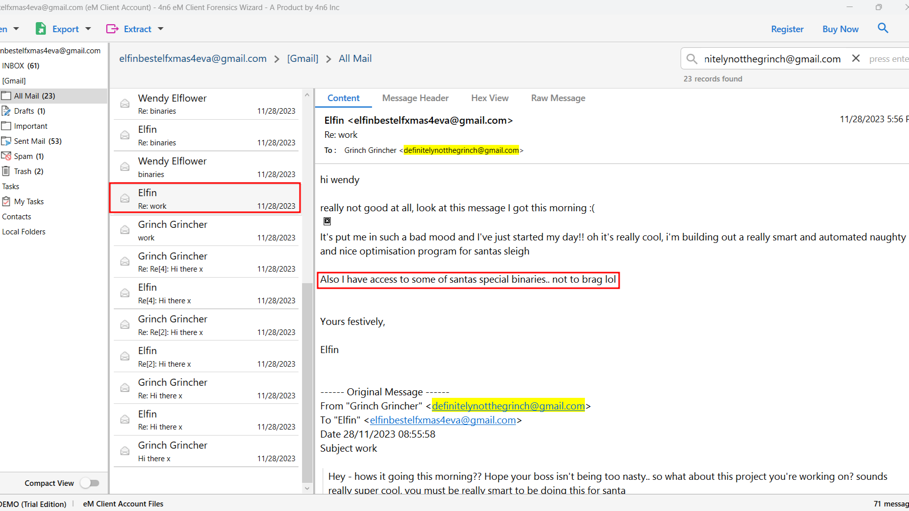
In `All Mail`, search for mails from Grinch, and we can see that Elfin mentioned about santa special binaries in this mail.
<br>     

Answer: `Re: work`


### Task 6
***The threat actor changes their name, what is the new name + the date of the first email Elfin receives with it?***
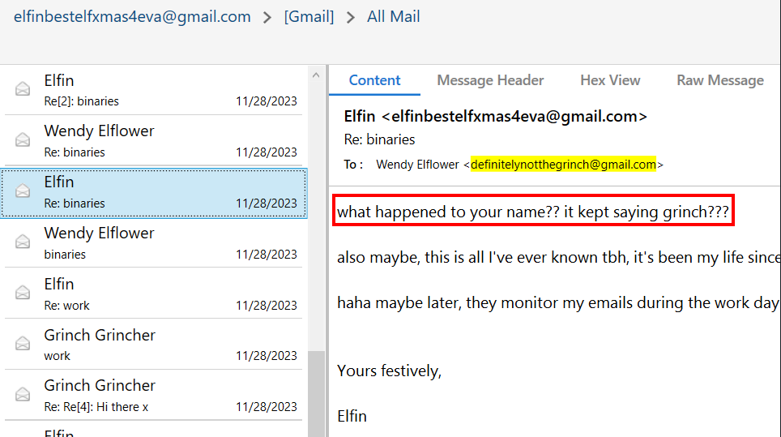
In this mail, Elfin asked Wendy Elflower about her name. This is where Grinch changed his name.
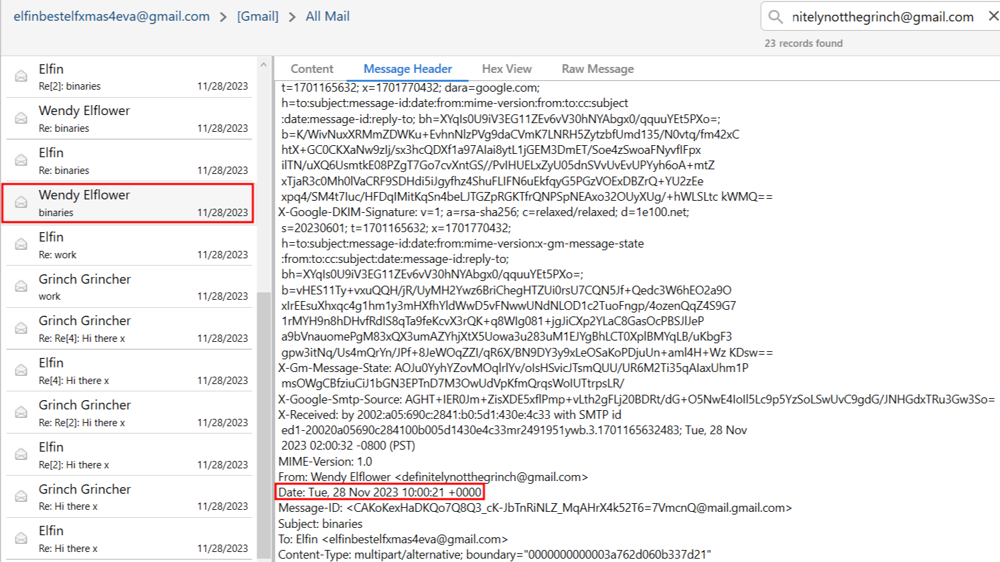
Moving back to the first mail sent by Wendy Elflower, we can get the time by looking into the message header.
<br>     

Answer: `Wendy Elflower, 2023-11-28 10:00:21`


### Task 7
***What is the name of the bar that Elfin offers to meet the threat actor at?***
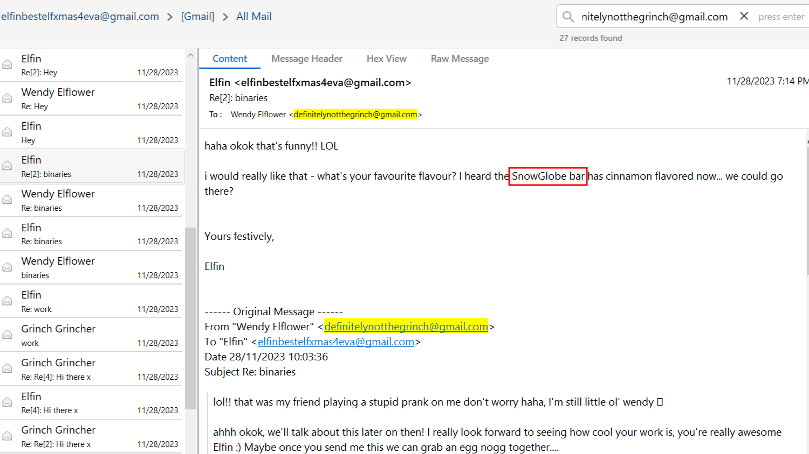
Answer: `SnowGlobe`


### Task 8
***When does Elfin offer to send the secret files to the actor?***
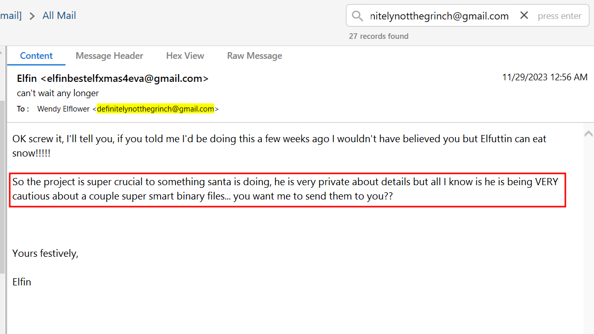
In this mail, go to message header to get the detailed time.
<br>     

Answer: `2023-11-28 16:56:13`


### Task 9
***What is the search string for the first suspicious google search from Elfin? (Format: string)*** <br>    

Question mentioned about Google search, this means that we need to perform browser forensics on Google Chrome again. This is the location to get the `History` file:
```
<YOUR-PATH>\optinseltrace1\elfidence_collection\TriageData\C\users\Elfin\Appdata\Local\Google\Chrome\User Data\Default
```

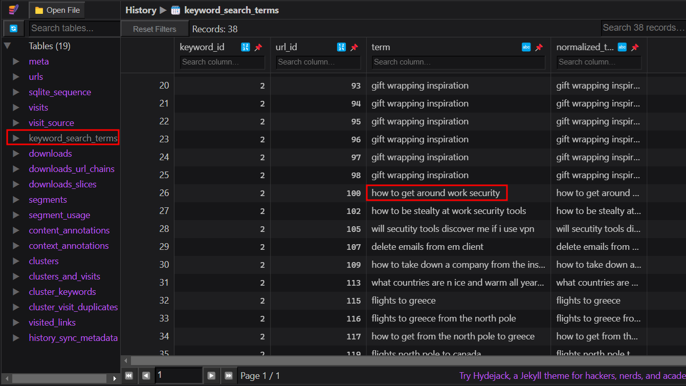
We can search for keyword search terms that Elfin searched for, which we can get the result above.
<br>     

Answer: `how to get around work security`


### Task 10
***What is the name of the author who wrote the article from the CIA field manual?*** <br>    

Question mentioned about an article, so we can assume that it is an online article. Therefore, we can try to search for URL in the browser history.
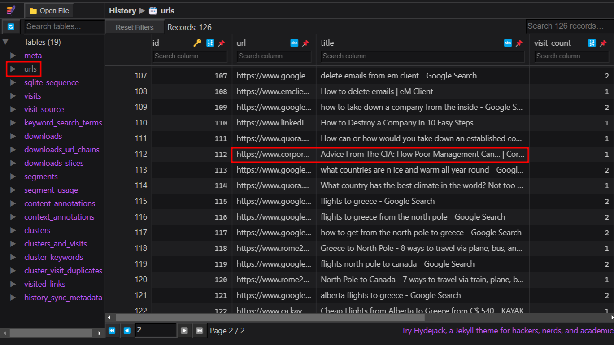
`urls` table shows the URLs that has been visited by Elfin. We can then visit the URL of the article to find the author.

Answer: `Joost Minnaar`


### Task 11
***What is the name of Santa’s secret file that Elfin sent to the actor?***
```
<YOUR-PATH>\optinseltrace1\elfidence_collection\TriageData\C\users\Elfin\Appdata\Roaming\top-secret
```
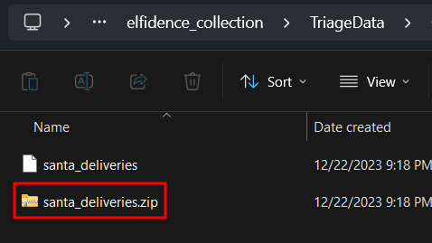
We can see that there is a suspicious folder named `top-secret` and there is a zip file inside. This [video](https://youtu.be/FL3-ACA6axk?t=2904) shows another way to get the filename if you installed eM Client directly.
> 💡Actually we are supposed to get it from the email analysis, but my eM Client Forensics Wizard does not show the file name. Therefore, this would be the alternative method.

<br>   

Answer: `santa_deliveries.zip`


### Task 12
***According to the filesystem, what is the exact CreationTime of the secret file on Elfin’s host?*** <br>    

Question mentioned about the CreationTime of the secret file `santa_deliveries.zip`. We are unable to get this information from the folder itself as the metadata of the modified time and creation time has been changed once we downloaded and extracted the folder. <br>    
Therefore, we can do some analysis on Jump List to see whether there is any useful information. Jump List folder has the data of the user's recently accessed files. We can search for Jump List from the location below:
```
<YOUR-PATH>\C\users\Elfin\AppData\Roaming\Microsoft\Windows\Recent\
```
There are two folders in this location:
- `AutomaticDestinations`: jump lists created automatically when user opens a file
- `CustomDestinations`: custom jump lists created when user pins a file 

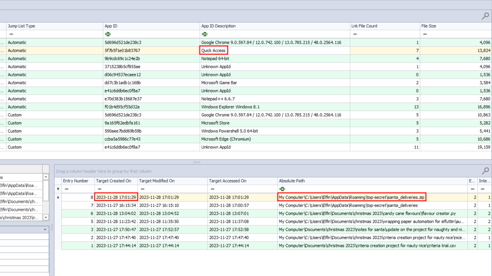
We can drag and drop all files from `AutomaticDestinations` into `JumpListExplorer` (which can be found [here](https://www.sans.org/tools/jumplist-explorer/)) to analyze recently access files. From there, we will be able to see the `santa_deliveries.zip` file and the creation date and time.
<br>     

Answer: `2023-11-28 17:01:29`


### Task 13
***What is the full directory name that Elfin stored the file in?*** <br>    
Refer to Task 11.
<br>    

Answer: `C:\users\Elfin\Appdata\Roaming\top-secret`


### Task 14
***Which country is Elfin trying to flee to after he exfiltrates the file?***
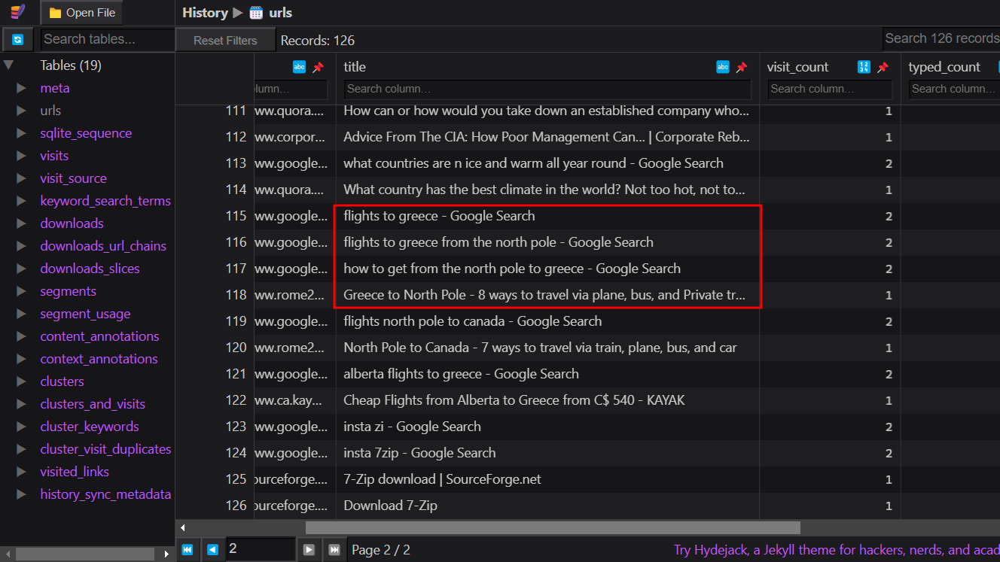
By going through the URLs visited, we can see that Elfin was searching for ways to Greece.
<br>    
Answer: `Greece`


### Task 15
***What is the email address of the apology letter the user (elfin) wrote out but didn’t send?***
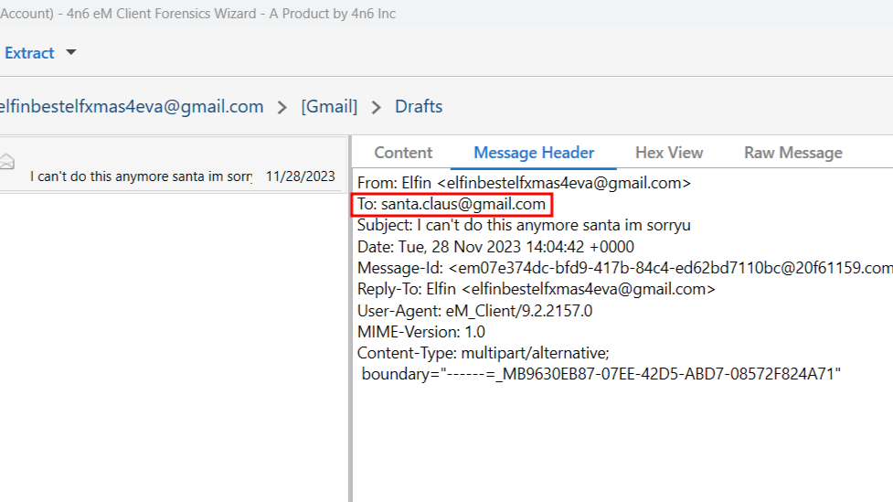
In our eM Client Forensics Wizard, go to `Draft` section to view the draft mail. There is an unsent mail for Santa Claus.
<br>     
Answer: `santa.claus@gmail.com`


### Task 16
***The head elf PixelPeppermint has requested any passwords of Elfins to assist in the investigation down the line. What’s the windows password of Elfin’s host?*** <br>    

This is the hardest question among all. To give you an overview, we need to download a copy of the registry file from Elfin's workstation, dump the registry (using impacket) to get the hash, and crack the hash. 

```bash
sudo apt install python3-impacket
impacket-secretsdump -sam SAM -security SECURITY -system SYSTEM LOCAL
```

`SAM`: Stores local user account information and credentials <br>
`SECURITY`: Stores security policy of current user <br>
`SYSTEM`: Stores configurations of Windows services <br>    

3 registry hives above are required in order to dump the user's credential, and they can be found in the location below:
```
<YOUR-PATH>\C\Windows\system32\config\
```

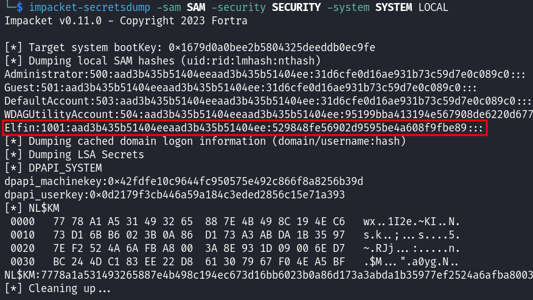
`aad3b435b51404eeaad3b435b51404ee` means that LM is not being used ([source](https://book.hacktricks.xyz/windows-hardening/ntlm)). Therefore, we can crack the NTLM hash which is `529848fe56902d9595be4a608f9fbe89` using [CrackStation](https://crackstation.net/).
<br>    
Answer: `Santaknowskungfu`
