Difficulty: Easy  
Printer server PCAP analysis

## Scenario
Printers are important in Santa’s workshops, but we haven’t really tried to secure them! The Grinch and his team of elite hackers may try and use this against us! Please investigate using the packet capture provided! The printer server IP Address is 192.168.68.128.

Attachment: `optinseltrace4.zip`

## Overview
We were given a `networktraffic.pcapng` file inside the zip file. It is about the printer server network.

## Solution
### Task 1
***The performance of the network printer server has become sluggish, causing interruptions in the workflow at the North Pole workshop. Santa has directed us to generate a support request and examine the network data to pinpoint the source of the issue. He suspects that the Grinch and his group may be involved in this situation. Could you verify if there is an IP Address that is sending an excessive amount of traffic to the printer server?***
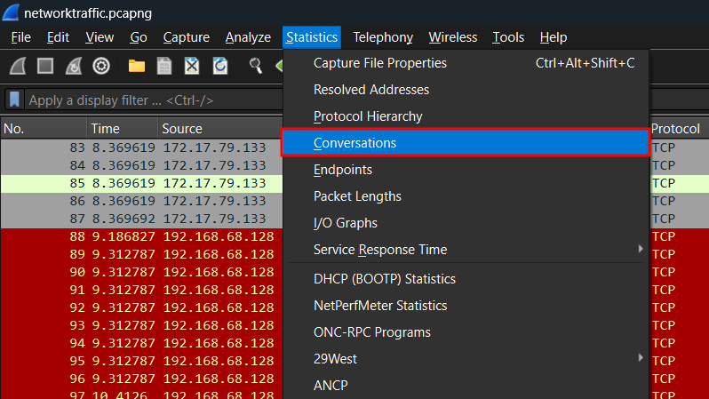
Question wants us to identify an IP address that sends a large amount of traffic to the printer server. Since we know the IP address of the printer server, we can use `Conversations` to view the network conversation between two endpoints.

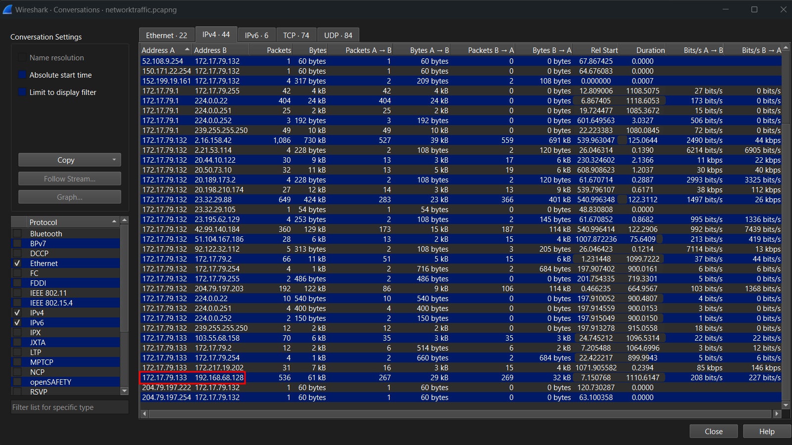
We can filter by looking for the printer server IP address first, then further searching for the endpoint that has the most traffic with it.
      

Answer: `172.17.79.133`

### Task 2
***Bytesparkle being the technical Lead, found traces of port scanning from the same IP identified in previous attack. Which port was then targeted for initial compromise of the printer?***
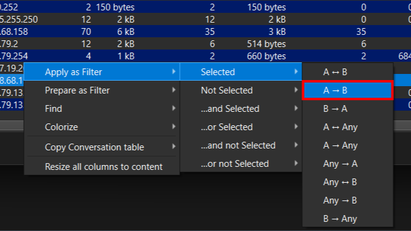
At the same column, apply as filter to get the traffics of the suspicious IP address to the printer server.
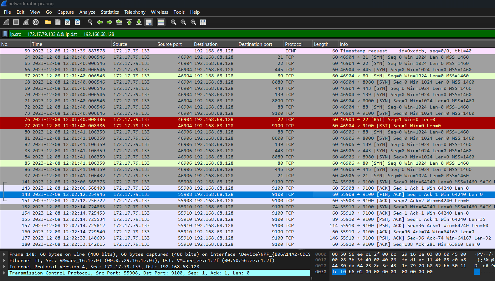
Port scanning activity can be identified here as the suspicious IP address is sending SYN packets to popular port numbers such as 21, 22, 445, 80, 8080, etc. Port 22 and 9100 replied with RST packet which resets the connection as the IP address is identified as unknown host. Since we know that port 22 is for SSH, we can assume that the targeted port is 9100. 
>💡You could search for TCP three-way handshake to know more about the idea behind the port scanning (SYN scan).

      

Answer: `9100`

### Task 3
***What is the full name of printer running on the server?***
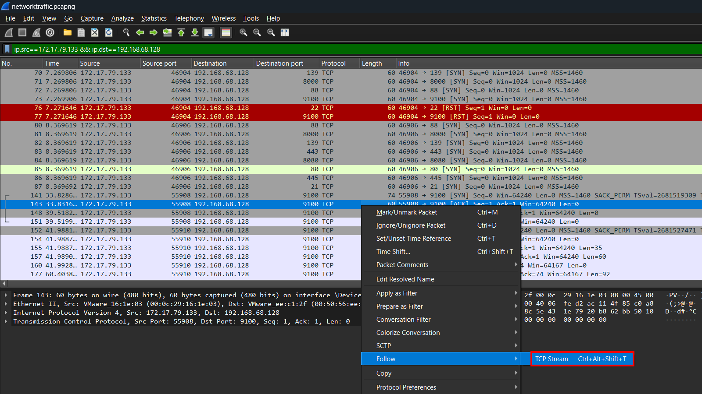
We can follow the TCP stream of the first successful connection with port 9100 to see more information about the traffic.
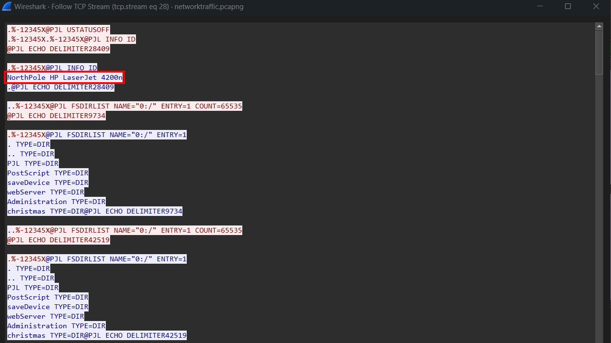
We can go through the stream by clicking the arrow at the bottom right until we see readable stream. We will then get the printer name from the first server response.
    

Answer: `NorthPole HP LaserJet 4200n`

### Task 4
***Grinch intercepted a list of nice and naughty children created by Santa. What was name of the second child on the nice list?***
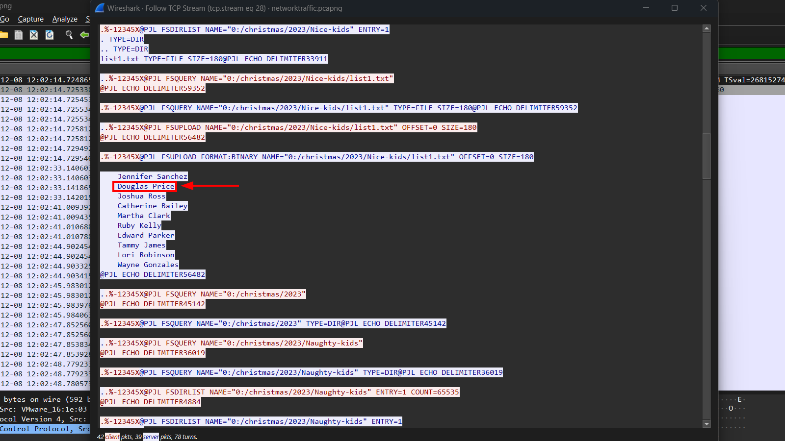
We can see a list of nice kids by reading through the stream.
      

Answer: `Douglas Price`

### Task 5
***The Grinch obtained a print job instruction file intended for a printer used by an employee named Elfin. It appears that Santa and the North Pole management team have made the decision to dismiss Elfin. Could you please provide the word for word rationale behind the decision to terminate Elfin's employment?***
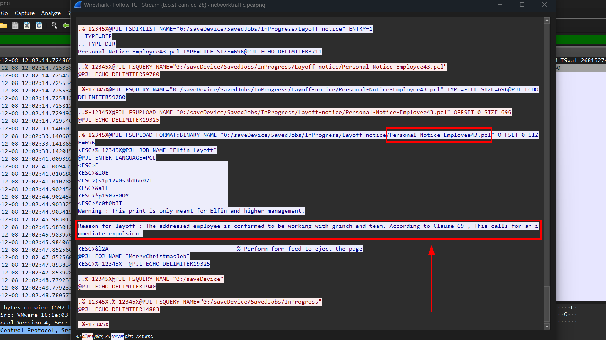
In the same stream, we can get the Personal Notice that is prepared for Elfin.
    

Answer: `The addressed employee is confirmed to be working with grinch and team. According to Clause 69 , This calls for an immediate expulsion.`

### Task 6
***What was the name of the scheduled print job?*** 
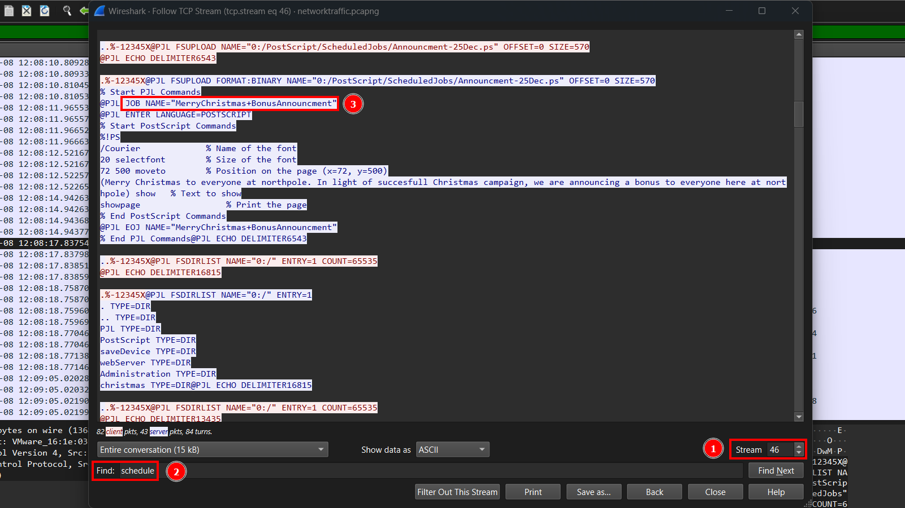
After going through the stream we have not much information to get. Therefore, we can further analyze it by going to another stream. We can use the arrow at the bottom left to go through the stream until we found a readable one. Then, search for strings like "schedule" to get the scheduled print job name.
     

Answer: `MerryChristmas+BonusAnnouncment`

### Task 7
***Amidst our ongoing analysis of the current packet capture, the situation has escalated alarmingly. Our security system has detected signs of post-exploitation activities on a highly critical server, which was supposed to be secure with SSH key-only access. This development has raised serious concerns within the security team. While Bytesparkle is investigating the breach, he speculated that this security incident might be connected to the earlier printer issue. Could you determine and provide the complete path of the file on the printer server that enabled the Grinch to laterally move to this critical server?***
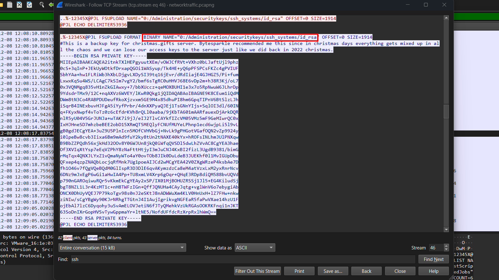
Since we need to find SSH key file path, we can search for strings like "ssh" to get more information.
      

Answer: `/Administration/securitykeys/ssh_systems/id_rsa`

### Task 8
***What is size of this file in bytes?***  
Refer to the image in Task 7. The file size is shown at `SIZE` variable.
   

Answer: `1914`

### Task 9
***What was the hostname of the other compromised critical server?***  
Refer to the image in Task 7. The comment mentioned that the SSH key is a backup key for christmas.gifts server.
     

Answer: `christmas.gifts`

### Task 10
***When did the Grinch attempt to delete a file from the printer? (UTC)***
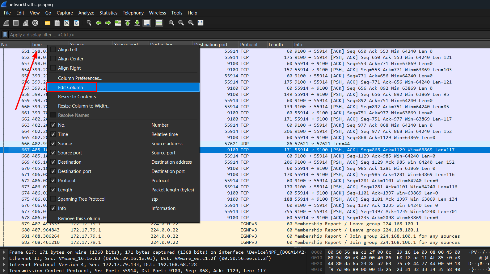
Since we need to answer in a format of YYYY-MM-DD together with time, we need to change the format of the time shown in Wireshark.
Right click `Time` column, select `UTC date, as YYYY-MM-DD, and time`, and click `OK`.
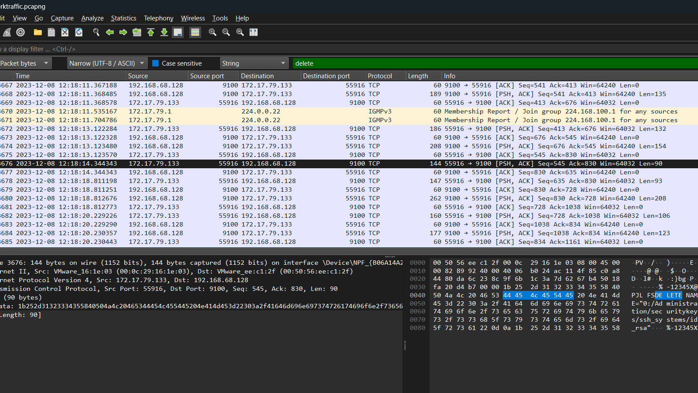
Since we have no idea of how the file deletion traffic looks like, we can use `Edit` > `Find Packet` to search for strings like "delete". With that, we will able to locate the time where Grinch deleted the file.
      

Answer: `2023-12-08 12:18:14`