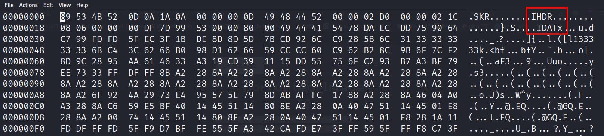
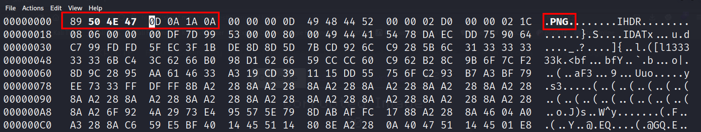

## Description
OMG! My flash drive was corrupted.
Can you help me to recover it?
<br>     
Attachment: `corruptedFile`

## Solution

`file` normally will show the file type of the file. However in this case, the file type is not shown.

```bash
hexedit corruptedFile
```
Therefore, we can try other methods like `hexedit` to see the hex of the file to check the file header. File header is another method to identify the file type.


We can see that there are IHDR and IDAT. We will know that this is a PNG image according to our experience. If you are still new to this and do not know what this is, you could also be able to find it through some google searching.


Through some research, we know that the file header of a PNG image is `89 50 4E 47 0D 0A 1A 0A`. We can then edit the file. Once done, we will be able to identify the file type using `file` command.

```bash
eog corruptedFile
```
We can use `eog` command to view the file. The flag is hidden inside the paragraphs, you could get the flag by combining all the capital letters in the paragraphs.
