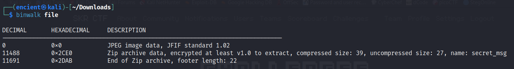
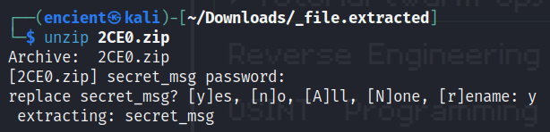

## Description
My friend said that the previous flag is not the real message! Is this file the one that reveals the truth?
<br>    
Attachment: `file`

## Solution

Upon running `binwalk` command, we can see that there is a zip file embedded in this JPEG image.

```bash
binwalk -e file
```
Try extracting the file by running the command above and you will get the zip file.


It requires a password. The password is `skr` (which is quite guessy imo).

```bash
cat secret_msg
```
Use `cat` command to see the content in `secret_msg` and you will get the flag.