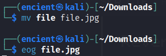

## Description
Kuki send me a weird file that no file extensions, can you figure what file is this??
      
Attachment: `file`

## Solution

The file is given without any extension and hence we do not know what is the file type. Use `file` command to check the file type of the file, and it shows that the file is in JPEG format.

Use `mv` command to rename the file with extension. Then, use `eog` command to view the image. The flag will be shown in the image.

