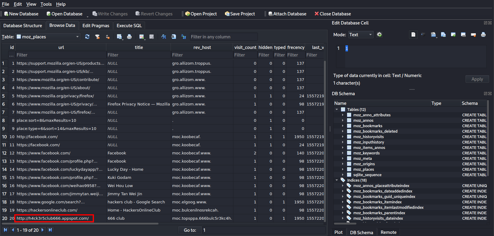
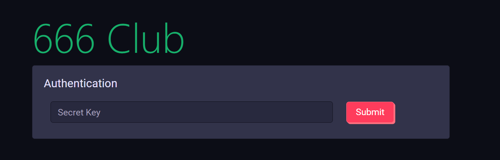
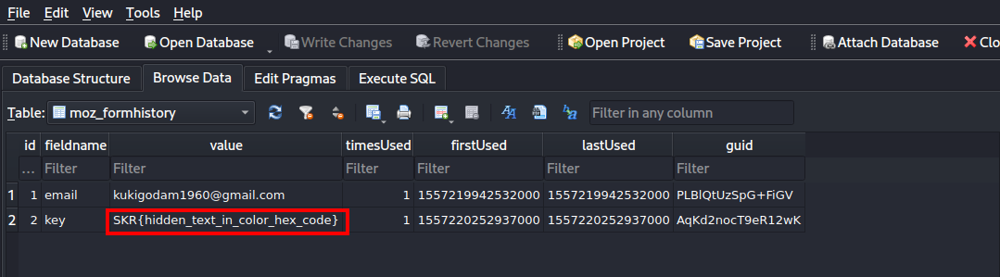
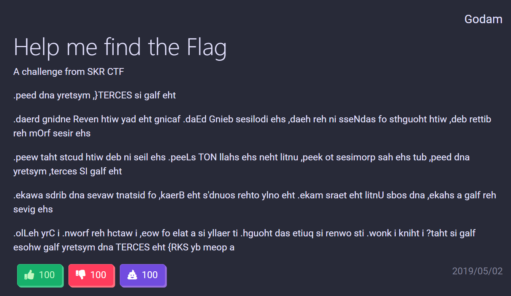
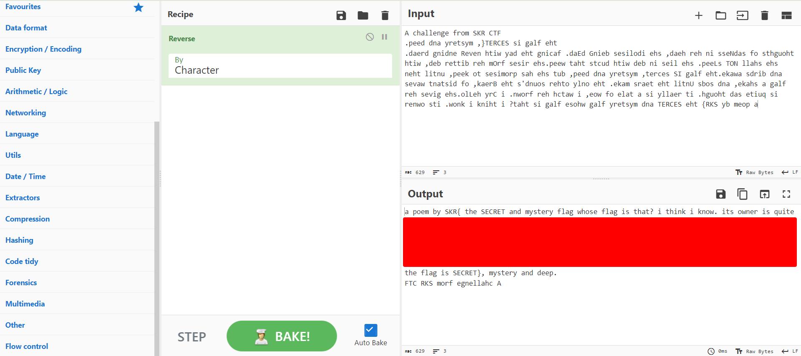

## Description
We managed to recover part of Godam's hard drive in his house, but we couldn't find anything suspicious. We hope you can help us in finding his secret.
      
Attachment: `godam_hard_drive.zip`

## Solution
We were given Mozilla folder which contains the Firefox browser details. There are a lot of them, so we have to know which is the exact file that we have to investigate. This [video](https://www.youtube.com/watch?v=RKgGa6Rc2N8) tells us that we can analyze the artefacts with several information, shown below:
- Browser history: `places.sqlite`
- Browser cookies: `cookies.sqlite`
- Form data (data entered into forms and search boxes): `formhistory.sqlite`

We can use `sqlitebrowser` to analyze the mentioned files. We can go through the browser history in `/home/godam/.mozilla/firefox/profile/places.sqlite`. Note that there is a page with title "666 club". We know that this is related and suspicious as the secret letter (from previous steganography challenge - Secret Letter) is written by 666 club.

Visiting the URL will show us an authentication page which needs a secret key. The secret key is the flag of the previous challenge which is `SKR{hidden_text_in_color_hex_code}`. 

We can also get the secret key from `/home/godam/.mozilla/firefox/profile/formhistory.sqlite`.

Once authenticated, we can see that there is a post about flag in the website. It seems like the alphabets are reversed.

We can reverse it back by using [CyberChef](https://gchq.github.io/CyberChef/) or any other online tool to read the content of the post. The flag is the combination of all the capital letters in the content of the post.