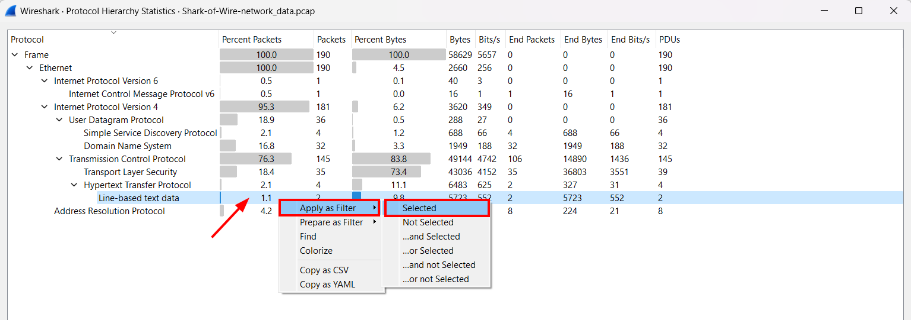
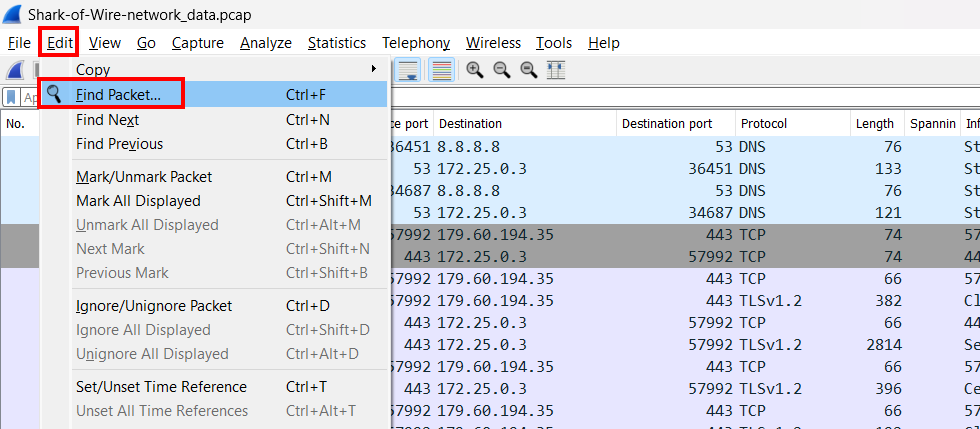
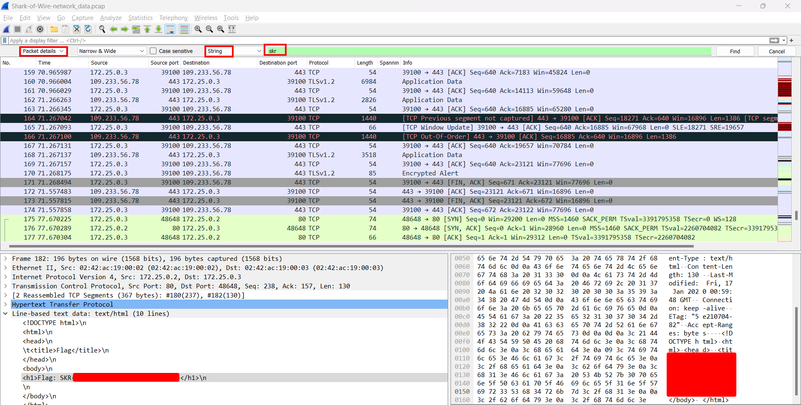

## Description
OMG! I lost all my network history data, luckily I got capture some data on a **pcap** file, maybe the flag is inside the file.
      
Attachment: `network_data.pcap`

## Solution 1
![[CTF Writeups/SKR CTF/Forensics/Attachment/shark-of-wire-1.png]]
Use `Protocol Hierarchy` to have an overview of the pcap file.

We can see that there are several protocols. HTTP protocol is available and there are some line-based text data. Let's try to filter that out and see what's inside.

## Solution 2

Another quicker way to solve this is to find the strings of the flag in packets.

Choose `Packet Details` to see the details of the packet and type the flag format which is "skr" (case insensitive). The flag will be shown in the packet.

