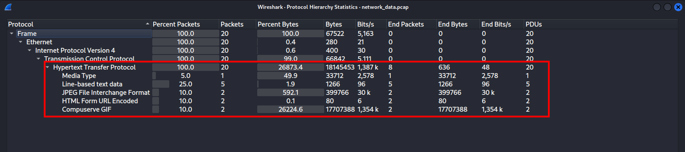
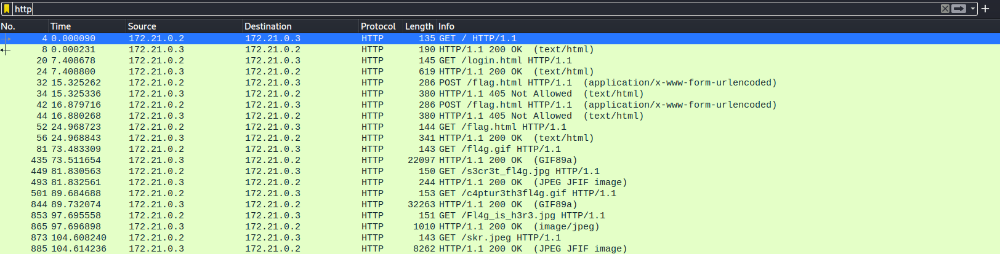
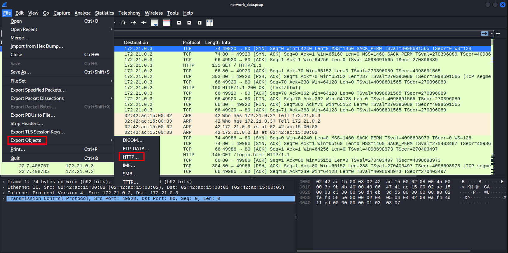
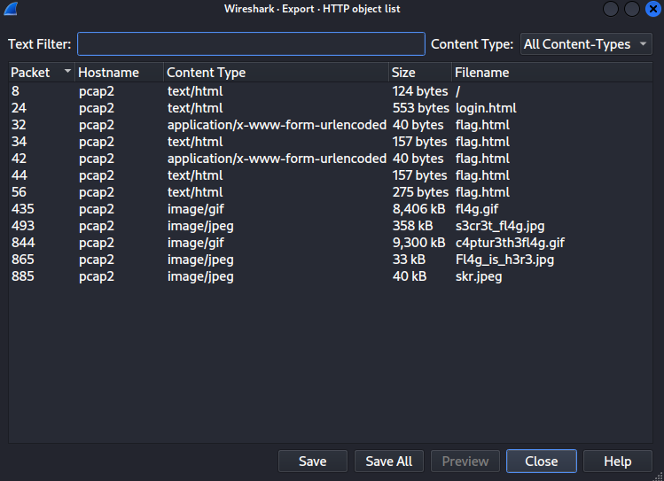
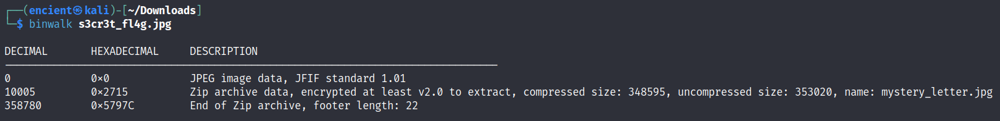
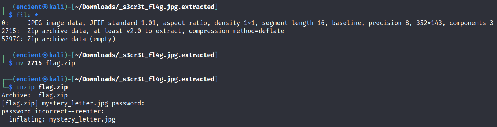
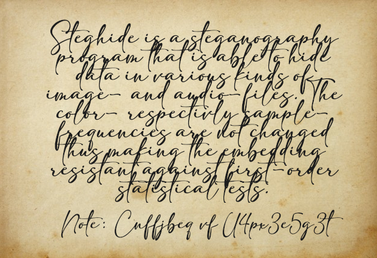
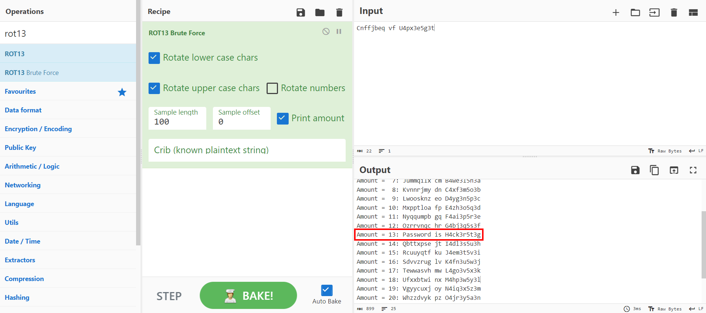
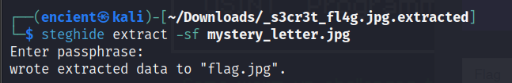
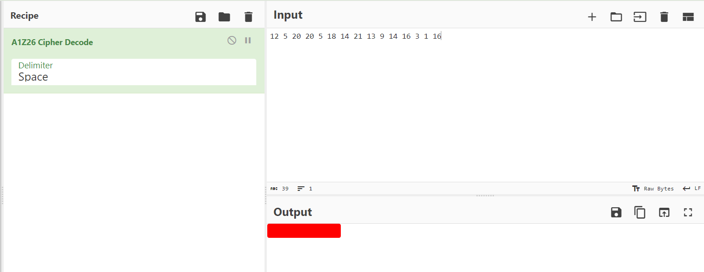

## Description
I lose my network data again... Luckily I always got a [backup pcap file!](https://drive.google.com/open?id=1sX_y8kohgr17fx9c0_lCe3z_7vCdZd6y) Please help me find my "flag" its important!
Note: _There were some stego and crypto elements_

## Solution

When looking at the protocol hierarchy, we can see that there is HTTP protocol, and it seems like there are some data and media going through.


Let us try to filter the HTTP traffic and see what was happened. We can see that there are some JPG and GIF files in the traffic.


Export the objects (HTML, JPG, GIF) from the pcap.


You can choose one by one and click `Save` to save it, or you can click `Save All` to save everything at once.


Analyze the objects and see what is inside. In `flag.html`, there is a username and password, the password is `ilovebinwalk` which kind of giving us a hint where we can use `binwalk` to analyze the JPG and GIF files. `binwalk` is a tool that is very useful to analyze files to check if there is any embedded files inside them. After using `binwalk` for all the files, we can see that `s3cr3t_fl4g.jpg` has a zip file embedded inside, and we can extract it out.

```bash
binwalk -e s3cr3t_fl4g.jpg
```


We can use `file` command to identify the file type, then use `unzip` to unzip the zip file. Note that I used `mv` command to change the file name (so that it looks nicer and more understandable). Once unzip using the password `ilovebinwalk` that can be found in `flag.html`, we will get a JPG image named `mystery_letter.jpg`.


From `mystery_letter.jpg`, we were given hint about `steghide` and there is a note which looks like a cipher in the last line. Since the question mentioned that there is crypto element, we can try to decipher it.


Go to [CyberChef](https://gchq.github.io/CyberChef/)to figure out what is the cipher about and decode it. CyberChef is a tool normally used for cryptographic operations in CTF such as decoding and decrypting. The cipher looks like Caesar Cipher so I chose to use ROT13 brute force. The decoded message is "Password is H4ck3r5t3g", which seems to be the password for `steghide`.


Use the command above for `steghide` to extract the embedded image with the given passphrase `H4ck3r5t3g`. 


The flag given in `flag.jpg` consists of numbers, and we can put into CyberChef again to identify the cipher and get the output as flag.