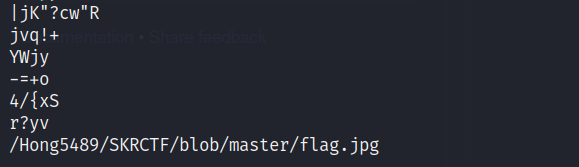
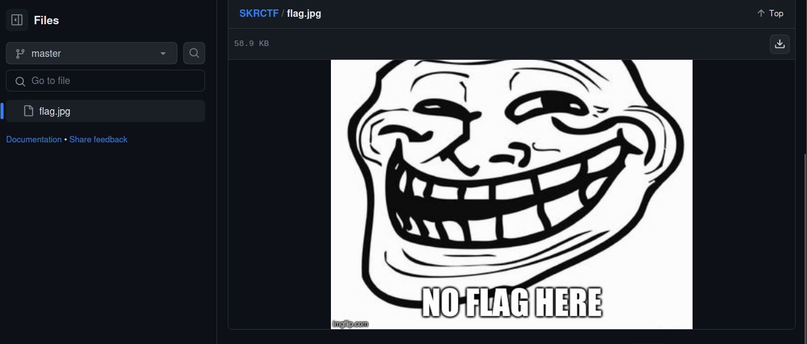
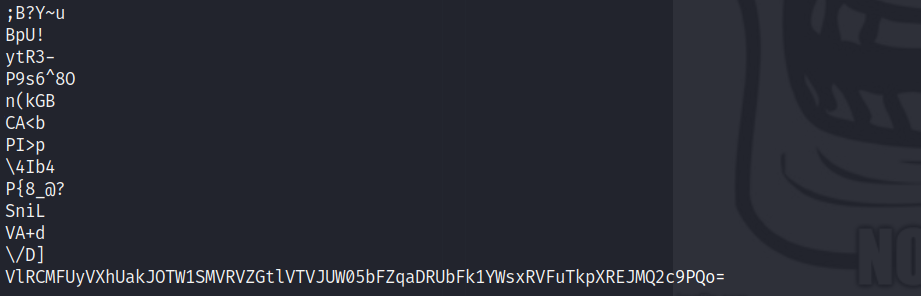
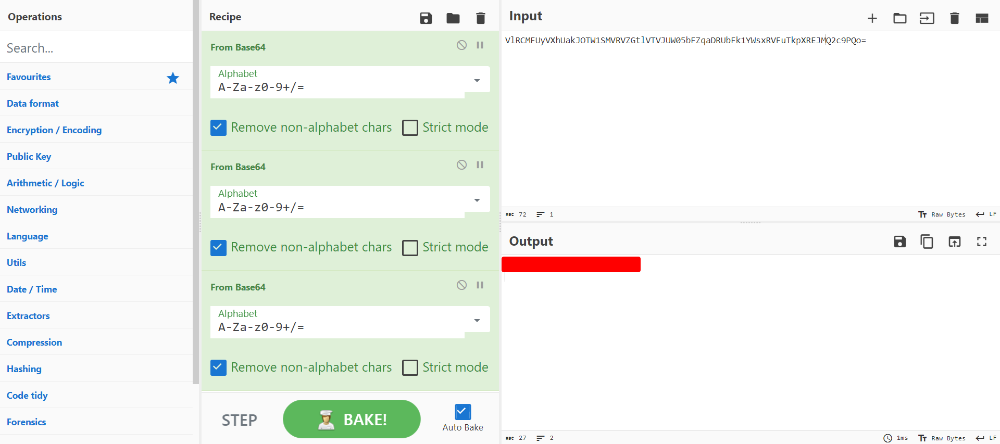

## Description
A picture worth a thousand words...
<br>     
Attachment: `github.com.jpg`

## Solution
```bash
strings github.com.jpg
```
Use `strings` command to view the printable text of the image.


We can see that there is a line which is related to SKRCTF and flag. Since the image name is `github.com.jpg`, it kind of gives us a hint that this might be a URL.


Go to the [website](https://github.com/Hong5489/SKRCTF/blob/master/flag.jpg) and we will see that there is another image. Download and analyze it. 


By using the same command which is `strings`, we will notice that there is a suspicious cipher in the last line of the image.


Put it into [CyberChef](https://gchq.github.io/CyberChef) and decipher it. CyberChef is a useful tool for CTF players for cryptographic operations like decoding and decrypting. By decoding 3 times of Base64, the flag will be shown in the output section.