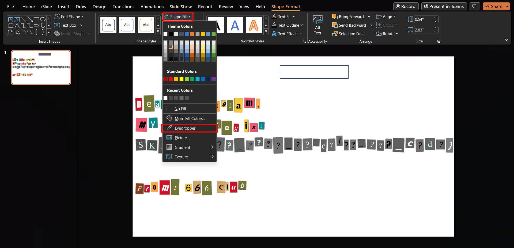
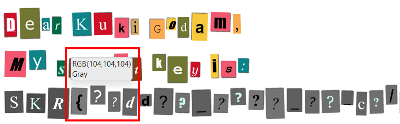
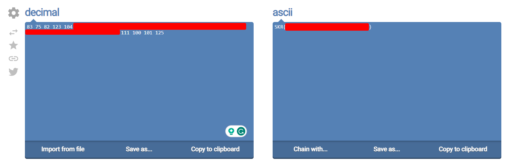

## Description
I found this letter from Kuki Godam house, but I cannot guess what the secret key is. Can you figure out what message his friend is hiding?

## Solution
In the given PNG image, the flag is greyed out. The hint given in the question tells us that they hide the message in colour codes. Therefore, we have to find out the colour for each letter of the greyed out section.

Insert the image into PowerPoint, create a shape, and choose `eyedropper` in the shape fill section. You could also use other online tools to get the colour code using the same way (use eyedropper to check the colour).

Hover the eyedropper to each of the colour one by one, and you will get the colour code in decimal. Notice that the RGB has repeated value, which in this case is 104, which is a decimal representation of the colour code. Note that colour code can be represented in hex value too, for example: #686868.

Since the code we have is in decimal format, we can search for [online tool](https://onlinetools.com/ascii/convert-decimal-to-ascii) to convert decimal to ASCII, and we will get the flag.