# Build a Linux Profile for Volatility 2
*Step-by-step guide on building an Ubuntu profile for Volatility 2 and fixing the errors.*
<!-- more -->

## Introduction
---
When we are doing memory analysis using [Volatility 2](https://github.com/volatilityfoundation/volatility), we have to specify the profile of the memory dump. This ensures the tool analyzes the memory dump correctly and provides accurate results. In this blog, I will be writing on how to build a Linux (Ubuntu) profile on Volatility 2 for memory analysis. It might sound easy at first, but you might face a lot of errors during the process.

I will be going through from start, which is when we get the memory dump and identify the profile, all the way through building the profile in Volatility 2 and fixing bugs and errors. I will be using the memory dump that I got from a CTF competition, named `cydes.raw`.

!!! note "Steps to build a new Volatility 2 profile"
    1. Create virtual machine with the operating system we need
    2. Update to the specific kernel version we need
    3. Build profile and create profile
    4. Move the profile to Volatility in our own machine


## Why Create Profile?
---
Volatility 2 does not have any Linux profile by default. All the profiles available are in Windows operating system.
```
python2 vol.py --info | grep Profile
```
We can use the command above to see all the profiles available in Volatility 2.

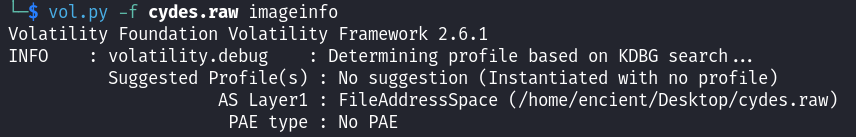
/// caption

///
Therefore, when we are going to analyze the memory dump with the profile that is not available in default Volatility 2, `imageinfo` plugin will show that there is no suggested profile, as it could not find any information from the available profile.

## Start Building
---
In order to build a Linux profile, we need to identify which distribution and kernel version used.

```
strings <FILE> | grep -i "GNU/Linux"
```

We can use the command above to get more information that we want.

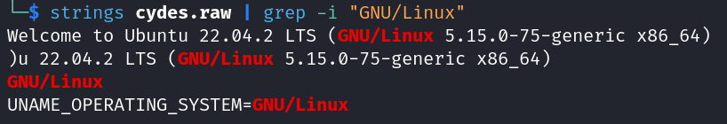
/// caption

///
Based on the output, we know it is running Ubuntu 22.04 LTS, with the kernel version of `5.15.0-75-generic x86_64`. Therefore, we need to install an Ubuntu 22.04 LTS virtual machine to get the kernel profile.

!!! tip
    Some people use docker instead of creating the entire virtual machine, you can find more information [here](https://beguier.eu/nicolas/articles/security-tips-3-volatility-linux-profiles.html).


### Configuring Virtual Machine
Once the installation of the Ubuntu virtual machine is done, we need to update the kernel version to the version we would like to build a profile for.
```
sudo apt update
sudo apt install linux-image-5.15.0-75-generic
sudo apt install linux-headers-5.15.0-75-generic
```
!!! info
    `linux-image-5.15.0-75-generic`: It is the actual kernel that will be running

    `linux-headers-5.15.0-75-generic`: It is the kernel header that has the necessary information for compiling software

After that, we need to reboot the machine to update the changes.

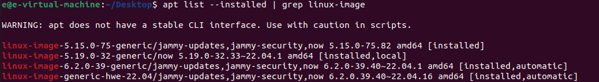
/// caption

///
Once rebooted, we can list all the downloaded kernels to verify the installation.

#### Error: Original kernel is more up-to-date

If the kernel from the virtual machine we downloaded is more up-to-date, it will not update the kernel we want for us. 

```
uname -r
```

You can use the command above to verify if your kernel has been loaded successfully as it will show the kernel version that the system is currently running.

If the kernel version remains the same, we need to downgrade the kernel version by choosing the kernel version in GRUB menu.

!!! info
    **GRUB menu** is an interface that allows user to choose the kernel version when a Linux operating system is booted.


To load GRUB menu, you can use shortcuts (refer [here](https://en.linuxportal.info/tutorials/tips-tricks/how-do-we-show-or-hide-the-grub-boot-menu-at-boot-time-in-ubuntu-operating-systems)), but that did not work for me so I will use another method which will show GRUB menu every time the system boots.

```
sudo nano /etc/default/grub
```

We can use `nano` to edit the GRUB menu configuration file.

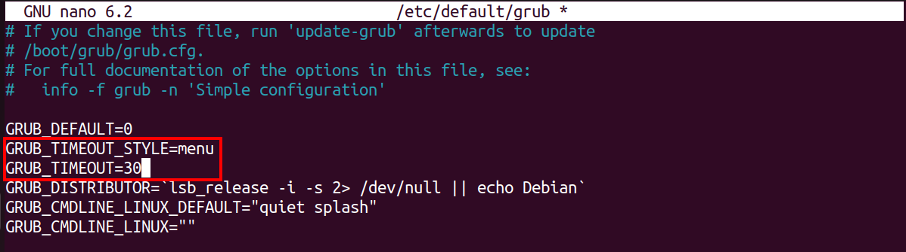
/// caption

///
Edit `GRUB_TIMEOUT_STYLE` variable and `GRUB_TIMEOUT` variable to the value above so that the menu will appear when the system boots.


!!! tip
    You can put any value you prefer for `GRUB_TIMEOUT` other than 0. If you put 30, it means it will be timed out after 30 seconds and continue booting the system if you left the menu unselected.


```
sudo update-grub
```

Once done editing, run the command above to update the configuration. Then, restart the machine to load GRUB menu.

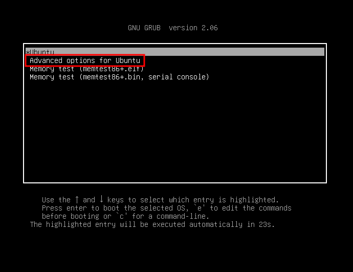
/// caption

///

Once GRUB menu loaded, choose `Advanced options for Ubuntu`.

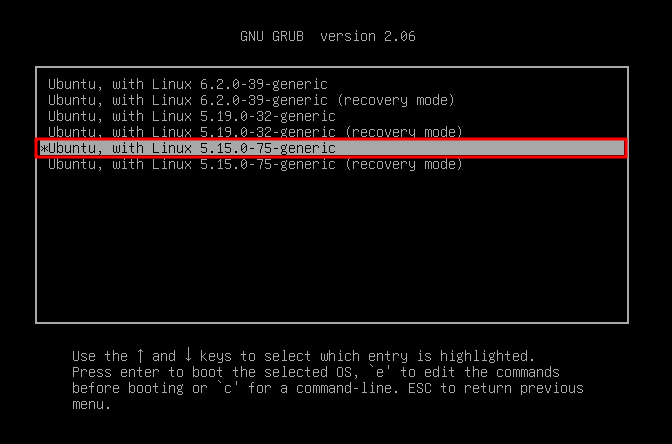
/// caption

///
Then select the kernel version that we would like it to load.

### Build Profile

Now we are moving on to build the profile. Before we start, let’s install some of the tools:

```
sudo apt install dwarfdump build-essential 
```
!!! info
    `dwarfdump`:  A tool that analyzes and dumps the DWARF debugging information.

    `build-essential`: Meta-packages (a set of packages) that are necessary for compiling software.

    DWARF: A file format for debugging information.


Let’s install the most important tool: Volatility 2

```
sudo apt install git
git clone https://github.com/volatilityfoundation/volatility.git
python2 setup.py install
```

Then, change directory to `volatility/tools/linux` to compile necessary components to build the profile by using the command `make`.

#### Error: Missing MODULE_LICENSE()

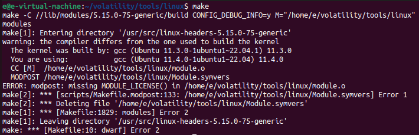
/// caption

///
You might encounter this error where it says “missing MODULE_LICENSE()”. You will need to add one line to `module.c` file to mention about the MODULE_LICENSE.

```
echo 'MODULE_LICENSE("GPL");' >> module.c
```

This will add the license to the last line of `module.c` file, which will then solve the problem. For more information, you can refer [here](https://github.com/volatilityfoundation/volatility/issues/812).

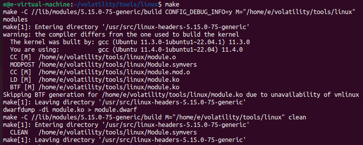
/// caption

///
The image above shows the successful output of `make` command which successfully created a `module.dwarf` file for us. 

### Add Profile into Volatility 2

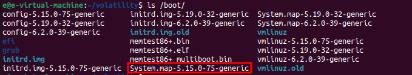
/// caption

///
Get the [System.map](http://System.map) of our specific kernel version and copy the file name to be used later. System.map has the physical memory location for everything that is required by kernel, and we are going to use it to build our profile.

```
sudo zip volatility/plugins/overlays/linux/Ubuntu2204-515.zip tools/linux/module.dwarf /boot/System.map-5.15.0-75-generic
```
!!! info
    `volatility/plugins/overlays/linux/Ubuntu2204-515.zip`: This is the file name that will be created (and its path). It will be shown later as the profile name in Volatility

    `tools/linux/module.dwarf` & `/boot/System.map-5.15.0-75-generic`: These two files will be zipped and it will be the profile (which is `Ubuntu2204-515.zip`)

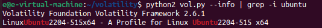
/// caption

///
Then, run volatility with `--info` to get the information page which will list available profiles and commands of Volatility. Use `grep` to search for string “ubuntu”, and `-i` will help search for the string case-insensitively.

## Move Profile to Own Machine
---
Once the profile created, we can then move the profile to our own machine to analyze our memory dump with the newly created profile.

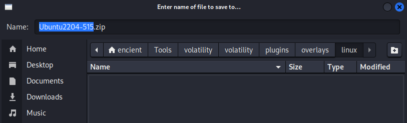
/// caption

///
You can download the profile to the same location as mentioned in section before.

!!! tip
    There are many ways to transfer the file, you can just drag and drop from virtual machine to host machine, or in my case I hosted a web server to transfer the file.


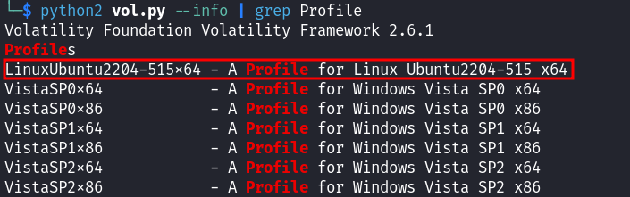
/// caption

///
Once done, run the same command again to verify the successful import of the profile. I `grep` ”Profile” this time to see all the profiles available.

### KeyError: ‘DW_AT_data_member_location’

Although everything seems done and successful, we might face the error below when we are to use start analyzing our memory dump using the newly imported profile:

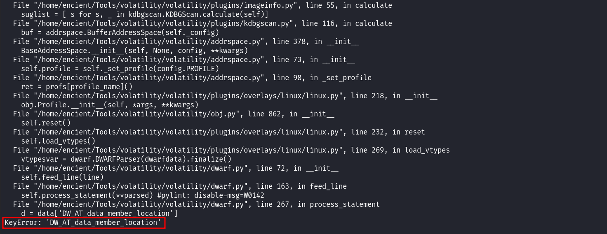
/// caption

///
It is common Volatility 2 issue as it does not support newer kernels, which you could find the issue [here](https://github.com/volatilityfoundation/volatility/issues/828). 

```
git clone https://github.com/miszr/volatility.git
git branch -a
git checkout dwarf-5
git merge origin/patch-1
```

The solution has been given [here](https://github.com/miszr/volatility/tree/dwarf-5), where we need to clone another version of Volatility 2. 

!!! info
    `git branch -a`: Show all branches available

    `git checkout dwarf-5`: Switch to branch named `dwarf-5`

    `git merge origin/patch-1`: Merge changes from `origin/patch-1` branch with `dwarf-5` 

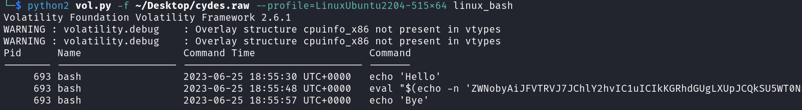
/// caption

///
With this, we can then successfully analyze our memory dump without any issues.

## Resources
---
- [HTB CTF Compromised Writeup](https://ctftime.org/writeup/29392)
- [GRUB Menu Not Showing on Boot](https://youtu.be/7od9dPf4gnM?si=TlmVnY1MLIeIDNZy)
- [Volatility Memory Analysis: Building Kernel Profiles](https://youtu.be/qoplmHxmOp4?si=Aj2BoVFLgWQ0Z-l4)
- [Official Volatility Page for Building Linux Profiles](https://github.com/volatilityfoundation/volatility/wiki/Linux)

## Special thanks
---
- [zachwong02](https://zachwong02.github.io/)