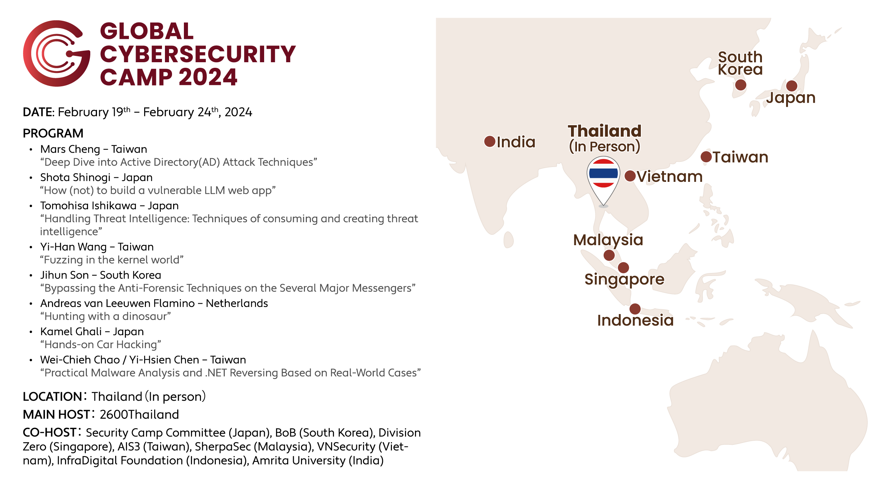
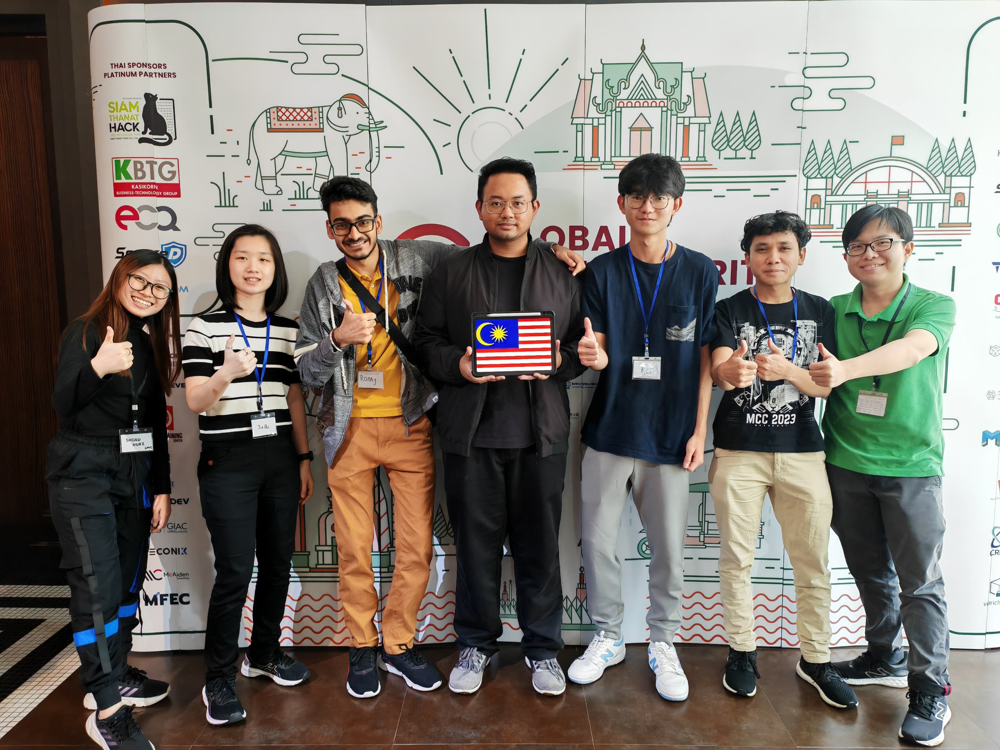
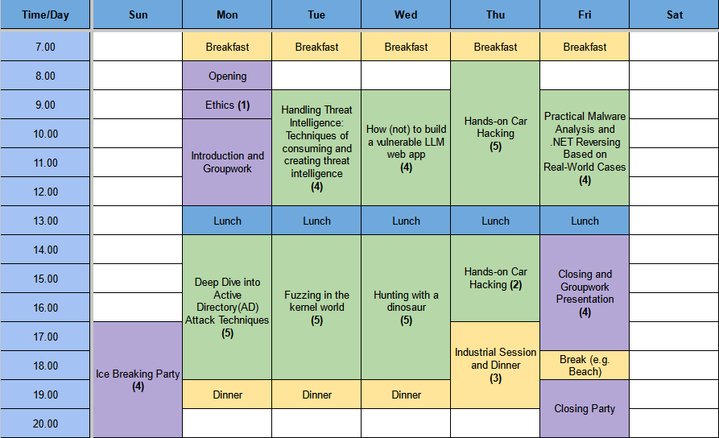
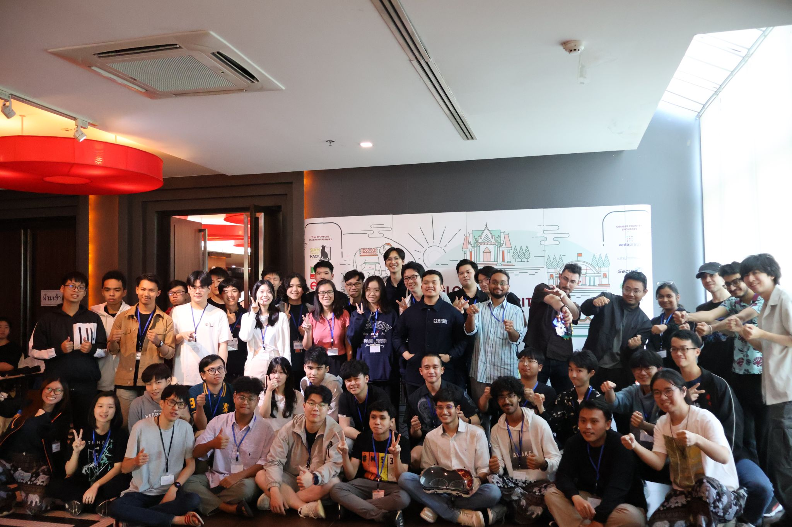

# GCC 2024: Participant's Experience
*Sharing my experience as the only female participant from Malaysia in Glocal Cybersecurity Camp (GCC) 2024.*
<!-- more -->

## Overview
---

Recently, I was given an opportunity to attend [GCC 2024](https://gcc.ac/gcc_2024/) which was held in Chon Buri, Thailand. GCC is a global camp that involves people from different countries so that we can connect together.

I am glad and proud to be one of the five representatives from Malaysia for attending this camp as a participant! This is a photo taken together with [SherpaSec](https://www.linkedin.com/company/sherpasec/) staff, thanks for their effort bringing us here~

## Trainings
---

The journey kicked off with a delightful dinner party on day 0 (Sunday), providing an excellent opportunity to make new friends. Following this, we delved into 5 days of training sessions covering various topics.

All the trainings were pretty interesting. One of the most memorable trainings is "Hunting with a Dinosaur", where we learned to use Velociraptor to perform threat hunting. The trainer created a very interesting storyline (he told me he cracked his head and spent a lot of time for this storyline, appreciate his effort!), which consists of three victim machines and all of them are interconnected. Our task was to use Velociraptor to perform threat hunting and digital forensics on those machines and try to find their relationship and connect the story.

Another training was about threat intelligence. The trainer gave us an in-depth explanation on threat intelligence which was extremely insightful. The trainer was super nice and tried to answer all our questions until we understand everything.

Throughout the training, we were fueled by coffee (provided by hotel) and enjoyed snacks from different countries, generously provided by the participants. The snacks were great and coffee kept us awake throughout the day!

## Group Project
---

On the first day of training, we were assigned to groups with members from different countries, and each group was given a topic to work on the group project. On the last day of the training, we would need to do a short presentation on our group project. 

This collaborative approach not only facilitated group members working closely together but also strengthened the bonds among us. I really enjoyed working together with my groupmates throughout the camp!  From initial research to development and presentation, we shared a rollercoaster of emotions — confusion, stress, happiness, relief — forging lasting connections between us.

## Conclusion
---

Overall, I enjoyed this camp a lot. Meeting new people from different countries and understanding more about their culture, education, and cybersecurity-related events in their countries allowed me to expand my own knowledge. Everyone in this camp has different specialties and interests in different field, which allowed us to exchange and share our knowledge to one another.

Once again thanks to our sponsor [SherpaSec](https://www.linkedin.com/company/sherpasec/) as well as the organizers for GCC 2024! Hope to meet everyone again in the future~