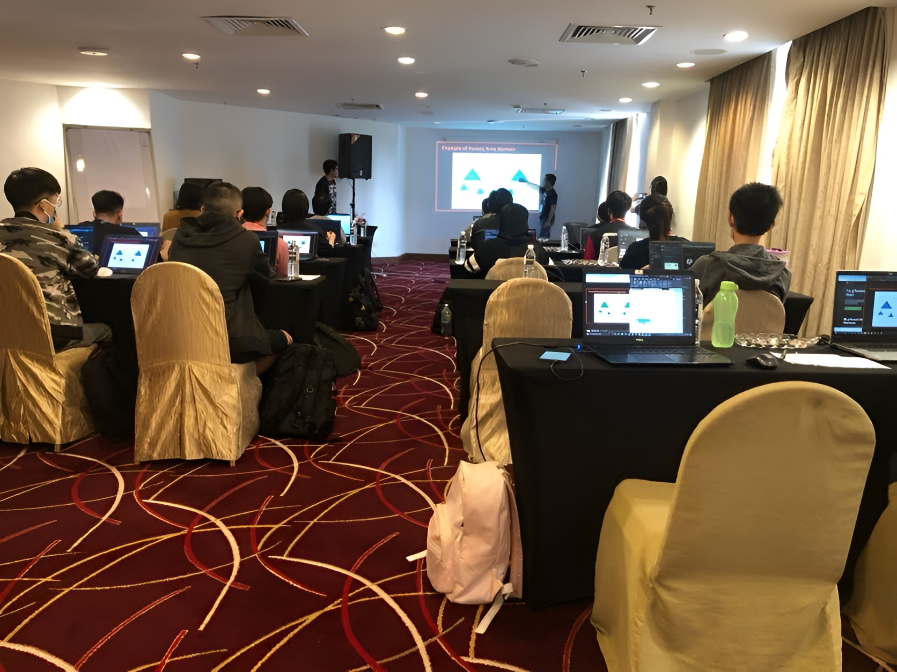
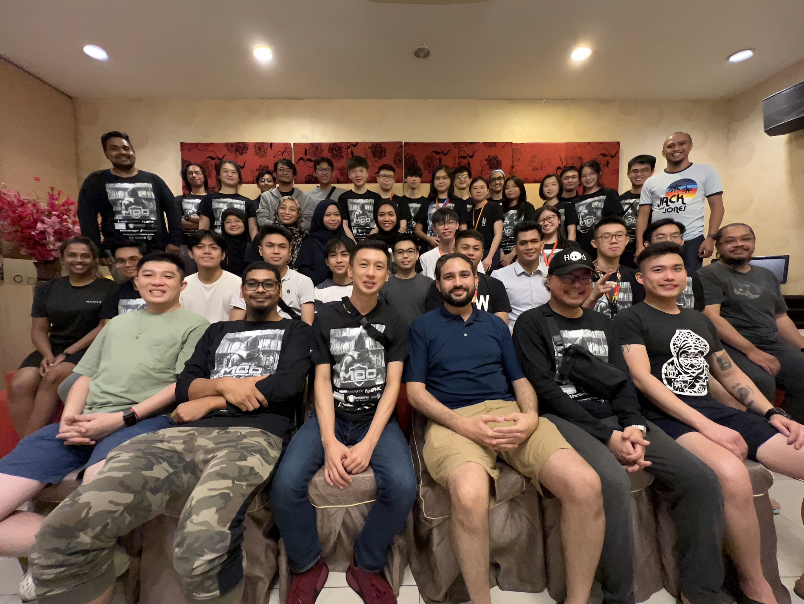

# MCC 2022: Participant's Experience
*Sharing my experience as a participant in Malaysian Cybersecurity Camp (MCC) 2022.*
<!-- more -->

## What is MCC?
---
MCC, also known as Malaysia Cybersecurity Camp, is a cybersecurity event organized by RE:HACK and NanoSec Asia. It aims to reduce the gap between students and professionals while providing the chance for students to build connection with local cybersecurity experts. It is a closed event, only the selected students can be invited to the event. Students have to submit the registration form and go through the interview in order to participate in this event. In this blog post, I will be sharing my experience in this event, from the captivating trainings and group assignments to the memorable interactions with fellow participants and industry leaders.

## Experience in MCC 2022
---
### Preparing for MCC
I was called for an interview few months after I submitted the registration form. There were few people in the interview, including organizers and crews. All of them were very friendly, and the interview was mainly to know more about us. I thought I did badly in the interview and had no chance to join this event, until I received an email telling me that I was selected to MCC 2022...

## Activities in MCC 2022
---
[MCC 2022](https://cybercamp.my/2022/07/25/mcc-2022-the-first-edition/) was a 4-day event, with 2 days of trainings. The trainings consisted of both red teaming and blue teaming, and students can choose the training that they prefer.

All trainers were local cybersecurity experts from various industries, which were passionate in cybersecurity and keened to provide training to students.

Apart from trainings, we (participants of MCC 2022) were also assigned to groups so that we can work together with our groupmates throughout this 4-day event. We were also given several assignments that were created by the MCC crews. All of us had to work in our own group to solve the assignment, and present them to the crews.

### Memorable Moments and Lasting Connections
All the organizers, crews and trainers are very friendly, which allowed me to easily blend in and build connection with them. As we were given group assignments to do, I had the chance to know more about my groupmates and communicate with them, while enjoyed solving the assignment as a team. During dinner time, some of my groupmates drove us to eat outside together, which further enhance our friendship!

During the 2 days of training, the trainers were very approachable and patient, which allowed all of us to ask questions freely whenever we need more explanation on any specific topic.

On the last day of the event, we had a dinner with organizers, sponsors, trainers and crews. There were some short talks, small prize giving ceremony, and networking sessions for everyone to keep in touch in the future.

Even though the event lasted only four days, we manage to build a strong and good connections with one another. We joined events and talks together, and even organized meetups to spend more time bonding.

## Lesson Learned and Growth
---
### Build a Supportive Community
It was an extremely valuable experience as it immersed me in a community of like-minded individuals driven by a shared passion and common goals. Interacting with this community not only helped me a lot in terms of giving me the exposure of the cybersecurity field, but also in terms of mental support which was the motivation to learn more and always be "hungry" to strive for knowledge.

### Share Knowledge for Mutual Benefit
The diverse knowledge levels within the MCC community presented opportunities for mutual growth through knowledge sharing. I am grateful to meet all the awesome participants who did not hesitate to share knowledge to me, which allowed me to further improve myself while fostering meaningful relationship.

### Embrace the Power of Inquiry
Through MCC 2022, I learned the importance of shedding shyness when it comes to seeking answers. As we progress in our learning journey, we discover the vastness of our knowledge gaps. Thus, it is crucial to overcome hesitation and ask the right questions. By reaching out to others and seeking guidance, we can overcome obstacles and continue our growth.

## Conclusion
---
I am very grateful and thankful for being invited to join as a participant in MCC 2022. It was an extremely good opportunity for me to improve myself and build connections with others. If you are interested and would like to know more about this event, feel free to check out their [official website](https://cybercamp.my/).