# Deploy T-Pot in Azure Cloud for Free
*Step-by-step guide on deploying an open-source honeypot named T-Pot in Azure Cloud using free student credit.*
<!-- more -->

[T-Pot](https://github.com/telekom-security/tpotce) is an all-in-one honeypot platform that is open-source. It integrates 20+ honeypots in a docker-based environment for us to study and analyze various attack vectors.
  
In this blog, we will be guiding you through step-by-step on deploying T-Pot in Azure cloud.

## Azure for Students
---
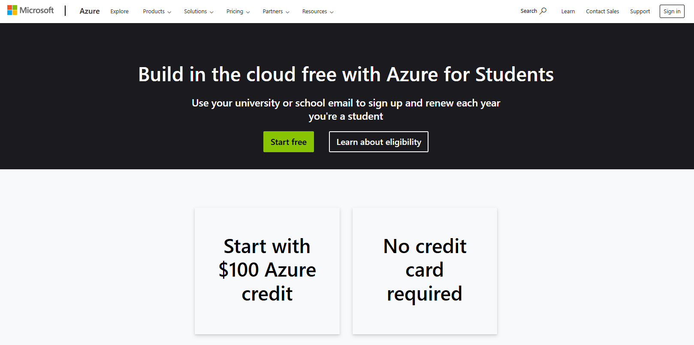
For students, Azure provides free $100 Azure credit without any credit card required. This is a good opportunity to allow students to learn more about cloud infrastructure. More details about the free student plan can be found [here](https://azure.microsoft.com/en-us/free/students/).

There is also a post about this on [T-Pot discussion page](https://github.com/telekom-security/tpotce/discussions/1710), guiding us for deploying T-Pot in cloud, and we will be following the guide with more detailed explanation for it.  

A big shout-out to the author for sharing this valuable guide in the discussion!

## Deploy a Virtual Machine in Azure Cloud
---
### Get Subscription ID
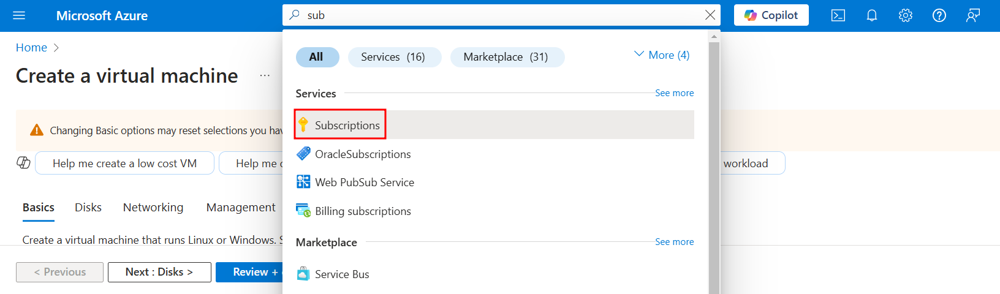
Before we start to create a virtual machine, we need to get subscription ID for further usage later. In the search bar, search for `Subscriptions` and go to the page. <br>   
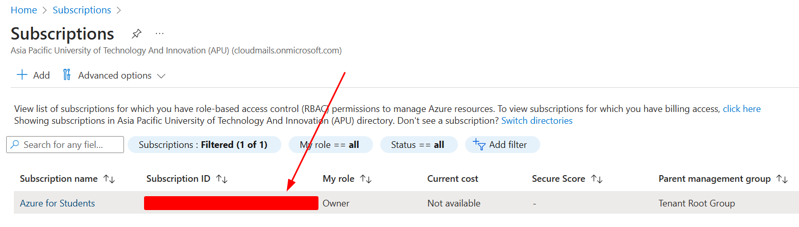
You can get your subscription ID here. Save it for further usage. <br>   
### Open Azure Cloud Shell
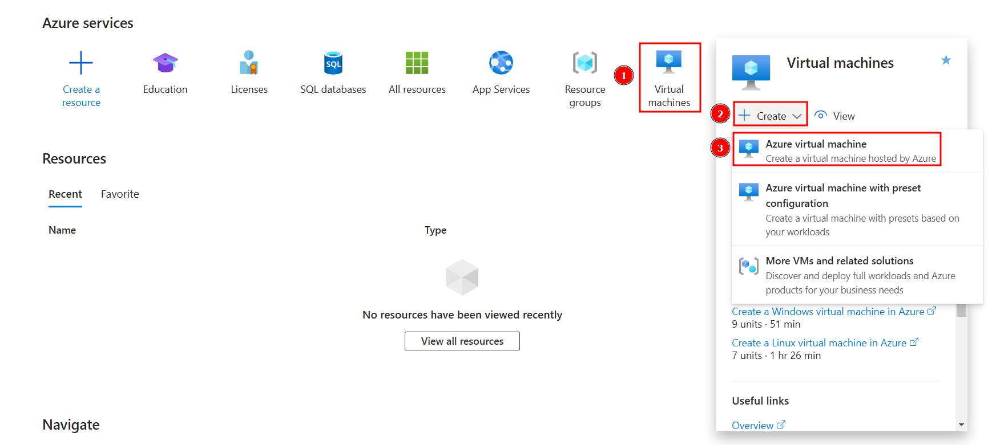
Now go back to home page by clicking `Home` and will be redirected to this page. You will then need to create an Azure virtual machine following the steps above. <br>   
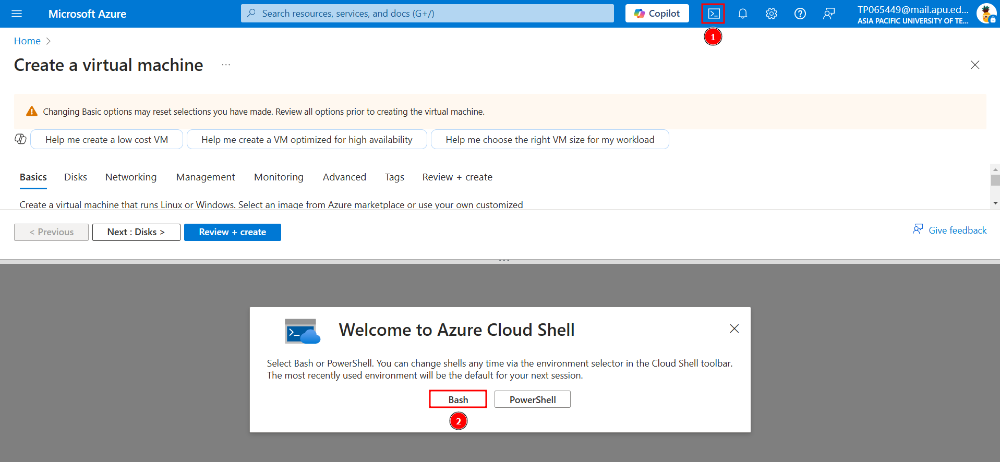
Following the guide from the T-Pot discussion, we will be using CLI to create our virtual machine instead of GUI so it is much more efficient. Make sure to open Azure Cloud Shell following the steps above, and we will be diving into the command line configuration in the following steps. 

### Create a Virtual Machine
This step is used to set the active subscription for our Azure account. It may not be necessary, but it can help avoid confusion in some cases according to the discussion guideline.
```
az account set --subscription [subscription-id]
```

Now we will be creating networking components which are resource group, virtual network (VNet), subnet, and network security group (NSG) using the commands below:

```
# create a new resource group in a specific Azure region
# you can choose location closest to you (eg. 'southeastasia', 'eastus')
az group create --name rg-tpot --location 'southeastasia'

# create a Virtual Network (VNet)
az network vnet create --resource-group rg-tpot --location southeastasia --name vnet-tpot --address-prefixes 10.0.0.0/16

# create a subnet within an existing Azure VNet
az network vnet subnet create --resource-group rg-tpot --vnet-name vnet-tpot --name subnet-tpot --address-prefixes 10.0.0.0/24

# create a Network Security Group (NSG)
az network nsg create --resource-group rg-tpot --name nsg-tpot
```

Now we will be setting up NSG rules that only allow our public IP address (*can be IP address of our home computer, or the subnet used by our campus*) to access the admin ports of T-Pot. You can get your own IP address by going to [https://whatismyipaddress.com](https://whatismyipaddress.com/). Replace `[ip-address]` with your own IP address.
```
# add a rule to an existing NSG
az network nsg rule create --resource-group rg-tpot --name AdminAccess1-tpot --nsg-name nsg-tpot --direction Inbound --priority 200 --source-address-prefixes [ip-address] --destination-port-ranges 64294-64297 --access Allow

# create a deny rule in NSG that blocks inbound traffic to specific ports
az network nsg rule create --resource-group rg-tpot --name BlockAdminPorts-tpot --nsg-name nsg-tpot --direction Inbound --priority 300 --destination-port-ranges 64294-64297 --access Deny

# create a rule in NSG that allows all inbound traffic on all ports as a "catch-all" rule
az network nsg rule create --resource-group rg-tpot --name AllowAllElse-tpot --nsg-name nsg-tpot --direction Inbound --priority 400 --destination-port-ranges 0-65535 --access Allow
```

Now we can create a virtual machine named "vm-tpot" using the command below:
```
# deploy a new VM
az vm create --name vm-tpot --resource-group rg-tpot --image Canonical:ubuntu-24_04-lts:server:latest --admin-username [your-username] --admin-password "[your-password]" --vnet-name vnet-tpot --subnet subnet-tpot --size Standard_B4ms --public-ip-address-allocation static --nsg nsg-tpot --no-wait
```

### Configure the Virtual Machine
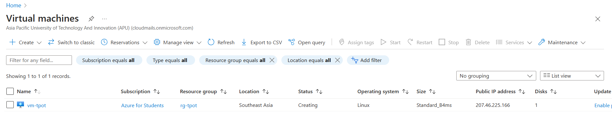
Use the search bar to search for `Virtual machines` page. The virtual machine will be in "creating" status initially, and you will need to refresh until you see the status is "running". <br>   
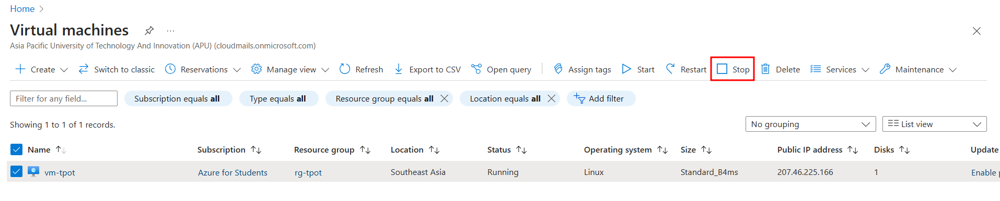
After the virtual machine is created and running, stop it and wait for it to halt. <br>   
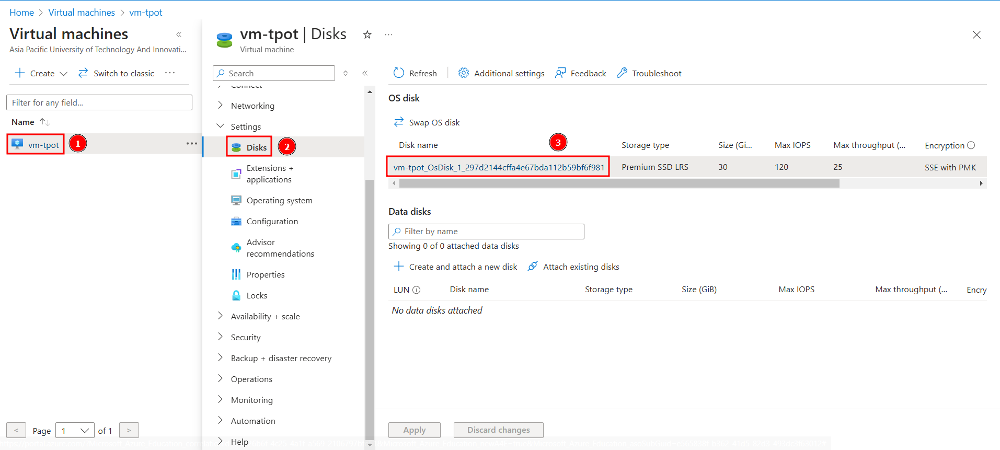
In the Azure GUI for the VM, open `Settings` -> `Disks`. Click on your OS Disk. <br>   
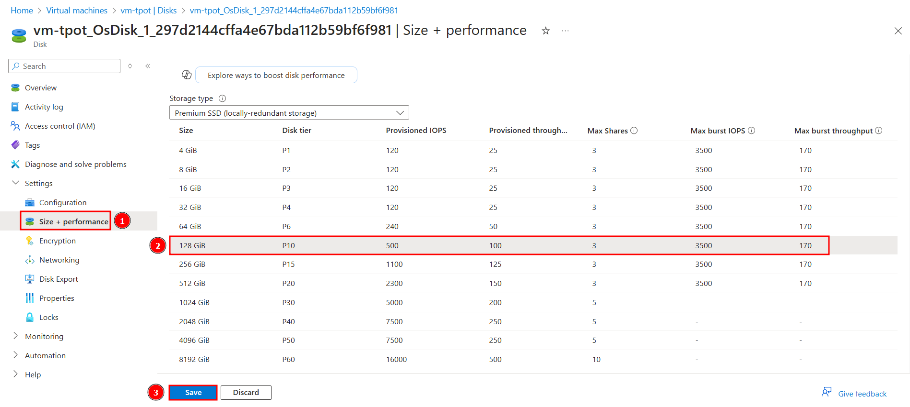
Then, in `Size + Performance`, select 128GB, and then `Save`. You can refer to T-Pot system requirement [here](https://github.com/telekom-security/tpotce/blob/master/README.md#system-requirements). Considering we are using $100 credit, 128GB storage should be sufficient for us to collect at least a week of logs. Make sure to occasionally check your machine to see if you have free storage space, as filling up the storage will crash the system.

## Install T-Pot in the Virtual Machine
---
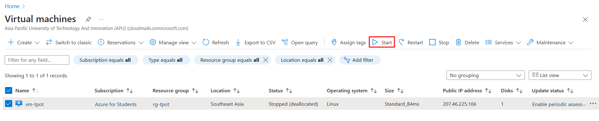
With our Ubuntu Server virtual machine up and running, we can now connect to it via SSH to install and run T-Pot.

Connect to the virtual machine using the following command:
```
ssh [username]@[vm-public-ip-address]
```

After connecting to the virtual machine, start by updating the packaging lists with:
```
sudo apt update
```

Next, install T-Pot by following the official instructions [here](https://github.com/telekom-security/tpotce?tab=readme-ov-file#get-and-install-t-pot), or you can refer to the command below:
```
git clone https://github.com/telekom-security/tpotce
cd tpotce
./install.sh

# when prompted, choose "h" for T-Pot Hive/Standard

# once done, reboot your machine
sudo reboot
```
!!! danger
    Note that once T-Pot is installed, our SSH is now using port 64295, as the default SSH port (port 22) is now a honeypot.  

If you would like to connect to your virtual machine again, you can use the command below:
```
ssh [username]@[vm-public-ip-address] -p 64295
```

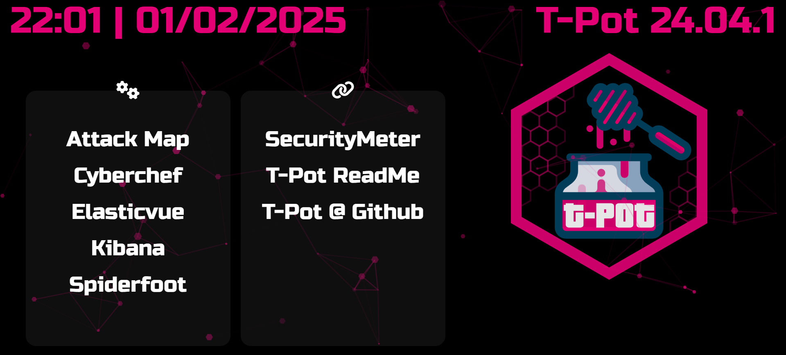
Once the installation is complete, we can access T-Pot web interface at
`https://[vm-public-ip-address]:64297`.

## Tips
---
### Only Run Selected Honeypots
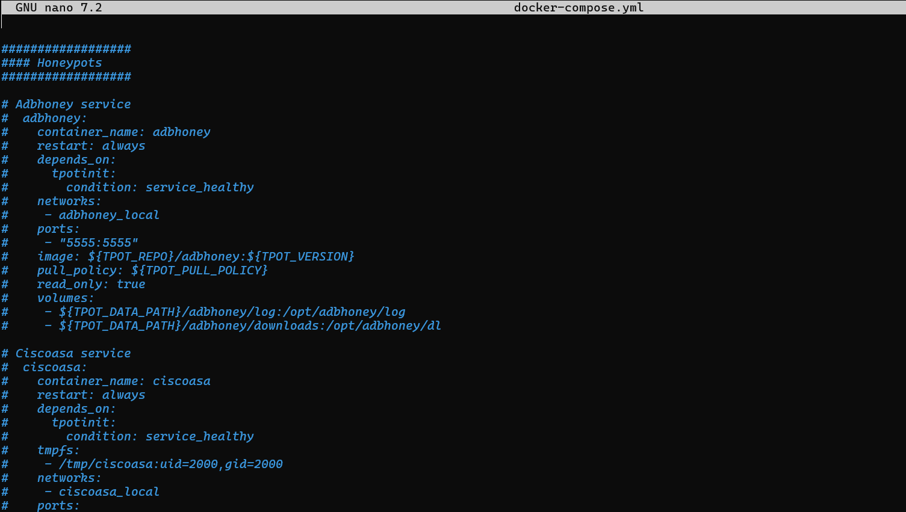
If you want to run only specific honeypots, you can modify the `docker-compose.yml` file. The full location of the file is `./tpotce/docker-compose.yml`. To disable a honeypot, you can comment out its section in the file by adding a `#` at the beginning of the line. You can refer to this [T-Pot GitHub issue](https://github.com/telekom-security/tpotce/issues/243) for further discussion on customizing the selection of honeypots.

### Change of IP Address for Accessing Admin Page
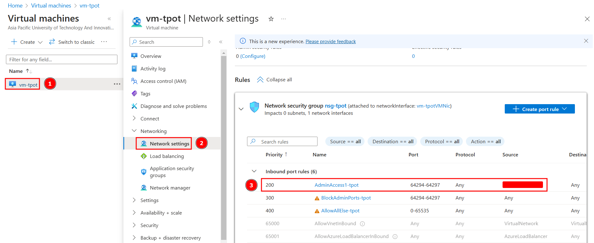
If your IP address changes and you can no longer access the T-Pot admin GUI, you need to update the allowed IP address in Azure NSG settings. Follow the steps above to modify the rule by changing the IP address.