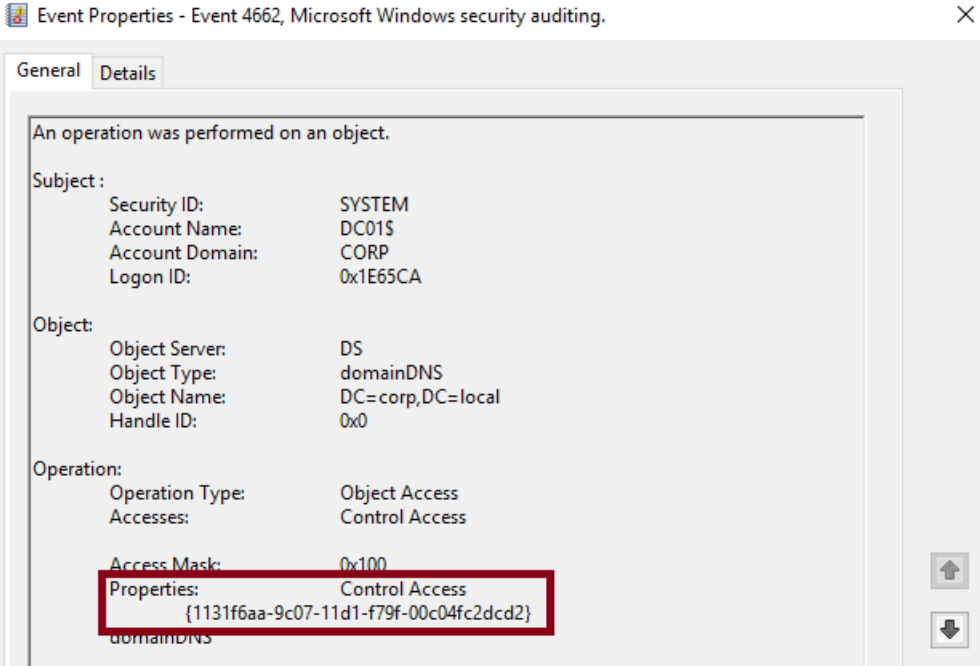

# Detecting DCSync and DCShadow
## DCSync
### Attack Steps
1. Attacker secures admin access to a domain-joined system or escalates priv to get the requisite rights to request replication data
2. Use Mimikatz to request domain replication data using `DRSGetNCChanges` interfaces to act as a legit domain controller
3. Attacker may then craft Golden Tickets, Silver Tickets, or opt to employ Pass-the-Hash/Overpass-the-Hash attacks

!!! note
    Legitimate DCSync should only be performed by `machine accounts` or `SYSTEM`, not users.

### Detection
- `DS-Replication-Get-Changes` operations can be recorded with `Event ID 4662`. However, an additional `Audit Policy Configuration` is needed since it is not enabled by default (Computer Configuration/Windows Settings/Security Settings/Advanced Audit Policy Configuration/DS Access).
    - Seek out events containing the property `{1131f6aa-9c07-11d1-f79f-00c04fc2dcd2}`, corresponding to `DS-Replication-Get-Changes`, as Event `4662` solely consists of GUIDs.



```bash
index="main" EventCode=4662 Access_Mask=0x100 Account_Name!=*$ Message=*{1131f6aa-9c07-11d1-f79f-00c04fc2dcd2}*
```

```bash
index=main EventCode=4662 Message="*Replicating Directory Changes*"
| rex field=Message "(?P<property>Replicating Directory Changes.*)"
| table _time, user, object_file_name, Object_Server, property
```

## DCShadow
### Attack Steps
1. The attacker secures administrative access to a domain-joined system or escalates privileges to acquire the necessary rights to request replication data.
2. The attacker registers a rogue domain controller within the domain, leveraging the `Directory Replicator` permission, and executes changes to AD objects, such as modifying user groups to Domain Administrator groups.
3. The rogue domain controller initiates replication with the legitimate domain controllers, disseminating the changes throughout the domain.

### Detection
To emulate a Domain Controller, DCShadow must implement specific modifications in Active Directory:

- `Add a new nTDSDSA object`
- `Append a global catalog ServicePrincipalName to the computer object`
- Detection → Event ID 4742 - `ServicePrincipalName`

```bash
index=main EventCode=4742 
| rex field=Message "(?P<gcspn>GC\/[a-zA-Z0-9\.\-\/]+)" 
| table _time, ComputerName, Security_ID, Account_Name, user, gcspn 
| search gcspn=*
```