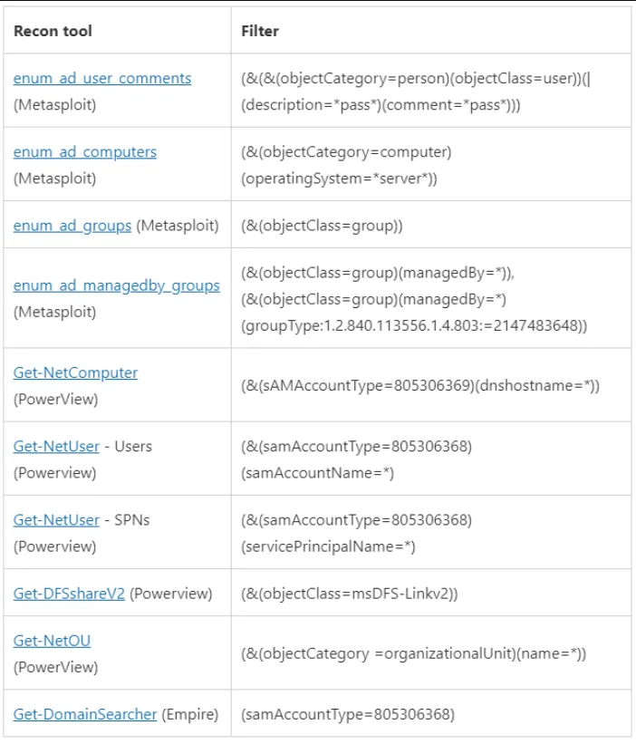

# Detecting Common User/Domain Recon
## Common Commands Used for User/Domain Recon Using Native Windows Executable
- `whoami /all`
- `wmic computersystem get domain`
- `net user /domain`
- `net group "Domain Admins" /domain`
- `arp -a`
- `nltest /domain_trusts`

### Splunk Query
```bash
index=main source="XmlWinEventLog:Microsoft-Windows-Sysmon/Operational" EventID=1
| search process_name IN (arp.exe,chcp.com,ipconfig.exe,net.exe,net1.exe,nltest.exe,ping.exe,systeminfo.exe,whoami.exe) 
     OR (process_name IN (cmd.exe,powershell.exe) 
     AND process IN (*arp*,*chcp*,*ipconfig*,*net*,*net1*,*nltest*,*ping*,*systeminfo*,*whoami*))
| stats values(process) as process, min(_time) as _time by parent_process, parent_process_id, dest, user
| where mvcount(process) > 3
```

Explanation:

|Query|Description|
|---|---|
| `process_name` | Search for process name which is either CMD or PowerShell which contains specific substrings. |
| `mvcount(process) > 3` | Filter the results to only include the data when `process` field is greater than 3. This step is looking for instances where more than 3 processes were executed by the same parent process (might be process of gathering information - recon). |


## Analysis of User/Domain Recon Using BloodHound/SharpHound
!!! info
    SharpHound is a C# collector for BloodHound.

- Windows Event ID 1644 - A client issued a search operation with the following options.
- List of [LDAP filters frequently used by reconnaissance tools](https://techcommunity.microsoft.com/t5/microsoft-defender-for-endpoint/hunting-for-reconnaissance-activities-using-ldap-search-filters/ba-p/824726)


### Splunk Query
```bash
index=main source="WinEventLog:SilkService-Log"
| spath input=Message 
| rename XmlEventData.* as * 
| table _time, ComputerName, ProcessName, ProcessId, DistinguishedName, SearchFilter
| sort 0 _time
| search SearchFilter="*(samAccountType=805306368)*"
| stats min(_time) as _time, max(_time) as maxTime, count, values(SearchFilter) as SearchFilter by ComputerName, ProcessName, ProcessId
| where count > 10
| convert ctime(maxTime)
```

Explanation:

|Query|Description|
|---|---|
| `spath input=Message` | The spath command is used to extract fields from the Message field, which likely contains structured data such as XML or JSON. The spath command automatically identifies and extracts fields based on the data structure. |
| `search SearchFilter="*(samAccountType=805306368)*"` | Filter the results to only include the data when `SearchFilter` field contains the string `*(samAccountType=805306368)*` (user object in Active Directory). This query is used to search for related LDAP queries that contains user object. |