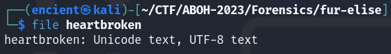
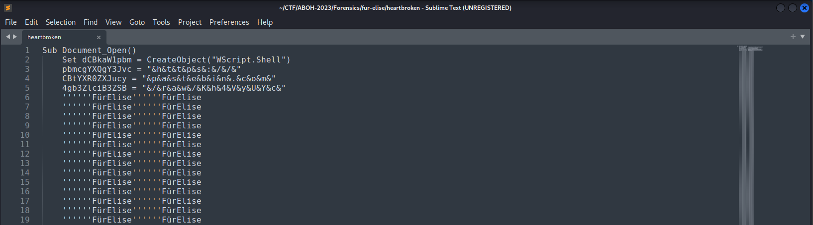
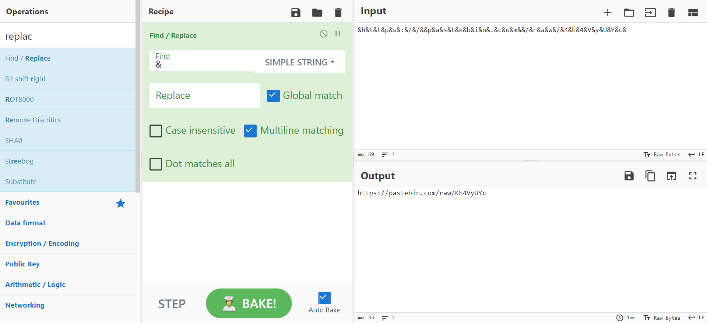
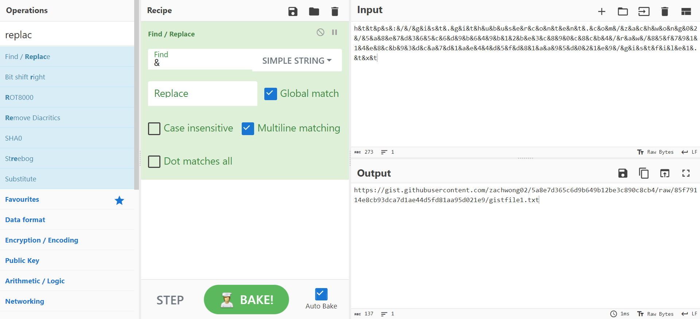
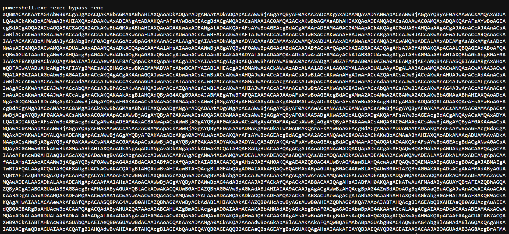
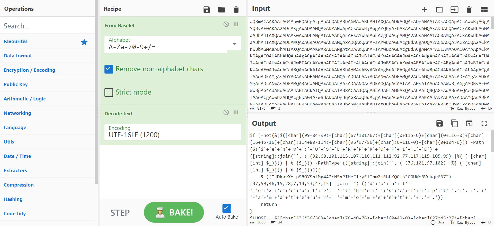
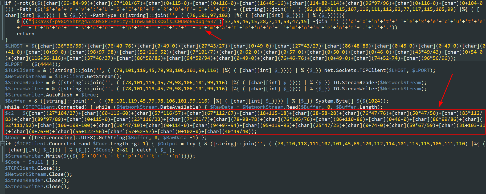

*Powershell script deobfuscation*

## Description
Beethoven was really pretty lol (read the section Beethoven Fur Elise: Fun facts): [https://www.chosic.com/why-is-beethoven-fur-elise-so-popular-and-who-was-elise/](https://www.chosic.com/why-is-beethoven-fur-elise-so-popular-and-who-was-elise/)
     
Attachment: `heartbroken`

## Solution

///caption
///
The file is given without any extension. I use `file` command to identify the file type. However, there is nothing useful about the file type. Therefore, I open the file in a text editor to see the contents of the file.

///caption
///
Upon opening the file, there are large chunks of repetitive words with some variables being set in the first few lines which immediately catched my attention. You will notice that it is a link as it contains "https://..." if you look closely.

///caption
///
By using CyberChef, we can remove the repetitive symbol "&" to see the link clearly. The output shows a pastebin link which gives us half of the flag `ABOH23{d!ff1cU17_s0Ng`.

///caption
///
Scrolling through the `heartbroken` file again will see another suspicious link, which is a github gist link.

///caption
///
The encoded string was run using Powershell, so we can suspect that this is a Powershell script. However, it is encoded, so let's put it back to CyberChef to decode again.

///caption
///
The string is encoded by base64. Therefore, using `From Base64` we can decode the string. After that, we can decode UTF-16LE from the string as the default encoding for Powershell is UTF-16LE ([source](https://learn.microsoft.com/en-us/powershell/module/microsoft.powershell.core/about/about_character_encoding?view=powershell-7.4)).

///caption
///
After decoding, we can see some strings that are suspectable. However, it seems like the string from the first box is just a string and is taking the characters and joining them together. We can see that there is a `$c2` variable. This normally stores the details of the C2 server and we can try analyzing this to see if there is any juicy info. I used ChatGPT to convert them back to ASCII and I believe there are much better ways to do this. Once decoded, we will get another pastebin link which contains another half of the flag.

## Flag
`ABOH23{d!ff1cU17_s0Ng_FROm_hEaRtBrE4K}`