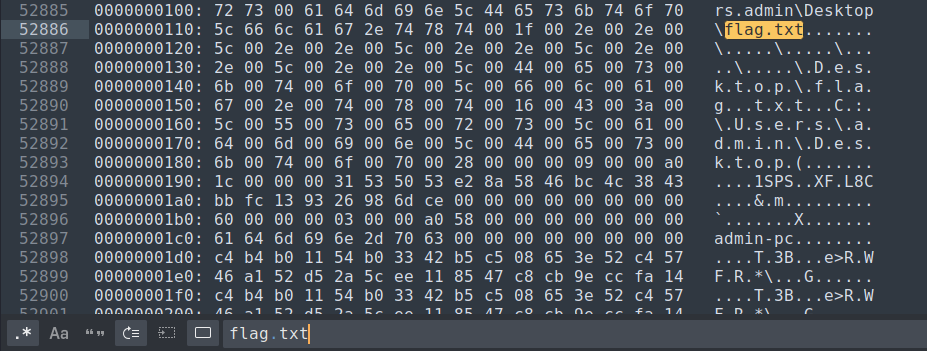

*Memory analysis (using mftparser plugin)*

## Description
Site-19 has been breached by the Chaos Insurgency following the breach of Site-[REDACTED]. All personnel is required to follow Procedure-15A.

Attachment: `Procedure-15A.pdf`, `memdump.raw`

## Solution 1

///caption
///
The given PDF file contains the rules that should be followed by SCP Foundation.
Another given file is a memory dump file which means that we have to do a memory analysis on it. I use Volatility 2 which can be found [here](https://www.volatilityfoundation.org/releases).

```bash {frame="none"}
vol.py -f memdump.raw imageinfo
```
For Volatility 2, we have to choose the correct profile before starting to analyze the memory dump file. It needs to know what kind of system the memory dump file is from so that it can further analyze it and come out with the correct output ([source](https://github.com/volatilityfoundation/volatility/wiki/Volatility-Usage#selecting-a-profile)). Therefore, we can use `imageinfo` to find the suggested profile.


///caption
///
There are several suggested profiles for this memory dump. We can try starting with the first suggested profile. If the output is unreadable, change another profile and try again.

```bash {frame="none"}
vol.py -f memdump.raw --profile=Win7SP1x64 pslist
```
Normally for memory dump analysis, the first thing that we will do is to analyze the processes of the system. `pslist` plugin shows all the processes ran in the system. However, do note that it does not show the hidden processes (`psscan` can show hidden processes).


///caption
///
Image above shows part of the pslist output. However, after analyzing all the processes, there are no malicious process that grabs our attention.

### Reanalyzing the question

///caption
///
The PDF file mentions data like documentation, images, and videos. This gives us an idea to search for available files in the memory.

```bash {frame="none"}
vol.py -f memdump.raw --profile=Win7SP1x64 filescan
```
We can use `filescan` command to list all the files. However, if we run this command, there will be a lot of output, and it takes time to go through. In DFIR, analyzing is about knowing what to search for and narrowing your scope. Since "documentation" is mentioned, we can try to search for documents, or "doc".
```bash {frame="none"}
vol.py -f memdump.raw --profile=Win7SP1x64 filescan | grep -i doc
```
We can try to use `grep` command to search for strings, and `-i` allows us to search for strings case-insensitively so that it can show both uppercase and lowercase outputs.


///caption
///
Based on the output, `SCP-055.doc` looks suspicious. We can try to dump it out and see what's inside.

```bash {frame="none"}
vol.py -f memdump.raw --profile=Win7SP1x64 dumpfiles -Q 0x000000001f6bbb70 --dump-dir=<YOUR_DIR_HERE>
```
We can use `dumpfiles`command to dump the file by specifying the physical address using `-Q` and the output directory using `--dump-dir`.

```bash {frame="none"}
mv file.None.0xfffffa80091d29f0.dat SCP-055.doc
```
Then, go to the output directory and rename the file.

```bash {frame="none"}
strings SCP-055.doc
```
After trying several methods to view the file, we will find out that we can view it using strings command.


///caption
///
We can see that there is a `flag.txt` file, but we have no clue how to get it. Let's reanalyze the question again.

### Reanalyzing the question 2

///caption
///
Looking back on the PDF file, we can see that it says all data must be eradicated (removed). This kind of gives us a hint where we can try to search for deleted files.

```bash {frame="none"}
vol.py -f memdump.raw --profile=Win7SP1x64 mftparser > mft.txt
```
We can scan for deleted files using `mftparser`. However, there will be a large chunk of output so I chose to save the output in `mft.txt` file.


///caption
///
However, we are still unable to get anything if we find for "flag.txt".  Therefore, we can try searching for only "txt".


///caption
///
This file was found in Recycle Bin and we are able to read the content of the file. The content has a long and suspicious string which seems to be a base64 encoded string.
       
!!! tip
    In CTF competitions, whenever there is base64 encoded string, decode it might give you a surprise!


///caption
///
Decode it and we will get the flag.

## Solution 2
After the competition, the challenge creator gave me another solution which I think is a faster way to search for the file. Since it is about deleted file, we can try to search for Recycle Bin.


///caption
///
Thanks to the challenge creator who gave me a better solution!

## Flag
`ABOH23{C0NT41nm3Nt_Breach_8Y_M@cr0$}`