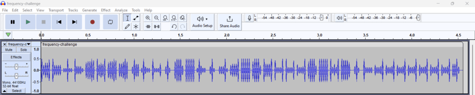
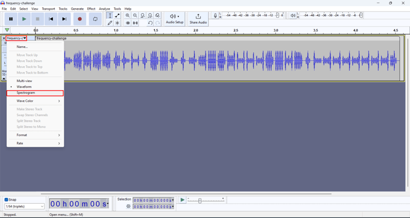
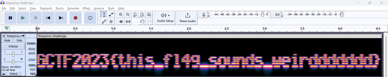

*Audio steganography - spectrogram*

## Description
I can hear flag...I think....or I am insane?  
Attachment: `challenge.wav`

## Solution
Listening to the audio file will give us some weird "alien" sound. There is no useful information from the audio. Therefore, we can try analyzing the audio using tools like [Audacity](https://www.audacityteam.org/) or [Sonic Visualizer](https://www.sonicvisualiser.org/download.html).

     
Waveform of the audio does not give us any useful information. In audio steganography, most of the time people hide information in the spectrogram.     

     
Therefore, we can try to view the audio in spectrogram. Spectrogram is a visual representation of the frequency of a signal and the amplitude, which is useful for hiding information.     

     
This is the spectrogram of the audio, which shows the flag.     

## Flag
`GCTF2023{this_fl4g_sounds_weirddddddd}`