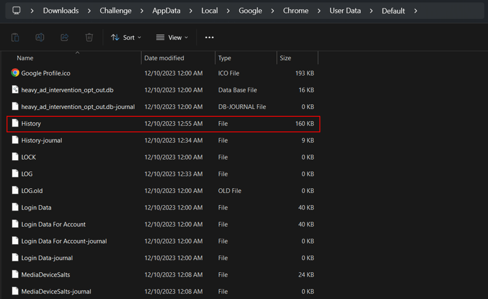
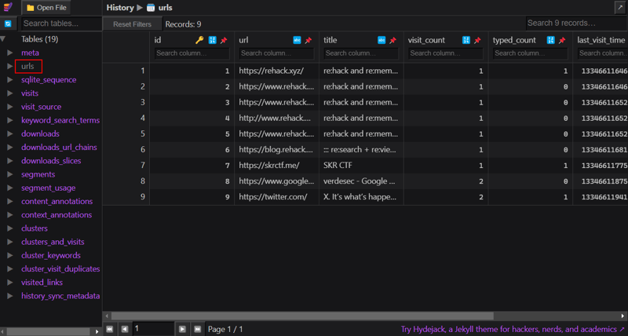
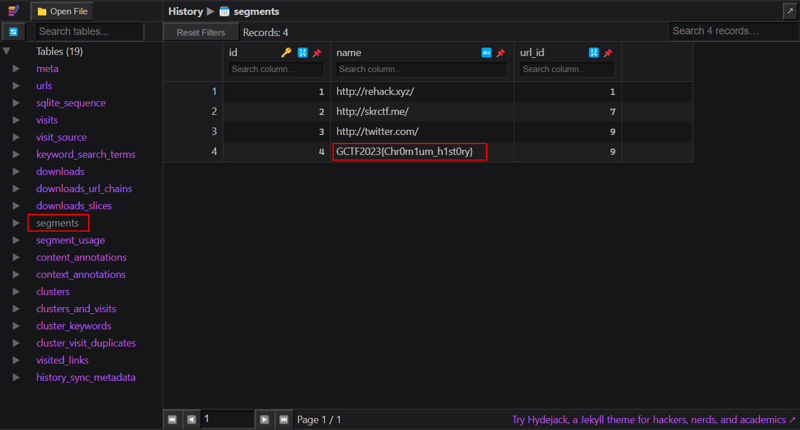

*Browser forensics*

## Description
I just got back my files from a corrupted hard drive and I need to find back my browser history, can you please help me to get it?

File: [https://drive.google.com/file/d/1XiVW7n5-U4nUQg7hyS9JwJ1Gge1a3OlB/view?usp=sharing](https://drive.google.com/file/d/1XiVW7n5-U4nUQg7hyS9JwJ1Gge1a3OlB/view?usp=sharing) <br>
Password of the zip file: `GCTF2023`

## Solution
Since the challenge description mentioned browser history, we know that we should focus on searching the browser history and hunting for information (a.k.a. flag). <br>

When doing browser forensics, we have to know which is the location that we have to search for the file that we need. In a normal computer, browsing history are stored in the locations below: <br>

Google Chrome
```
C:\Users\<USERNAME>\AppData\Local\Google\Chrome\User Data\Default\History
```
Microsoft Edge
```
C:\Users\<USERNAME>\AppData\Local\Microsoft\Edge\User Data\Default\History
```
<br>      

!!! tip
     If you are not able to find AppData folder, make sure to check your settings and show all files/folders including the hidden items.

<br>     

After analysis (by going through the folders), we can see that there are both Google Chrome and Microsoft Edge. Since Google Chrome is commonly used, we can start with viewing its browsing history first.


///caption
/// 
Browser artifacts are normally stored in SQLite database. Hence, this is a SQLite file. We can use any online SQLite viewer like this [website](https://sqliteviewer.app/), or we can also use [DB Browser for SQLite](https://sqlitebrowser.org/) which is an open-source tool to view or edit SQLite database.  


///caption
///
We will see that there are many tables stored in the database. Table `urls` stores visited URLs, along with some information such as visit count and last visit time. However, we did not see any flags here. Let's go through other table. 


///caption
/// 
Table `segments` stores the domain name of accessed URLs ([source](https://lowmanio.co.uk/2010/06/10/how-google-chrome-stores-web-history/)). The flag is located here.

## Flag
`GCTF2023{Chr0m1um_h1st0ry}`