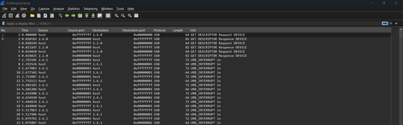
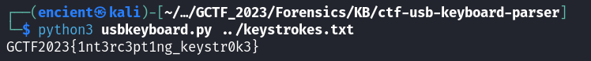

*USB keystroke in Wireshark*

## Description
Hmm, haven't seen this type of wireshark file in a while now.

Attachment: `challenge.pcapng`

## Solution
We were given a pcap file for this challenge. However, it has different protocols compared to what we normally see. 


///caption
///
Note that the captured packets are using USB protocol. Since we are not familiar with this kind of packet capture, let's try to find for similar CTF writeups (if there's any).


///caption
///
We found some useful websites and videos for similar challenges. It says that we have to record all the keystrokes captured. 

```bash {frame="none"}
tshark -r challenge.pcapng -Y 'usb.capdata && usb.data_len == 8' -T fields -e usb.capdata | sed
's/../:&/g2' > keystrokes.txt
```
We can use `tshark` to get the keystrokes we want.


///caption
///
Then we use a [keystroke parser](https://github.com/carlospolop-forks/ctf-usb-keyboard-parser) to parse all the keystroke and display it.

## Flag
`GCTF2023{1nt3rc3pt1ng_keystr0k3}`

## Resources
- [https://abawazeeer.medium.com/kaizen-ctf-2018-reverse-engineer-usb-keystrok-from-pcap-file-2412351679f4](https://abawazeeer.medium.com/kaizen-ctf-2018-reverse-engineer-usb-keystrok-from-pcap-file-2412351679f4)
- [https://www.youtube.com/watch?v=EnOgRyio_9Q](https://www.youtube.com/watch?v=EnOgRyio_9Q)