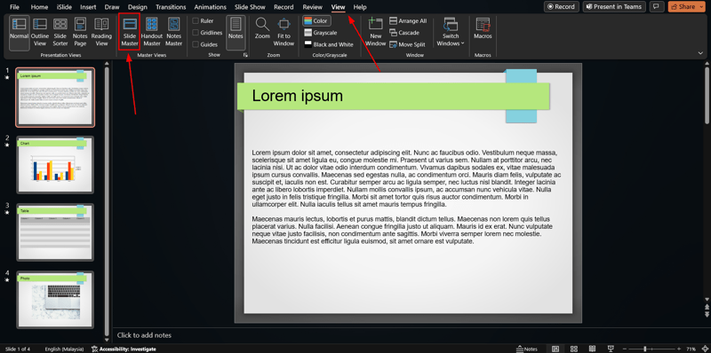
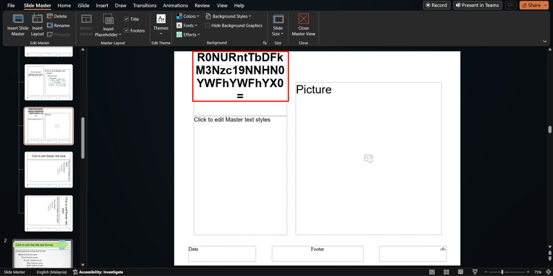
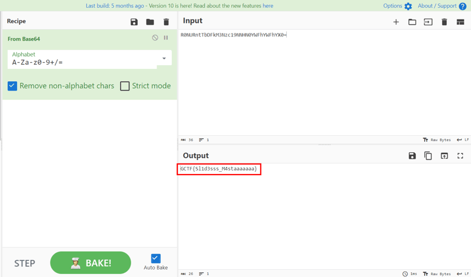

*PowerPoint slide master*

## Description
Just made a presentation, with flag.

Attachment: `challenge.pptx`

## Solution
Hint is already given within the challenge title, which is slide master.

///caption
///
Slide master is a feature that allows us to control the format of the entire presentation ([source](https://support.microsoft.com/en-us/office/what-is-a-slide-master-b9abb2a0-7aef-4257-a14e-4329c904da54)). To go to slide master settings, go to `View` --> `Slide Master`.

///caption
///
Scroll through all the slides and we will see a suspicious string.

///caption
///
Decode the string by using [CyberChef](https://gchq.github.io/CyberChef/) and we will get the flag.

## Flag
`GCTF{Sl1d3sss_M4staaaaaaa}`