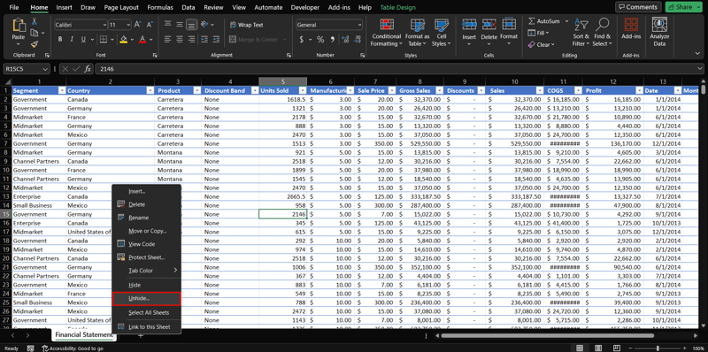
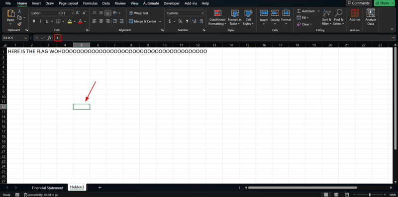
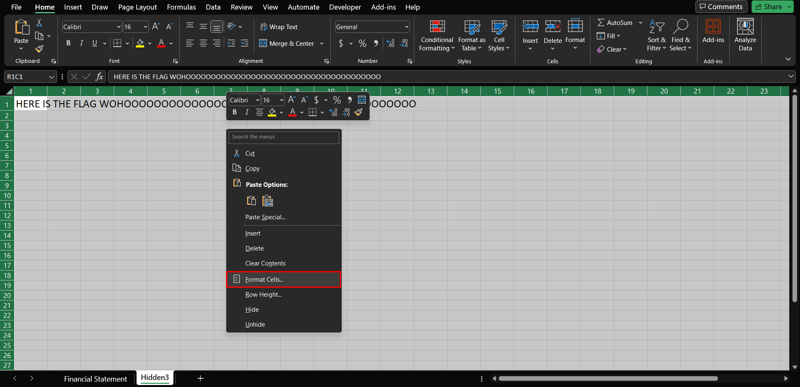
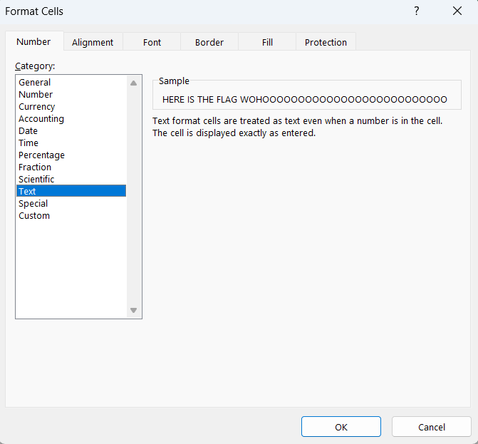
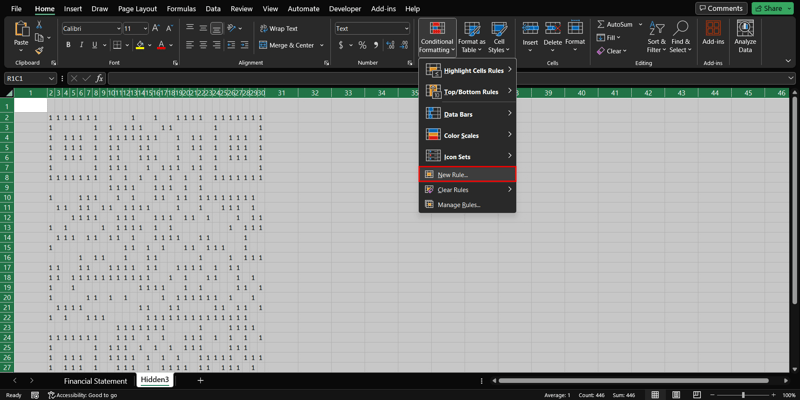
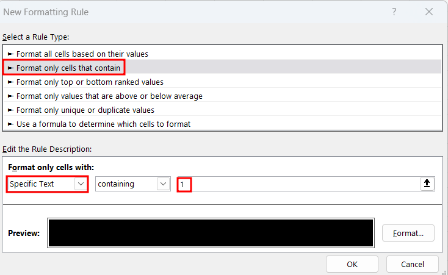
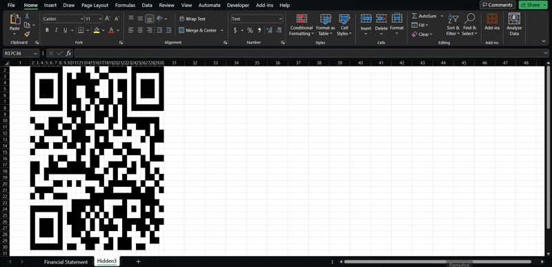

*Format cell*

## Description
I heard there are hidden information here, can you find it for me?

Attachment: `challenge.xlsx`

## Solution

///caption
///
The given tab in the excel sheet does not give us any useful information. We can try to search for hidden tabs.

///caption
///
In Hidden3 tab, we will see that there are hidden texts in the cells. Changing the font colour or the fill colour will not help in revealing the text.

///caption
///
Therefore, we can select all cells to change the format of the cells.

///caption
///
Change the format to text so that the hidden text will be visible.

///caption
///
Once the hidden texts are shown, we can kind of see that it is a QR code. We can apply rules to the cells so that it will fill with colour automatically.

///caption
///
Image above shows the rules set by us to colour the cell.

///caption
///
Once the new rule is applied, a clear QR code will be shown and it will redirect us to the flag.

## Flag
`GCTF2023{F0rmatt1ng_c311s_t0_h1d3_inf0rm4t10n}`