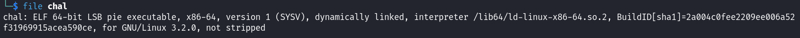
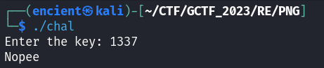
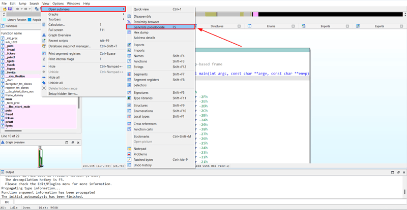
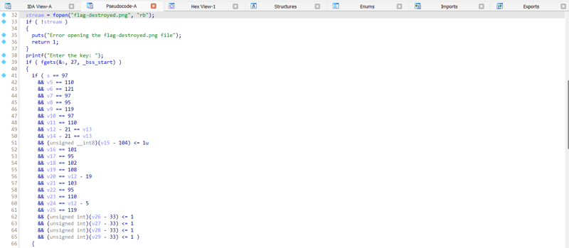
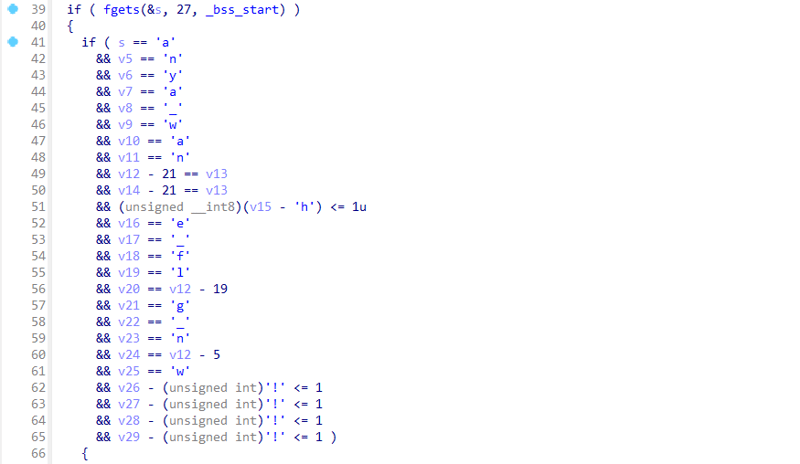
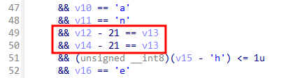
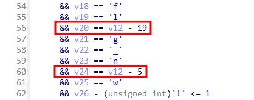
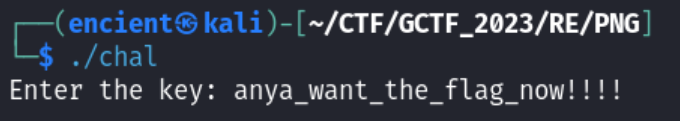
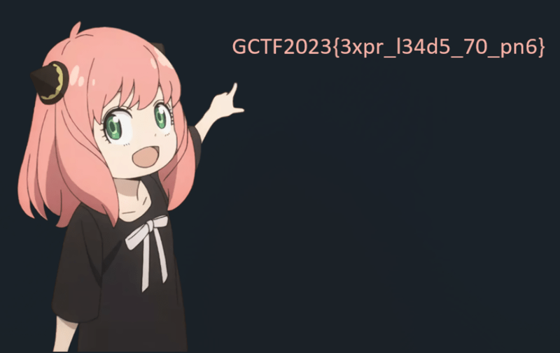

*ASCII code*

### Description
Expressions.

Attachment: `chal`, `flag-destroyed.png`

## Solution

///caption
///
When attempting a reverse engineering challenge, we can use `file` command to get more information of the given file. We can see that this file is a ELF executable file, and it is not stripped (which means that we can see the exact name of the functions of the program when we decompile it).

!!! tip
      If the executable file is stripped, we will only see function names like FUNCTION_1337 when we decompile it.

Then, we can run the command below to make it executable so that we can try to run it to get more information about the executable.

```bash {frame="none"}
chmod +x chal
```


///caption
///
This executable seems to require us to enter a key to continue. Wrong key will result in exiting the program. Since we have another file named `flag-destroyed.png`, we can assume that this executable can help us recover the "destroyed" PNG file.


///caption
///
Let's decompile it by opening it in [IDA](https://hex-rays.com/ida-free/), and generating pseudocode for it.


///caption
///
There is no other interesting function that attracts our attention. Hence, we can focus on the main function. We can see that there is an if-statement being used, and it compares some data with each of the variables. 


///caption
///
The decimal is the decimal representation of a character. Convert it to ASCII character using the shortcut `R` and we can see part of the key. You can basically guess the key for it by looking only this, but I will explain the proper way of solving this.


///caption
///
We can assume that v12 has the same value as v14. However, v13 (which is supposed to be in between v12 and v14) somehow disappear (which I don't know why either). Let's just assume v13 is there in between v12 and v14 first.


///caption
///
Next, we have these two variables. Since the key is almost completed, we can try to assume that v24 is 'o'. According to ASCII table, 'o' has the value of 111. With this we can deduce that v12 has the value of 116.

```python
v24 = v12 - 5
111 = v12 - 5
v12 = 111 + 5 = 116 = 't'
```


///caption
///
Do this for all the remaining characters and we will get the correct key, which produces a new file named flag.png.


///caption
///

## Flag
`GCTF2023{3xpr_l34d5_70_pn6}`