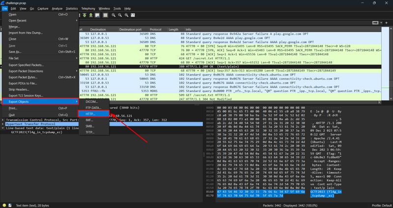
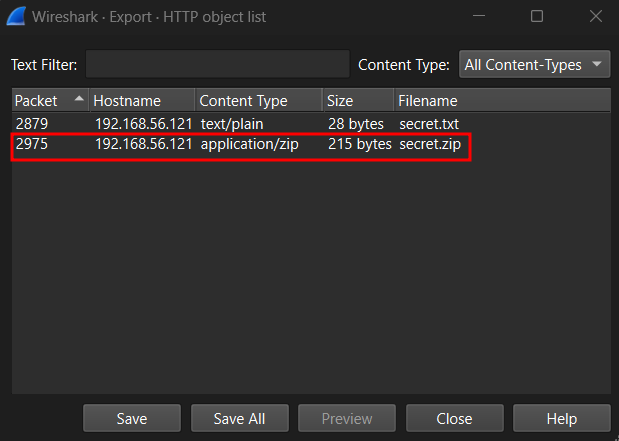
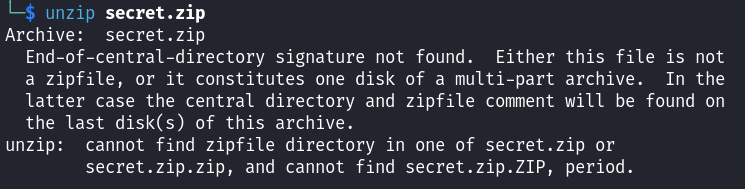
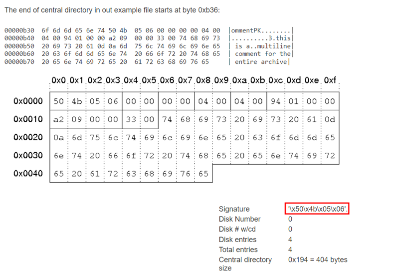
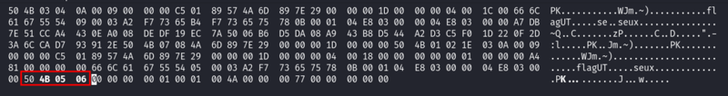
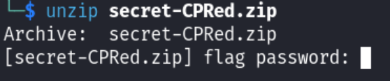
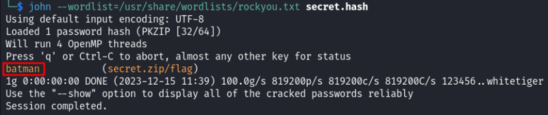
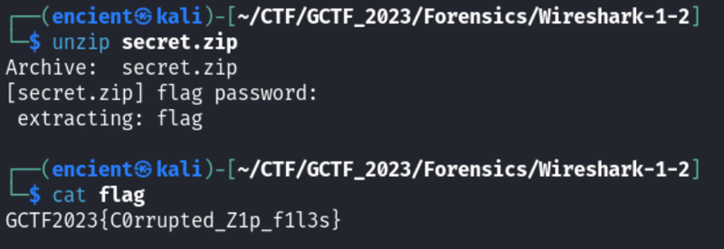

*Export HTTP object*

## Description
I remember there is a compressed file. Please find it and expose the secret! Same challenge file as Wireshark #1.

## Solution
Challenge description mentioned file, so we can try to search for objects in the export section.


///caption
///
`File` --> `Export Objects` --> `HTTP`

We chose to export HTTP objects as we can see that there are HTTP protocols in the packets. You can always choose other protocols to see whether there are any other objects transferred. However, the most common one is HTTP.


///caption
///
Given hint is compressed file, we know that we need to focus on the zip file. We can then choose the `secret.zip` file and save it.


///caption
///
However, the zip file is not able to be extracted or unzipped as it is corrupted. It is shown that the end-of-central-directory is not found.


///caption
///
After some research, we found the signature of the corrupted part.

```bash {frame="none"}
hexedit secret.zip
```

///caption
///
Edit the corrupted part with the correct signature and the zip file will be fixed.


///caption
///
However, the zip file requires a password. The string in secret.txt did not work out for it. Therefore, we thought of bruteforcing the password.

```bash {frame="none"}
zip2john secret.zip > secret.hash
```
Use `zip2john` to generate hash for the zip file.

```bash {frame="none"}
john --wordlist=/usr/share/wordlists/rockyou.txt secret.hash
```
Then, use John the Ripper tool to bruteforce the password using `rockyou.txt` wordlist.


///caption
///
The zip file password will be cracked successfully and the password is `batman`.


///caption
///
Upon submitting the correct password, it will give us a file named “flag”. View it and get the flag.

## Flag
`GCTF2023{C0rrupted_Z1p_f1l3s}`