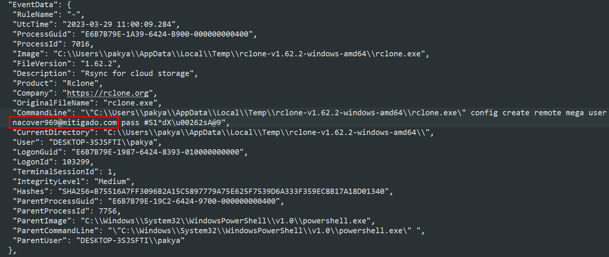
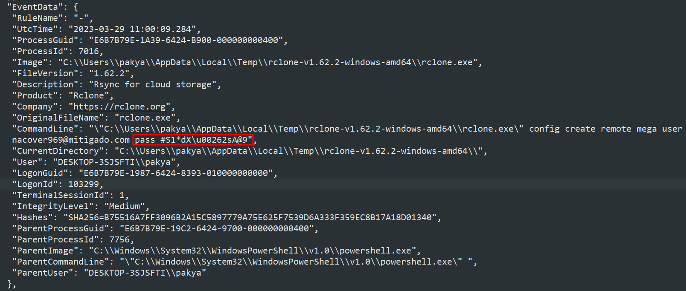
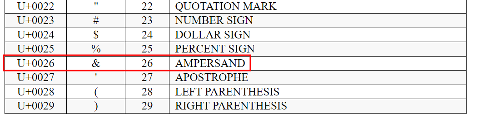
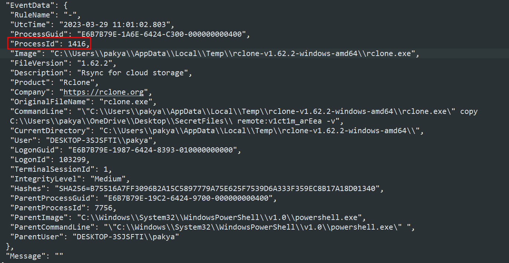
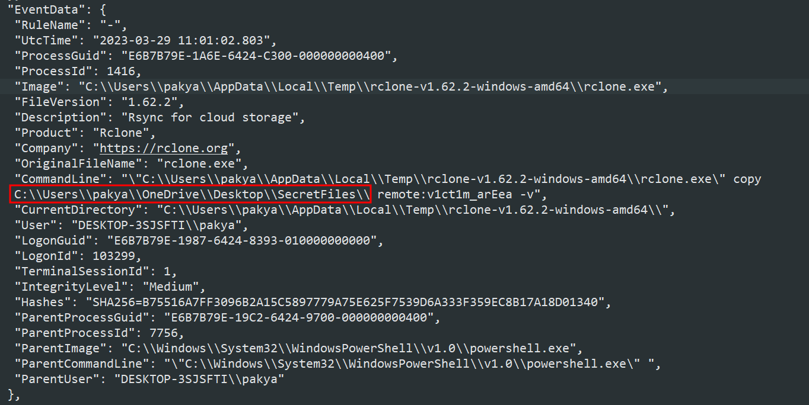
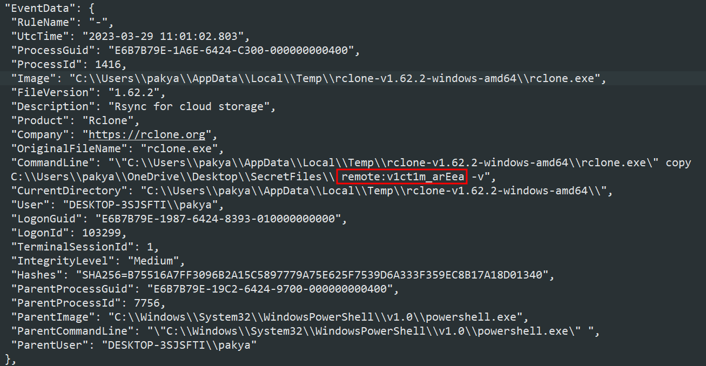

*Windows event log analysis*

## Description
We noticed some weird traffic coming from our PC. That led us to believe that our host was compromised. After a quick investigation, our fear was confirmed. We believe that the malicious actor used rclone to exfiltrate the research to the cloud. Can you detect the usage of rclone from the event logs produced? To get the flag, you need to connect to the web service and answer all the questions correctly.
   
`nc 10.0.2.202 13000`<br>
Attachment: `forensic_Clone_attachment.zip`

## Solution
We were given a zip file with a lot of `.evtx` files, which are event log files. We were given a clue that the malicious actor used rclone and we need to detect the usage of rclone.<br>   
Question mentions that we need to find logs related to rclone, we thought of searching for the sysmon event log. Sysmon event logs are the event logs created by Microsoft System Monitor (sysmon). These event logs provide information about system-level operations on Windows. Activities like network connections, file and registry modifications, and process initiation are all recorded in these event logs ([source](https://www.manageengine.com/products/eventlog/logging-guide/what-is-sysmon.html)). We can use this [tool](https://github.com/Velocidex/evtx) to dump the sysmon evtx file and parse it into text file.
```bash
./dumpevtx parse /path/to/Microsoft-Windows-Sysmon%4Operational.evtx | tee sysmon.txt
```
But first, let us connect to the web service and see what is the first question.

### 1. What is the email of the attacker used for the exfiltration process? (example: name@email.com)
To search for email values, we can open the file that we parsed (sysmon.txt) in a text editor, and search for "@" as all the emails must contain this symbol.


The email can be found in "CommandLine" section, which is the command ran by the malicious actor. <br>   
Answer: `nacover969@mitigado.com`

### 2. What is the password of the attacker used for the exfiltration process?
From the same output as previous question, we can see there is a password section after the word pass.


It shows that the password is `#S1*dX\u00262sA@9`. However, when we submit the password to the web service, it shows that the answer is wrong. After some research, we figured out that there is a unicode character in the password.


According to the unicode table where you can find it online, `\u0026` represents the symbol "&". Therefore, the final password would be `#S1*dX` + `&` + `2sA@9`. <br>   
Answer: `#S1*dX&2sA@9`

### 3. What is the Cloud storage provider used by the attacker?
From the same output as question 1, "CommandLine" shows that the malicious actor is using rclone to create remote `mega` user. <br>   
Answer: `mega`

### 4. What is the ID of the process used by the attackers to configure their tool?
The tool mentioned here is rclone. Therefore, by searching for "rclone.exe", we will be able to see the ID of the process.


Answer: `1416`

### 5. What is the name of the folder the attacker exfiltrated; provide the full path. (format: C:/path/to/folder/)
In the same output as question 4, we can see that the malicious actor is trying to execute the command as we can see in "CommandLine" section. The exfiltrated folder is the folder that is being copied by the malicious actor.


Answer: `C:/Users/pakya/OneDrive/Desktop/SecretFiles/`

### 6. What is the name of the folder the attacker exfiltrated the files to?
In the same output in question 5, we can see that the destination is `remote:v1ct1m_arEea`.


Answer: `v1ct1m_arEea`

## Flag
I forgot to copy and save the flag. But upon answering all questions correctly, we should be able to receive a flag sent by the web service in the format of `gohunikl2023{flag}`.

## Resources
- https://forensicskween.com/ctf/hack-the-box/htb-cyber-apocalypse-2023-forensics/