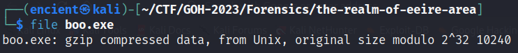

*PCAP analysis*

## Description
In this mysterious realm, a malevolent force is at play. Uncover the hidden malevolence within. Figure out the dark secrets the area holds.

Attachment: `eerie-area.pcapng`

## Solution
The challenge description does not provide any hint. My first approach for all pcap challenges is to go to `Statistics > Protocol Hierarchy` to have an overview of the challenge by looking through the protocols involved in the traffic.

///caption
///
Normally, if there's text data, there might be some juicy info there. Right click `Line-based text data`, then click `Apply as Filter > Selected` to apply it as filter to view it.

///caption
///
It is a 404 Not found message. When I saw 404, I thought that I was in a wrong path. However, I chose to further analyze it first so that I won't miss any important thing. Right click the packet, then `Follow > TCP Stream` to view it in a better way.

///caption
///
Red denotes request sent by client, while blue denotes response received from server. In the first line, we can see that the client is using `GET` request to get something with a weird name. It looks like encoded string or cipher, so I tried to copy it and decode it.

///caption
///
By using CyberChef, we will then get the decoded string, which appears to be a link to download another file named `boo.exe`.

///caption
///
It appears to be a gzip file instead of an exe file.

///caption
///
Once extracted, it shows a directory with another exe file inside, and the filename seems like the flag.

///caption
///
However, it is again not an exe file, but text instead. Viewing the contents in the file reveals the real flag to us.

## Flag
`gohunikl2023{p3ek_4_&0o}`