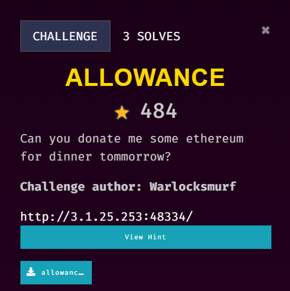
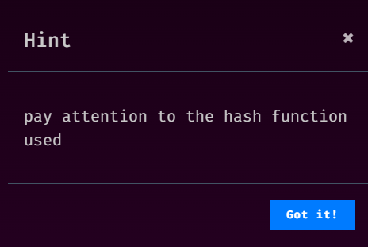
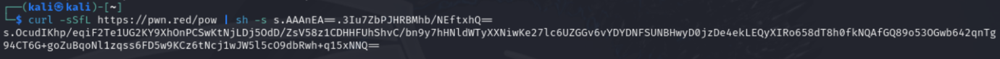
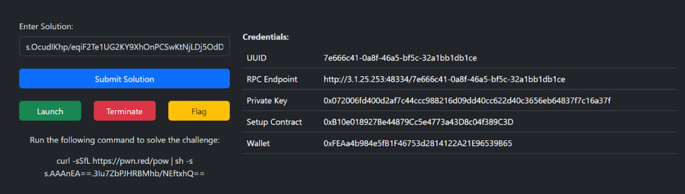
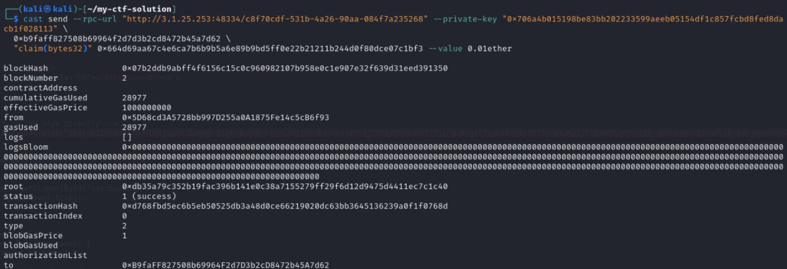

## Description

///caption
///


///caption
///
This challenge is solved by my teammate, `Jin_707`. This writeup is written by `Jin_707`.


## Solution
 <br>   
At first to spawn up our instance, use the `curl` command given and get the token(?)  I'm not sure and input into the web app, then an instance will be spawned. <br>   
 <br>   
At first we get two files for this challenge which is the `setup.sol`, and `gurl.sol`. `gurl.sol` shows that a passphrase is needed, but it was hashed with keccak256, with the strings exposed to us "warlocksmurf wants your ethereum"  hence we can get the passphrase hash with
```bash {frame="none"}
cast keccak256 "warlocksmurf wants your ethereum"
```
The cast function is in foundry library so need to [install](https://github.com/foundry-rs) beforehand. <br>
Then the after job are all left to ChatGPT :P <br>   
The structure is:
```bash {frame="none"}
cast send --rpc-url <RPC_URL>  --private-key <Private_Key> \
<Gurl_Contract_Address> \
"claim(bytes32)" <CALCULATED_PASSPHRASE> --value 0.01ether
```

<Gurl_Contract_Address> can be retrieved with (if not mistaken)
```bash {frame="none"}
cast call --rpc-url <RPC_URL>  <Setup_Contract> "challengeInstance()"
```

Example:
```bash {frame="none"}
cast call --rpc-url "http://3.1.25.253:48334/c8f70cdf-531b-4a26-90aa-084f7a235268" 0x96C00Add89E8CfCf9A24ebaC87F451320e36109D "challengeInstance()"
```

Final payload:
```bash {frame="none"}
cast send --rpc-url "http://3.1.25.253:48334/c8f70cdf-531b-4a26-90aa-084f7a235268" --private-key "0x706a4b015198be83bb202233599aeeb05154df1c857fcbd8fed8dacb1f028113" \ 0xb9faff827508b69964f2d7d3b2cd8472b45a7d62 \
"claim(bytes32)" 0x664d69aa67c4e6ca7b6b9b5a6e89b9bd5ff0e22b21211b244d0f80dce07c1bf3 --value 0.01ether
```

