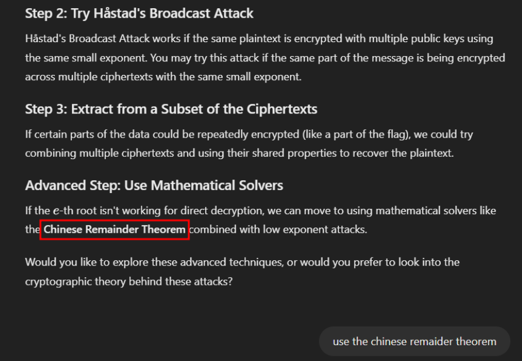
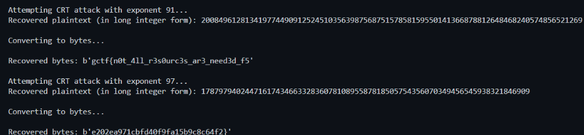

## Description

///caption
///

///caption
///

```python {title="overflow.py"}
from Crypto.Util.number import getPrime, bytes_to_long as b2l
from secret import flag
import random

m_1 = flag[:36]
m_2 = flag[36:]

e_list = [91, 97]

def main():
    for i in range(200):

        p, q = getPrime(1024), getPrime(1024)
        n = p*q
                
        e = random.choice(e_list)

        if e == 91:
            c = pow(b2l(m_1), e, n)            
        else:
            c = pow(b2l(m_2), e, n)

        with open('out.txt','a+') as f:
            f.write(f"[{e}, {n}, {c}]\n")

if __name__ == '__main__':
    main()
```

```text {title="out.txt"}
[91, 14983214299066891061758447907449734031591479401128110319949374461118770551678260191839572082804349761512767318894967010228984909916341049249372312579328145999879843259939716585996895193476087662072761717845396714667587138238070652587777938480062286892034492696138939826635626536213397079816184344818701332417040993543251638010610799732264502641538422724621617985705649419671506540412576508561554234295096373970634306474965431323943669392641068817463384789589392395503251719627006438801852992070056199952903701767640494504118651826768705789289672322282090103023185725143556966997097340296482973615728612033222504687627, 9848550218070250281313731844475223533302037268897308471790223719108618142981536047970286689350810234407355365853957569950091166640040981374424971066265130432074910895250103525973705712597736245392043801098618781288153458786032521561882004009669816537147719828763071320853700521249885717668958189557361081921448433813313053960676083547476139339699167996920379764770648302157346661532135205703823515844714964210295870102905156759257014265986334863138093414295224935121219307447074862542432386632420663802893271413110548146586006916146408106291427967881880343674332553133850725333728855028825529234005866493025628378567]
[97, 18918511242758369274135583040906234072739777081293824831822290419046394521075004241044392837591457688093656177294970319760915956949626302560112140916289867297798535449423453652808753056883116291122634842893812257751852158797771835165279266215601549942265586281327781869763218534671861542494546852729864694245748555489344761104133931610491821269226322466425326440166168962575646847219325887362601770077560870025177332382912244790498458050378578548988123926823833296250770307086310450945513831278245702856258526674103142039819512898528151992858996859731873672568668916632785112586424198588691632068716925901053977994803, 1111854131923152121778411823885080618496516431832170019729885596456453070819653848026418896658511719640129789446227771539544436772954090934062758582886032431577449158533883509555624889697372225574602837709404946003355721678126053739295416358062826997957551509997889330076325183135155928289937098358872658400667835632503636506841042431125533820898161002908227732376121702712623625863693261860472084133300080315245448195998064682296385149915828369342573512858682215282907138773991213797145511618904555424813028567873972616040757844536803643740005454831877610542748203108337227406625687987978050019556553283326380929133]
[97, 17198276324255329813384900915667407243447833858554762249089628756428192629251347632199931988065605821443721449248775346607605092850087601432414079750820836389742459443001561727120135769645466942152683796909664708588308264964371003928291839293419137364014351955179721401731084646969965841913974814816490366160495071445193988296480456766915756053513916780673158468856832446841612264994048349113565616232255060165322624612667869601632165158251257526339645522222676877213662544796128628594805767864838598868471685970028451605471976440499496598318184049478553846994038346783472931384395961528204222662295835110316818936613, 4561934652288509820923329534569431945174543724388366377557985525195392678023166325769852355332497253352722628786040321200870175247067447556959970319247552938816045061507023191275279325866450910270661126820518008930860256221015303365587398054889718520099535555986357360629681116378542956908222790760876232230583309161647304697721585235124846656512305569283147060480515786385328932651904700266719765939265417787796117615712789749738719506558641434407761610060486945914017582475367893999851213581497278168216903275002469441661114390284426076248514984032723501885378126814559296326889758573003372553845280614364206038324]
...
-TRUNCATED-
```

## Solution
*This challenge involves the help of ChatGPT*
 <br>   
Based on the hint given, we can choose the correct method to decrypt. <br>   

```python {frame="none"}
from sympy import Integer, integer_nthroot
from sympy.ntheory.modular import crt  # Correct import for CRT
from Cryptodome.Util.number import long_to_bytes as l2b
import re

# File containing the RSA outputs
file_path = 'out.txt'

# Function to parse the file and gather ciphertexts with the same exponent
def parse_rsa_data(file_path):
    rsa_data = []

    # Regular expression to parse each line
    pattern = r'\[(\d+), (\d+), (\d+)\]'

    # Read the RSA data from the file
    with open(file_path, 'r') as file:
        data = file.readlines()

    # Parse each line and extract e, n, and c
    for line in data:
        match = re.match(pattern, line.strip())
        if match:
            e = int(match.group(1))
            n = Integer(match.group(2))
            c = Integer(match.group(3))
            rsa_data.append((e, n, c))

    return rsa_data

# Function to perform the CRT-based attack
def crt_attack(rsa_data, e):
    # Filter all ciphertexts with the same exponent e
    n_list = []
    c_list = []
    for entry in rsa_data:
        if entry[0] == e:  # Only consider entries with the same exponent
            n_list.append(entry[1])
            c_list.append(entry[2])

    if len(n_list) < 2:  # We need at least two ciphertexts to apply CRT
        print(f"Not enough ciphertexts with exponent {e} to perform CRT.")
        return None

    # Use the Chinese Remainder Theorem to combine the ciphertexts and moduli
    combined_c, combined_n = crt(n_list, c_list)
    if combined_c is None or combined_n is None:
        print("CRT failed.")
        return None

    # Now, try to take the e-th root of the combined ciphertext
    m, exact = integer_nthroot(combined_c, e)
    if exact:
        return int(m)
    else:
        print("Failed to compute exact e-th root.")
        return None

# Function to convert long integers (plaintexts) to byte representation
def convert_to_bytes(plaintext):
    try:
        byte_rep = l2b(plaintext)
        print(f"Recovered bytes: {byte_rep}")
    except ValueError:
        print(f"Could not convert {plaintext} to bytes.")

# Main function to run the attack
if __name__ == "__main__":
    # Step 1: Parse the RSA data
    rsa_data = parse_rsa_data(file_path)

    # Step 2: Attempt CRT-based attack for each exponent
    for e in [91, 97]:  # Consider both exponents
        print(f"\nAttempting CRT attack with exponent {e}...")
        recovered_plaintext = crt_attack(rsa_data, e)

        # Step 3: If a plaintext was recovered, convert it to bytes
        if recovered_plaintext:
            print(f"Recovered plaintext (in long integer form): {recovered_plaintext}")
            print("\nConverting to bytes...\n")
            convert_to_bytes(recovered_plaintext)
        else:
            print(f"No plaintext recovered for exponent {e}.")
```

