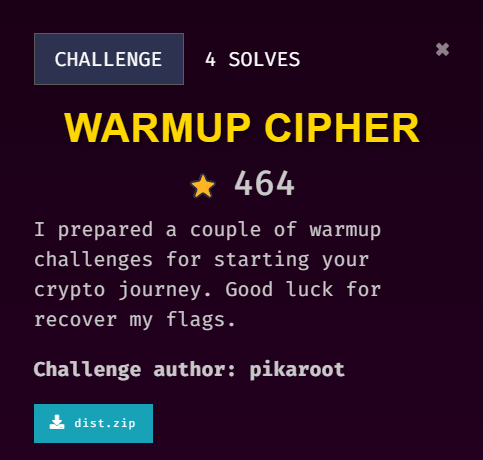

## Description

///caption
///

```python {title="encrypt.py"}
from hashlib import sha256
import string, random
from secret import MASTER_KEY, FLAG
from Crypto.Cipher import AES
from Crypto.Util.Padding import pad

SET = string.printable[:62] + '~!@#$%^&*'

def genRandpass():
    master_key = int.from_bytes(MASTER_KEY, 'little')
    randpass = ''

    while master_key:
        bit = master_key & 1
        if bit:
            randpass += random.choice(SET[:len(SET)//2])
        else:
            randpass += random.choice(SET[len(SET)//2:])
        master_key >>= 1

    return randpass

def main():
    randpass = genRandpass()
    encryption_key = sha256(MASTER_KEY).digest()
    cipher = AES.new(encryption_key, AES.MODE_ECB)
    ciphertext = cipher.encrypt(pad(FLAG, 16))

    with open('out.txt', 'w') as f:
        f.write(f'Your randpass : {randpass}\n')
        f.write(f'Encrypted Flag : {ciphertext.hex()}')

if __name__ == '__main__':
    main()
```

```text {title="out.txt"}
Your randpass : v@BV4oHAbKP$hxK&qWDGysRAWHZJpj!zPW&Pkj^!&NEGq8&#EUQ~tlCIgZXzc3JQD*YJa1YYt#N&odTZASRGu5!UAWUItd*OfAFPqvZIkPIWb6U!jIT~nh%zO!V!w5T~BEXAab*A^EPP3gDYIRGGio$&&GT$exR^aFYAan@OKzJIxmz#RNTJejHPhC%B84FDYD%Kh1FHM@^B9jWKPXVB60OXTAE*d7~OGN%#yt~KCQIz23**FKD&5iWZ#&EMipK&~G&N7iFWRJRLv5K^%@*~pgINbG*CpyYSbJJRopQZDX@~5bVLzJFOoiQDERIM8xSMjIEGviGHlIJNj3IA%#MGa2^NoQC@7yA!l^TEvrHOD$P*yy@JE%zVfsI^2KZ%j1!GS^WAxuT*zCAPuaVNxUJQnhJ~CFNJ3cD$KJDDcq@AIL$BeuSCGMDL9fIF4E%Zpv&TeI%zvlMDaVF!a9PB4DBP66I%5@~Rce~C3Q!*jtTZo~T~2cA%cTIV5u~^lX!LhxQK#Z##swCFpG&GyiQKd~USm2CTb^Iz0qzYMzQTwkB#PRHIslUFM#S~dfNHc!SOlj&Ct@$IpbD&^X%Reu^J!HJXe0GJPzY&7rT#1@JEy1RP*@!Tv9BMpEzUy4UQ2$NIctM$jIIV08!!C^Z~23TUlNH@cxNXrLZVfnAV3MWYph
Encrypted Flag : 6159896fa4241f271807fb20645c98d03166742795e13a9904ca21df34c9fa7ee2721bffb5aa0ba60f9798edaa0c4684af558312db93c5d27c22ad3f778ff019
```

## Solution
*This challenge involves the help of ChatGPT*
```python {frame="none"}
import string
from hashlib import sha256
from Cryptodome.Cipher import AES
from Cryptodome.Util.Padding import unpad

# Provided randpass from out.txt
randpass = "v@BV4oHAbKP$hxK&qWDGysRAWHZJpj!zPW&Pkj^!&NEGq8&#EUQ~tlCIgZXzc3JQD*YJa1YYt#N&odTZASRGu5!UAWUItd*OfAFPqvZIkPIWb6U!jIT~nh%zO!V!w5T~BEXAab*A^EPP3gDYIRGGio$&&GT$exR^aFYAan@OKzJIxmz#RNTJejHPhC%B84FDYD%Kh1FHM@^B9jWKPXVB60OXTAE*d7~OGN%#yt~KCQIz23**FKD&5iWZ#&EMipK&~G&N7iFWRJRLv5K^%@*~pgINbG*CpyYSbJJRopQZDX@~5bVLzJFOoiQDERIM8xSMjIEGviGHlIJNj3IA%#MGa2^NoQC@7yA!l^TEvrHOD$P*yy@JE%zVfsI^2KZ%j1!GS^WAxuT*zCAPuaVNxUJQnhJ~CFNJ3cD$KJDDcq@AIL$BeuSCGMDL9fIF4E%Zpv&TeI%zvlMDaVF!a9PB4DBP66I%5@~Rce~C3Q!*jtTZo~T~2cA%cTIV5u~^lX!LhxQK#Z##swCFpG&GyiQKd~USm2CTb^Iz0qzYMzQTwkB#PRHIslUFM#S~dfNHc!SOlj&Ct@$IpbD&^X%Reu^J!HJXe0GJPzY&7rT#1@JEy1RP*@!Tv9BMpEzUy4UQ2$NIctM$jIIV08!!C^Z~23TUlNH@cxNXrLZVfnAV3MWYph"

# Character set used in the code
SET = string.printable[:62] + '~!@#$%^&*'

# Split the set into first half and second half
half_len = len(SET) // 2
first_half = SET[:half_len]  
second_half = SET[half_len:] 

# Reverse the process of generating randpass to get the MASTER_KEY bits
master_key_bits = []

for char in randpass:
    if char in first_half:
        master_key_bits.append(1)  
    elif char in second_half:
        master_key_bits.append(0)  
    else:
        raise ValueError("Character not in SET")

# Convert the bits back to an integer by reversing the bit order
master_key = 0
for bit in reversed(master_key_bits):
    master_key = (master_key << 1) | bit

# Convert the integer MASTER_KEY to hexadecimal format
master_key_hex = hex(master_key)

# Print the derived MASTER_KEY in hex format
print("MASTER_KEY (hex):", master_key_hex)

# Encrypted flag from out.txt
encrypted_flag_hex = '6159896fa4241f271807fb20645c98d03166742795e13a9904ca21df34c9fa7ee2721bffb5aa0ba60f9798edaa0c4684af558312db93c5d27c22ad3f778ff019'

# Convert the master key from hex to bytes
master_key_bytes = master_key.to_bytes((len(master_key_hex) - 2) // 2, byteorder='little')

# Derive the encryption key using SHA-256
encryption_key = sha256(master_key_bytes).digest()

# Convert the encrypted flag from hex to bytes
encrypted_flag_bytes = bytes.fromhex(encrypted_flag_hex)

# Decrypt the flag using AES in ECB mode
cipher = AES.new(encryption_key, AES.MODE_ECB)
decrypted_flag_padded = cipher.decrypt(encrypted_flag_bytes)

# Remove padding to get the original flag
decrypted_flag = unpad(decrypted_flag_padded, 16)

# Print the decrypted flag
print("Decrypted Flag:", decrypted_flag.decode())
```
This encryption script basically uses a master key to encrypt the flag. The `genRandpass()` function generates a random password based on the master key, while The `main()` function uses a random generated password to encrypt the flag using AES. The variable named `SET` defines the characters used for random password generation. <br> 
Therefore, we deduce that we can the `MASTER_KEY` by reversing the `genRandpass()` function as we already have the random password. This is because the password is generated by shifting through the bits of the MASTER_KEY. For each bit:

- If the bit is 1, a character is selected from the first half of `SET`.
- If the bit is 0, a character is selected from the second half of `SET`.
