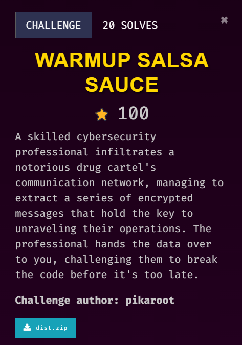

## Description

///caption
///

```python {title="wss.py"}
from Crypto.Cipher import Salsa20
from secret import FLAG
from secrets import token_bytes as tb

def encText(text, key, nonce):
    cipher = Salsa20.new(key=key, nonce=nonce)
    ciphertext = cipher.nonce + cipher.encrypt(text)
    return ciphertext

if __name__ == "__main__":
    text = b"We covered the drugs with our favourite salsa sauce. The stupid cops will not find it."

    key, nonce = tb(32), tb(8)

    enc_text = encText(text, key, nonce)
    enc_flag = encText(FLAG, key, nonce)

    with open('out.txt','w') as f:
        f.write(f"Encrypted flag: {enc_flag.hex()}\n")
        f.write(f"Encrypted text: {enc_text.hex()}")
```

```text {title="out.txt"}
Encrypted flag: fa1c26b66ad926ab75cd51524f05ec08f7f3160c74bec57f8aec3f7cace6fbb7370923e8c540673f657dada9e9540101d7f4dc0b6627f147fc47627a244c88b2ea6c3340
Encrypted text: fa1c26b66ad926ab45cb05575b0ab90fcdf1060d72bfba6f90aa076cbcf2f3aa311a13fc800638382570bcbee142001290f1d41d3761e315b91730663c2cd8e1fe7a25482ce0cd69745028635ef5dae54282f162e448fec5f6b0e7d8ff85
```

## Solution
*This challenge involves the help of ChatGPT*
```python {frame="none"}
from Crypto.Cipher import Salsa20
import itertools
import string

def decText(ciphertext, key):
    nonce = ciphertext[:8]  # The first 8 bytes are the nonce
    encrypted_message = ciphertext[8:]  # The rest is the actual encrypted message
    cipher = Salsa20.new(key=key, nonce=nonce)
    decrypted_message = cipher.decrypt(encrypted_message)
    return decrypted_message

def brute_force(ciphertext, known_plaintext):
    keyspace = string.ascii_letters + string.digits  # Alphanumeric characters
    for key_candidate in itertools.product(keyspace, repeat=5):  # Adjust the length based on assumptions
        key_candidate = ''.join(key_candidate).encode()  # Create the candidate key
        try:
            decrypted_text = decText(ciphertext, key_candidate)
            if known_plaintext.encode() in decrypted_text:  # Check for known plaintext
                print(f"Key found: {key_candidate}")
                print(f"Decrypted text: {decrypted_text.decode()}")
                break
        except Exception:
            continue  # Ignore decryption failures

if __name__ == "__main__":
    # Reading the encrypted data from the 'out.txt' file
    with open('out.txt', 'r') as f:
        lines = f.readlines()

    # Extract the encrypted flag and text from the file
    enc_flag_hex = lines[0].split("Encrypted flag: ")[1].strip()
    enc_text_hex = lines[1].split("Encrypted text: ")[1].strip()

    # Convert the hex strings to bytes
    enc_text = bytes.fromhex(enc_text_hex)

    # Known plaintext (a part of the original message)
    known_plaintext = "We covered the drugs with our favourite salsa sauce."

    # Attempt brute-force decryption
    brute_force(enc_text, known_plaintext)
```
The vulnerability in the encrypting script is the repeating use of `key` and `nonce` for encrypting process. Therefore, we can create a script to brute force the encryption key in order to recover the original plaintext. It reads the encrypted data from a file, extracts the nonce, and generates possible 5-character keys from an alphanumeric set. For each candidate key, the script uses the nonce and key to decrypt the message with Salsa20. If the decrypted text contains a known portion of the original message, the correct key is identified. This process exploits the fact that the same key and nonce were reused for multiple messages, making brute-force attempts feasible.
