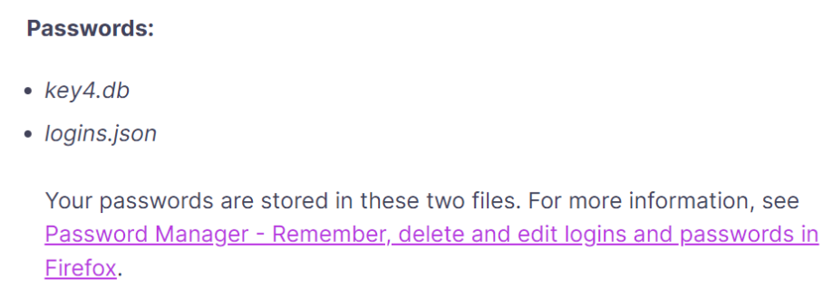
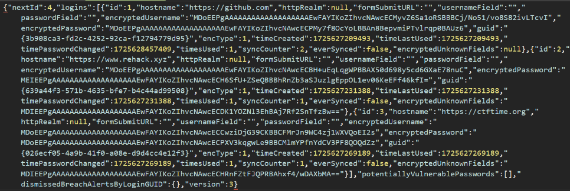
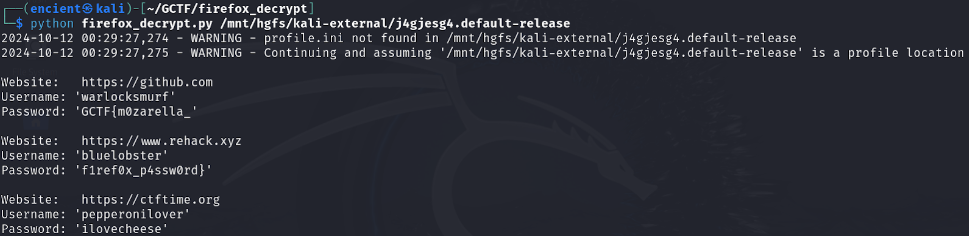

## Description

///caption
///
Challenge description hints that we need to find the password from Firefox. This might be the saved password of the user. The attachment given is an `ad1` file, so we need to use FTK Imager to open the file and navigate to Firefox file location.

## Solution

Through some [research](https://support.mozilla.org/en-US/kb/profiles-where-firefox-stores-user-data), we will know that the Firefox saved passwords are stored in these two files, located in the Firefox user profile:
```PowerShell {frame="none"}
C:\Users\<your Windows login username>\AppData\Roaming\Mozilla\Firefox\Profiles\
```


However, all the usernames and passwords are encrypted.


There are several tools online to decrypt it, the tool I used is [this](https://github.com/unode/firefox_decrypt), which is found from a [YouTube tutorial](https://www.youtube.com/watch?v=DltXmGoaLVs).
