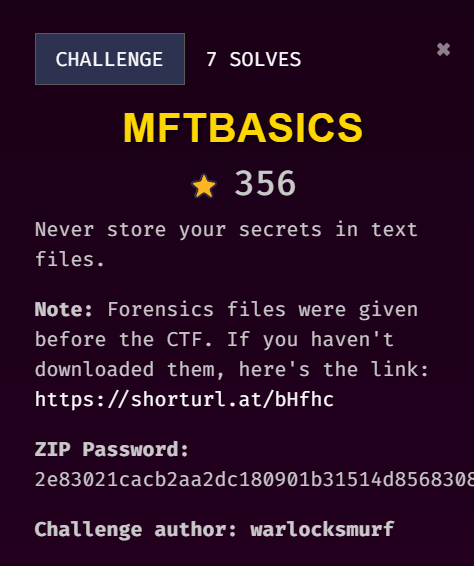
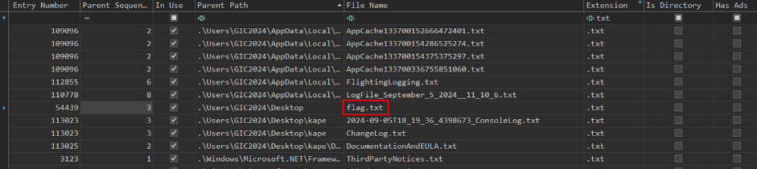
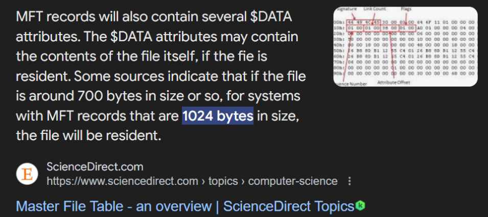
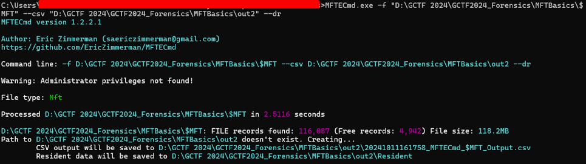
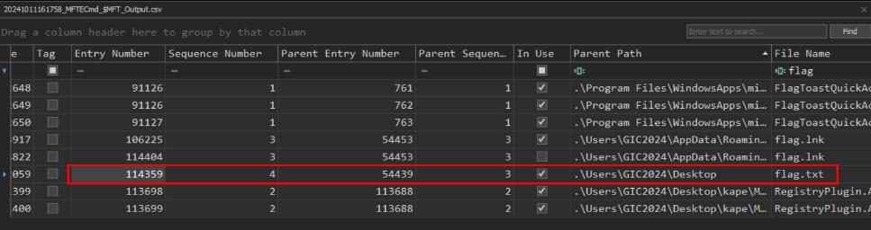
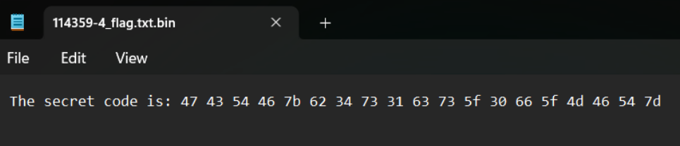
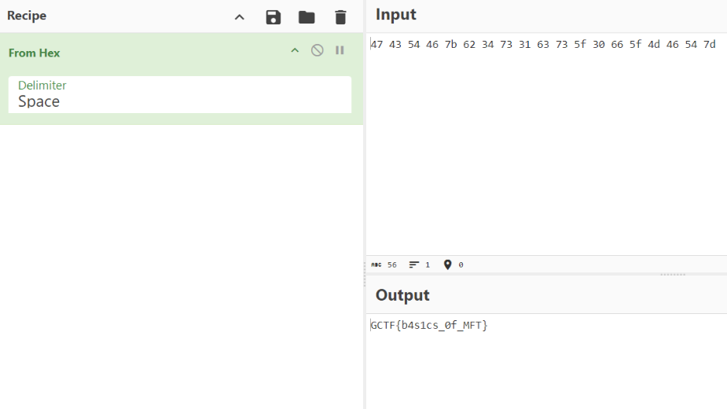

## Description

///caption
///

!!! tip "Information we got from the challenge title and description"
    - Title: it might be a basic MFT challenge
    - Description: the flag might be in text file
    - Attachment: only MFT file is given, so just focus on MFT

## Solution
     
By performing basic MFT parsing using [MFTECmd](https://ericzimmerman.github.io/#!index.md), we found flag.txt. There is no other filename that looks like flag, or anything with flag format. Since we are not able to get the content of the text file from this result as it is just a basic parsing, we need to find other methods to get the content of the text file.     
     
As shown, the file will be resident if it is small enough. It is called MFT resident and it is stored in MFT records. Since the flag is in the text file, it might be a MFT resident. We can also check the file size from the MFT record above.     
     
Therefore, we can use MFTECmd again, but this time is to dump the MFT resident.     
     
Get the entry number of the flag file from the CSV file that is exported.     
     
Then, search through the MFT resident dump using its entry number and open in Notepad to see the file content.     
