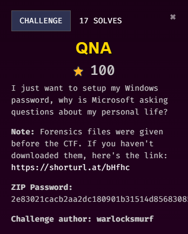
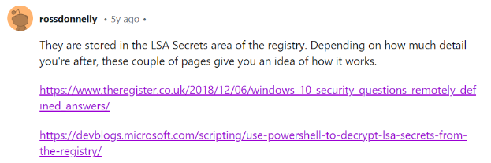
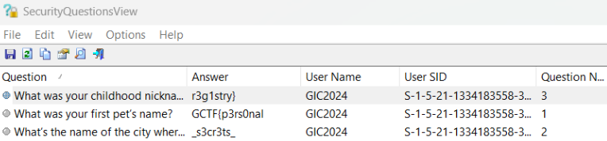

## Description

///caption
///
Challenge description hints that the flag might be the answer of the Microsoft Security questions. Challenge attachments are all the registry files which hint that this might be something related to registry.

## Solution

///caption
///
Through initial research, I found a [reddit post](https://www.reddit.com/r/sysadmin/comments/eatkjq/windows_10_security_questions_answers_stored/) mentioning that the answer to the security questions are stored in LSA secrets in the registry. After researching more, I decided to search for alternative solution as I think this might not be the solution as the process of decrypting is quite hard.

///caption
///
After searching for tools to get the Windows Security answer, I found this [tool](https://www.nirsoft.net/utils/security_questions_view.html#google_vignette). Installing it and running it immediately shows us the result. 