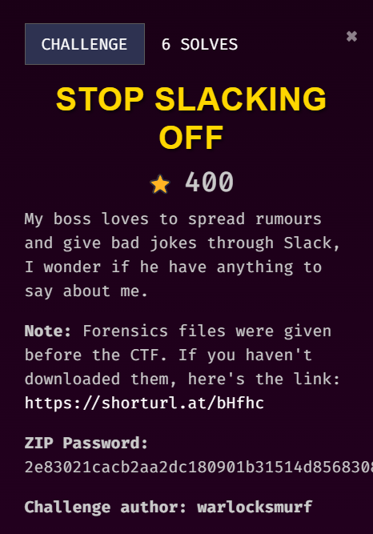
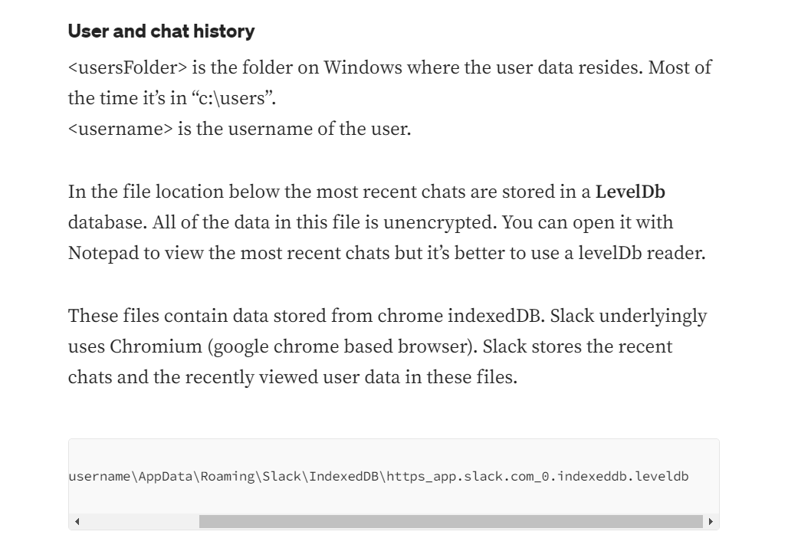
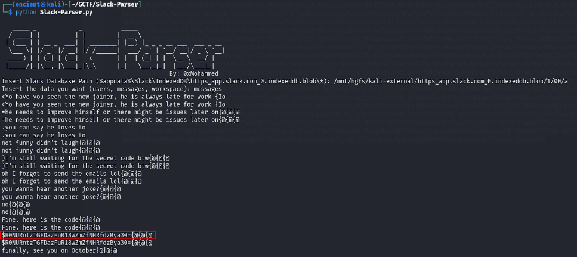
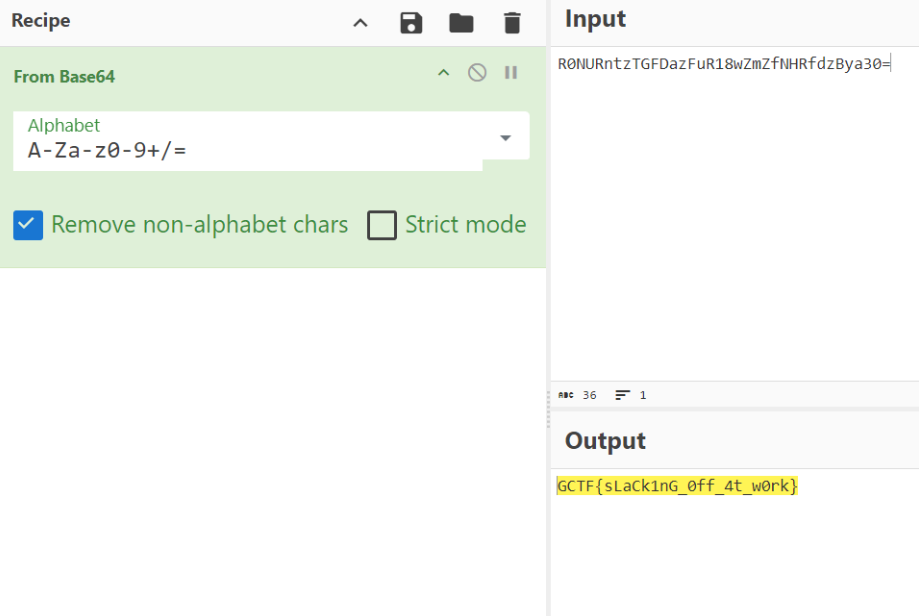

## Description

///caption
///
Challenge description hints that this is something related to Slack. The challenge is quite straight forward as only Slack folder is given to the participants.

## Solution
     
From this [post](https://medium.com/@jeroenverhaeghe/forensics-finding-slack-chat-artifacts-d5eeffd31b9c), we know that all chats are stored in leveldb format. I did not able to find any leveldb viewer that allows me to view the file.     

     
Therefore, I tried to search for parsers online for parsing Slack artifacts and found this [tool](https://github.com/0xHasanM/Slack-Parser?tab=readme-ov-file).     

     
