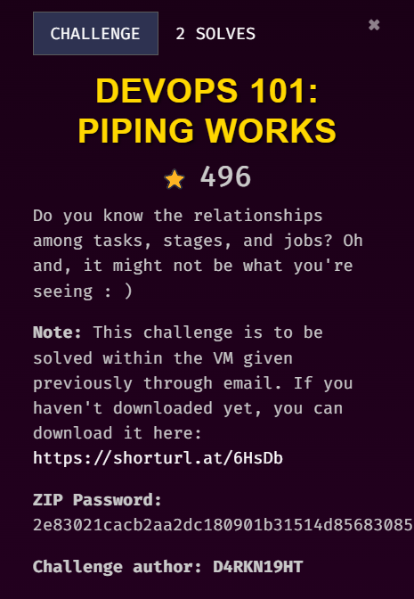
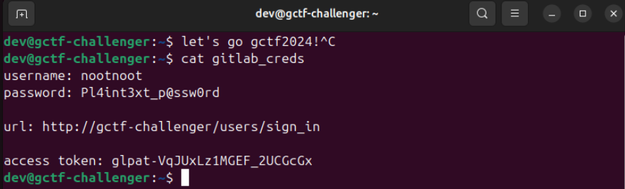
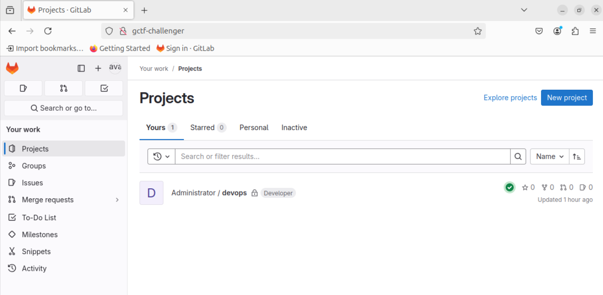
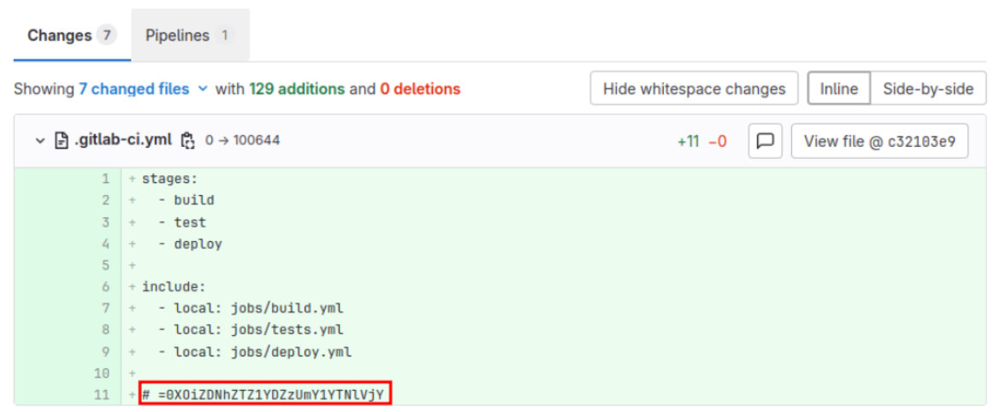
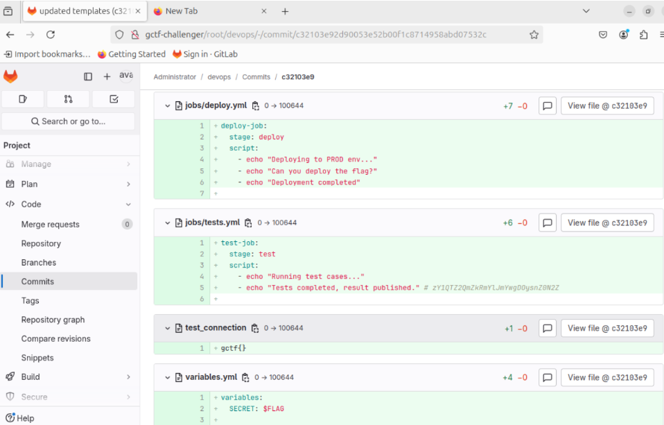
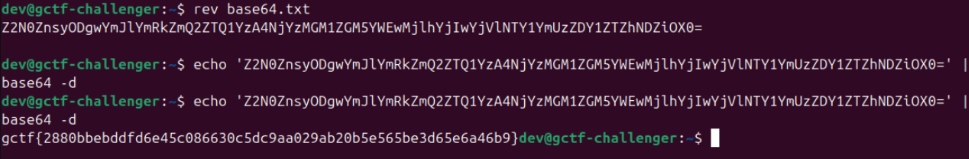

## Description

///caption
///

## Solution
     
Credentials are given in the VM. It is a challenge related to GitLab. GitLab is open source and it is normally used for DevOps and DevSecOps projects.     

     
Once signed in, we can see that there is only one project. We can go through the project and explore.     

     
In commit section, we will see several comments that have weird strings. The first part of the string has an equal sign as the first character. Therefore, I suspected that it is a base64 string, but in reversed order.     

     
We can find other parts of the string in the commit.     

