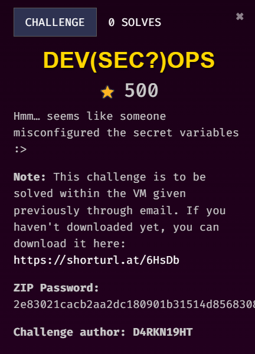
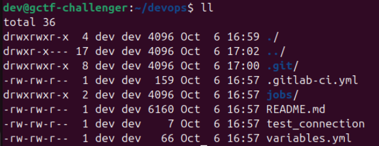
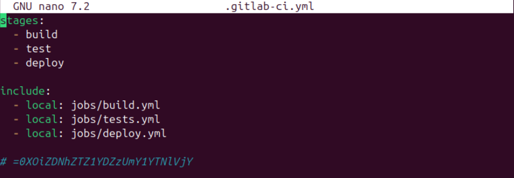
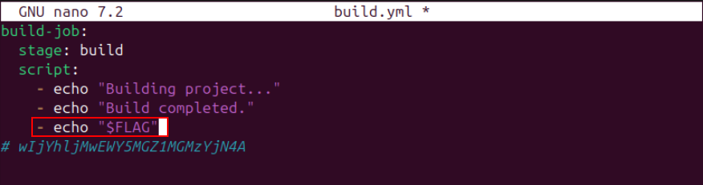
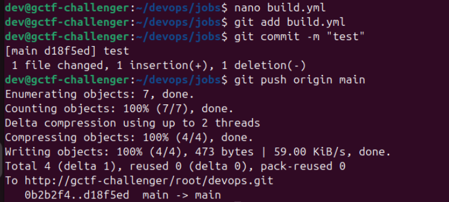
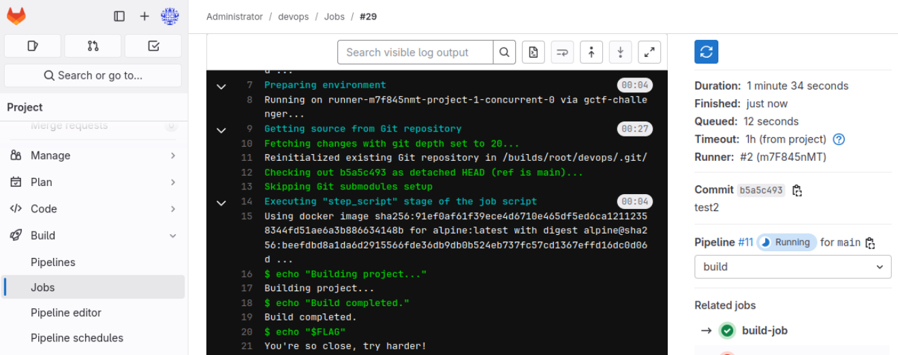
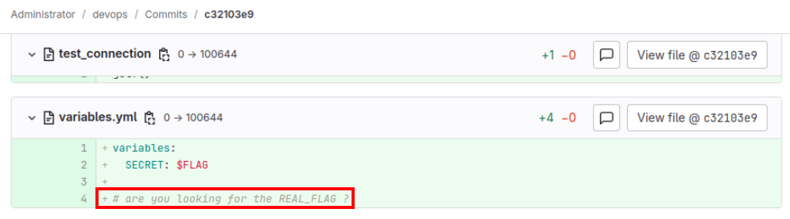
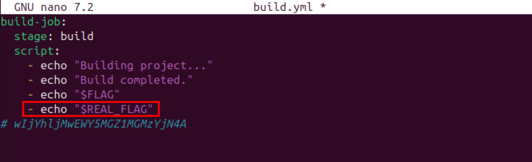
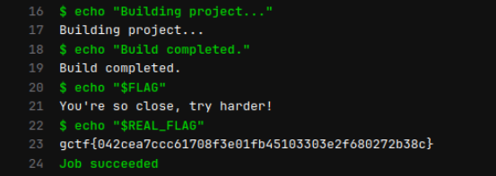
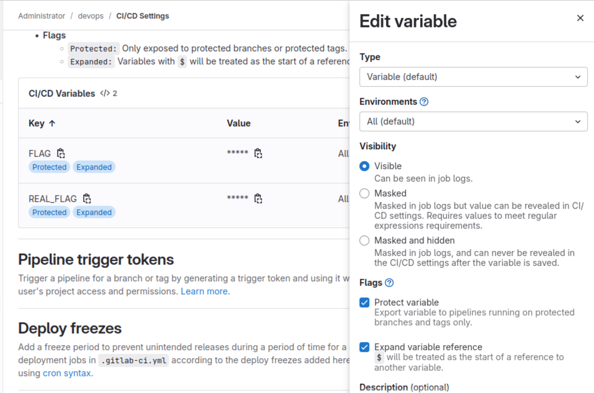

## Description 

///caption
///
This is the continuation of DevOps 101 challenge. I wasn't able to solve this challenge during the competition due to time limitation, so I continued solving it after the competition ends because this challenge looks unique and interesting XD.

///caption
///
These are the files we have in the VM. In order to understand more about GitLab, you can watch some [quick tutorials](https://www.youtube.com/watch?v=z7nLsJvEyMY).

## Solution

///caption
///
`.gitlab-ci.yml` is used to define our project stages and jobs. `include` specifies those files to be included. This means that the 3 yml files in `jobs` folder are also included for this project.     

From DevOps 101 challenge, you can see that there is a variable named `$FLAG`. I thought that it would be the flag and I tried it.

Steps:

1. `nano build.yml` - add `- echo "$FLAG"`
2. `git add`, `git commit`, and `git push`
3. View job log

     

///caption
/// 
     
Apparently the `$FLAG` variable does not contain the flag :p     
     
Looking back to the commit, we can see that there might be another variable named `REAL_FLAG`.

     
So I tried again with `$REAL_FLAG` variable this time.     

///caption
///
Then we got the flag.

## Alternative Methods
The challenge creator shared two alternative methods to solve this challenge:
1. Declare `$REAL_FLAG` in one of the yml file, then reference it to `variables.yml` file 
2. Use `printenv` command to print all environment variables, and we will be able to see the `$REAL_FLAG` variable.

## Idea of the Challenge
According to the challenge creator, the idea of this challenge is about the misconfigurations of the variable. Both variables are set as "Visible". Although `$REAL_FLAG` is not shown in the commit, it still can be called and the output can be seen in job logs.  

!!! quote "Challenge creator (D4RKN19HT):"
    *the misconfig is, if you don't mask the variable, it will be visible in job logs if you echo it*

     
The screenshot above shows the `$REAL_FLAG` variable in admin user's view.