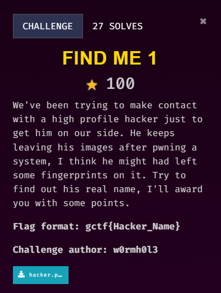
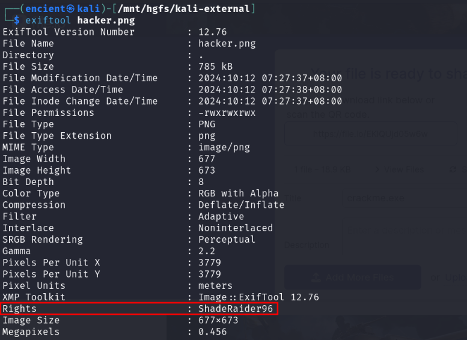
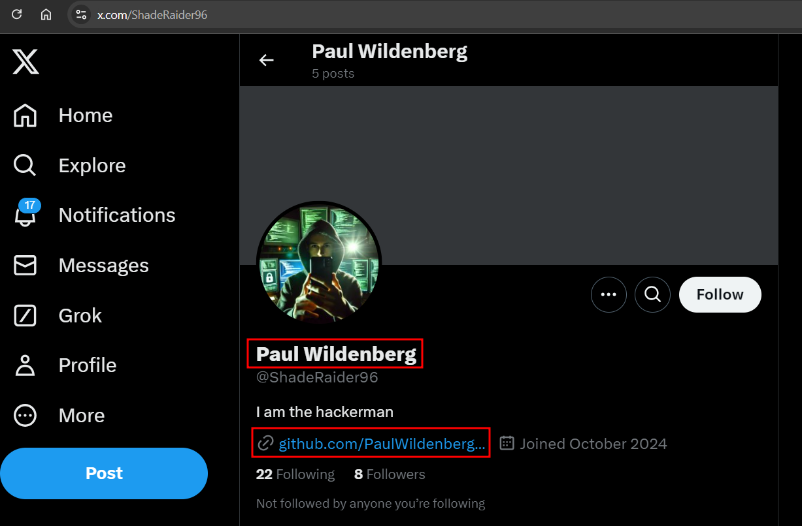

## Description

///caption
///  

## Solution

///caption
///
Since the challenge description mentioned fingerprint, we can try to see if there is any useful information from the metadata of the image. Using `exiftool`, we can get the hacker's username `ShadeRaider96`.

///caption
///
We can use the username and search through popular social media. We will then find his real name in X, along with his GitHub profile (for Find Me 2).