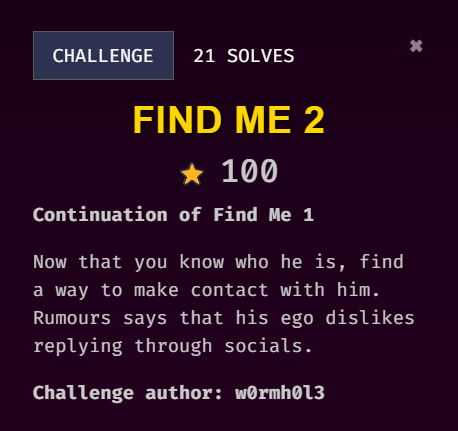
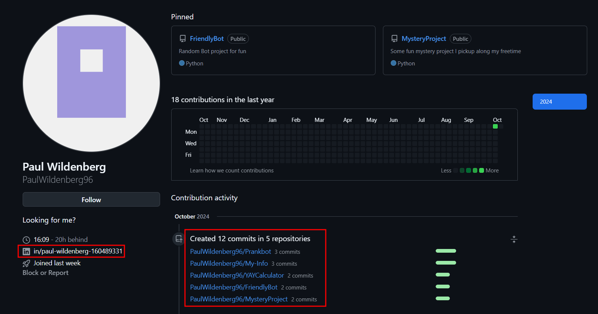
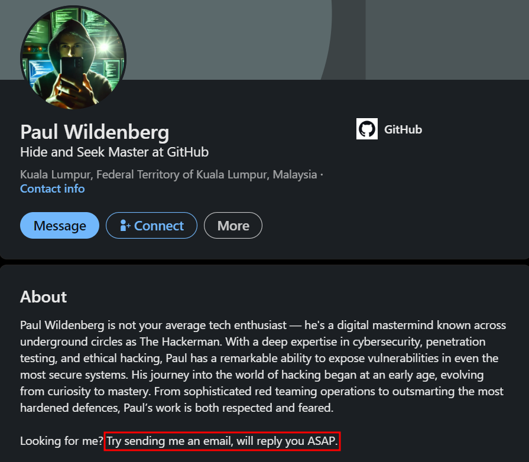
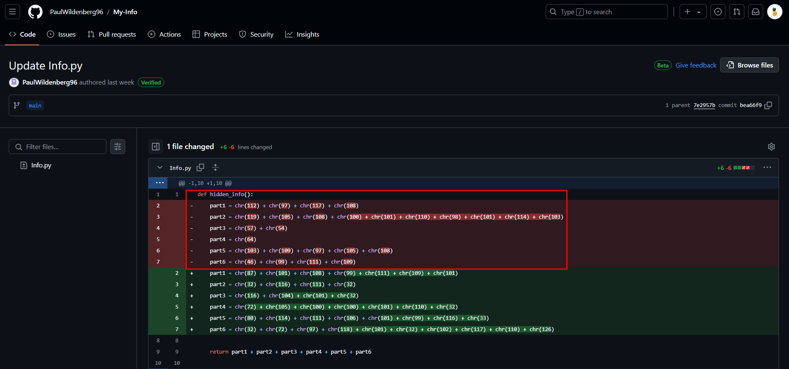
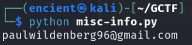
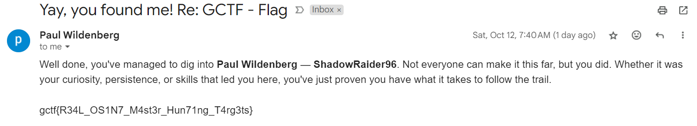

### Description

///caption
///
Challenge description gives a hint that we need to make contact with him, which means we might need to message him or send an email to him. It also mentions that he dislikes replying through socials, hence email might be the way.

## Solution
     
In his GitHub profile, we can get his LinkedIn and several GitHub repositories.     

     
His LinkedIn profile gives us a hint to email him, showing that we are on the right path. Since we can't find his email from his LinkedIn, we can try to search through his GitHub repositories.  

     

`MyInfo` repo looks most interesting for me as it might contain his information like email. Looking through the commit, we can see the latest commit deleted a portion of code, which is the flag.       

///caption
///
Just copy and run the Python script and it will print out the hacker's email.     

    
Send an email to this guy and we will get an immediate automatic reply, with the flag.
