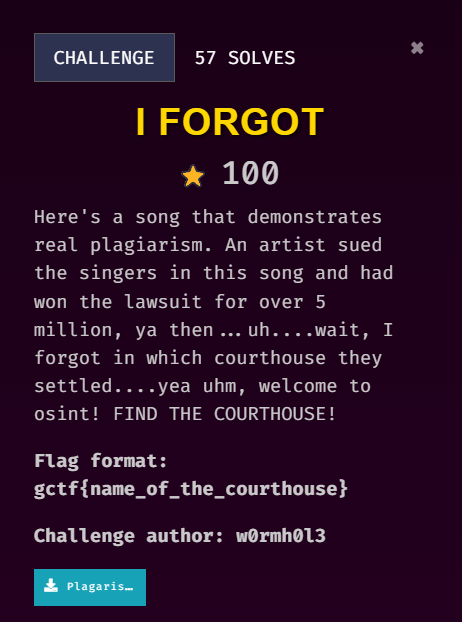
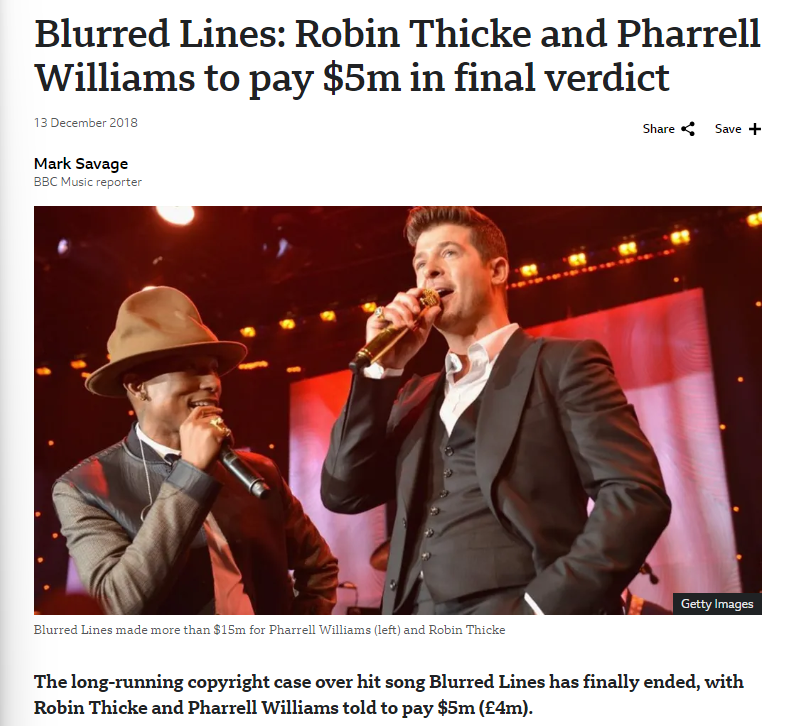
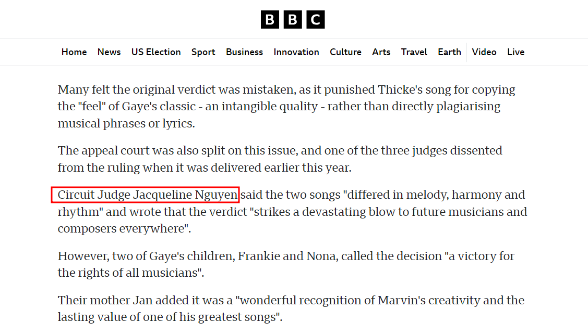
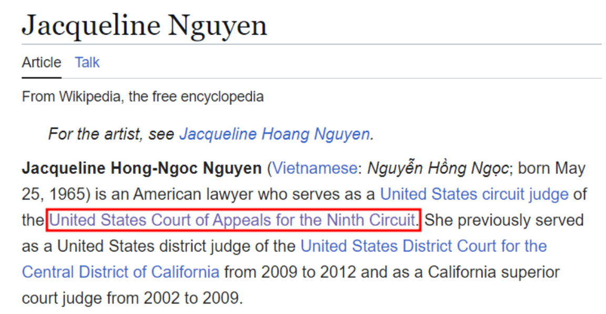

## Description

///caption
///
The challenge gives us an audio file. According to the challenge description, it mentions plagiarism, lawsuit, 5 million, and courthouse. Our task is to get the name of the courthouse.

## Solution
We can use our mobile phone or any online applications to recognize the music, which is "Blurred Lines".

///caption
///
We will then find this [news](https://www.bbc.com/news/entertainment-arts-46550714) that has most of the content stated in the challenge description.

///caption
///
After reading through the news, we will the judge that give the final verdict is Judge Jacqueline Nguyen.

///caption
///
Through her [Wikipedia page]([https://en.wikipedia.org/wiki/Jacqueline_Nguyen](https://en.wikipedia.org/wiki/Jacqueline_Nguyen)), we can get the court that she serves for, which will be the flag.   