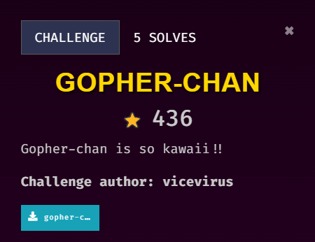
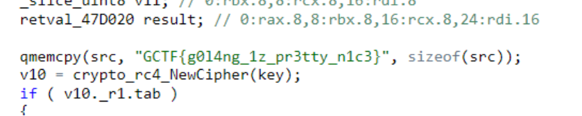

## Description

///caption
///
This challenge is solved by my teammate, `Jin_707`. This writeup is written by `Jin_707`.

## Solution

Just put into decompiler and `Ctrl + F` to find the flag format gctf and we got the flag weee  
Think can use strings `<filename> | grep “gctf”` to find it too. There is also a useful online compiler introduced by my friend Firdaus: https://dogbolt.org/