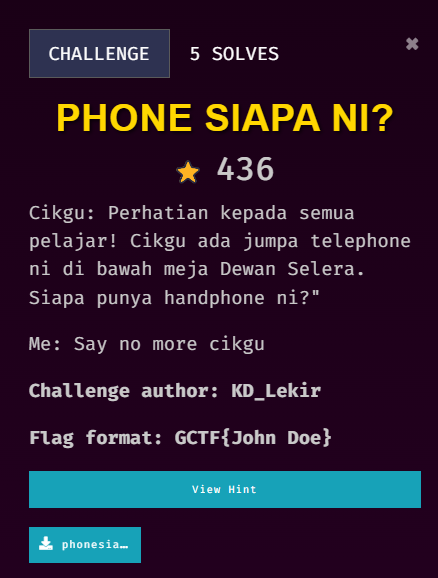
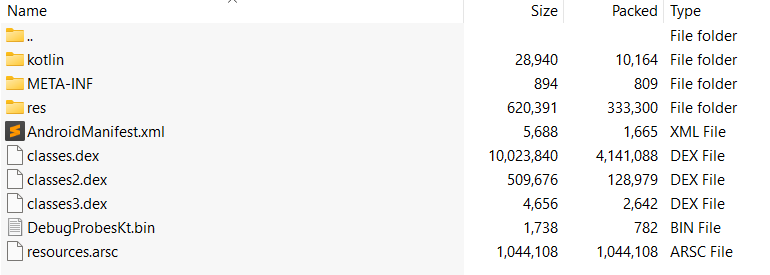
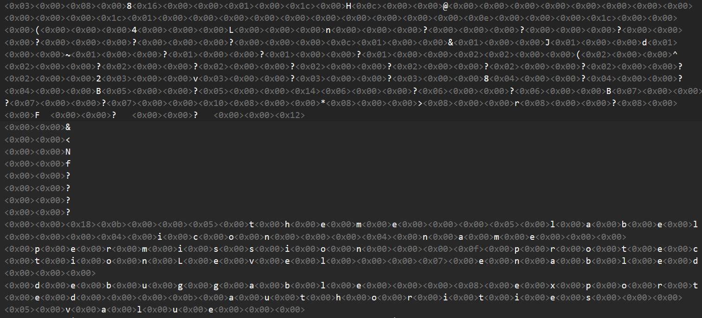
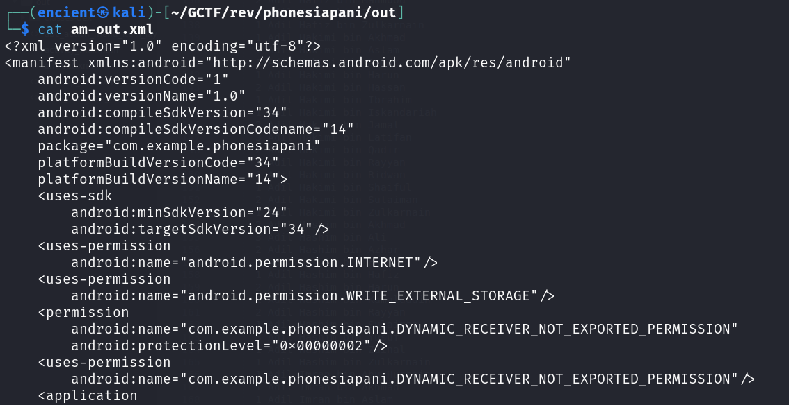
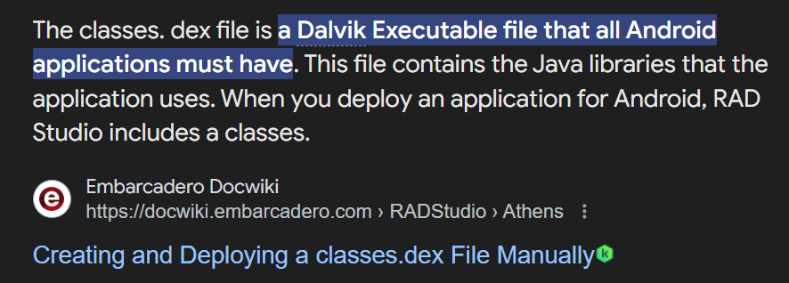
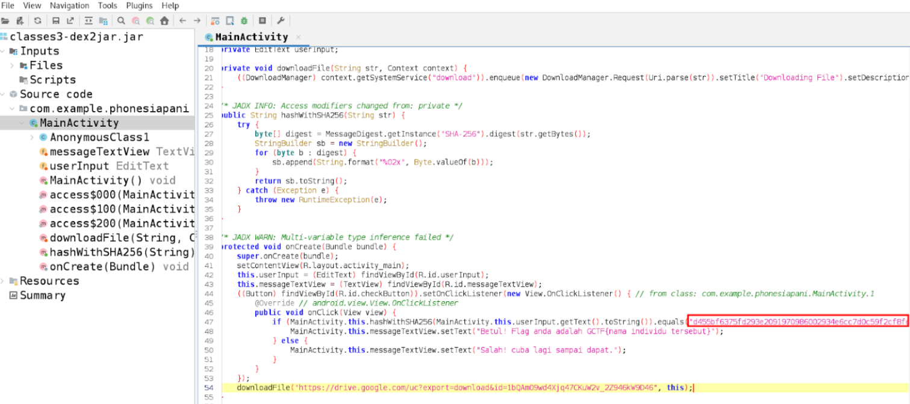
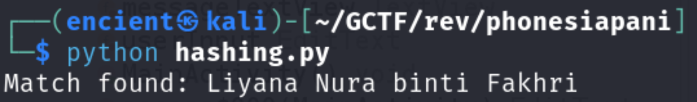

## Description

///caption
///


///caption
///
The attachment given is a zip file containing all the files and folders as shown above.

## Solution
 <br>   
The goal of this challenge is to find the name of the owner. I started with looking through `AndroidManifest.xml` as it normally contains basic information of the app (feel free to correct me cuz I am not too familiar with Android reverse engineering XD). However, the file appears abnormal to me as it is not in readable text. <br>   
 <br>   
After going through some research, I found out that it is a binary XML file, and we can use [parser](https://github.com/AbdurazaaqMohammed/axml2xml) to parse it into readable format. However, the content doesn't look useful for me. <br>   
 <br>   
After some researching, I found out that `classes.dex` files might be useful as it contains the classes files. We can get the source code of the application from it. <br>   
 <br>   
Using Kali Linux tool `d2j-dex2jar`, we can convert dex files into jar files so that it is readable. From `classes3.dex`, we will be able to find the main source code of the app. We can see that there is a Google Drive link which contains a name list. Looking through the source code, we can see that it is comparing user input to a SHA256 hash. <br>   
 <br>   
So, we can create a script to generate hashes for the names in the name list, and compare with the hash from the source code to get the name.

```python {frame="none"}
import hashlib

# Given SHA-256 hash
target_hash = "d455bf6375fd293e2091970986002934e6cc7d0c59f2cf8feb80a0c09adfa784"

# Function to hash a name using SHA-256
def hash_name(name):
    return hashlib.sha256(name.encode('utf-8')).hexdigest()

# Open and read the file containing the list of names
with open("senaraiPelajarUITM.txt", "r") as file:
    names = file.readlines()

# Loop through the names, hash each one, and check if it matches the target hash
for name in names:
    name = name.strip()  # Remove any leading/trailing whitespace or newline characters
    hashed_name = hash_name(name)
    
    if hashed_name == target_hash:
        print(f"Match found: {name}")
        break
else:
    print("No match found.")
```